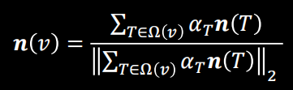

# P2 Discrete differential geometry 离散微分几何

- [P2 Discrete differential geometry 离散微分几何](#p2-discrete-differential-geometry-离散微分几何)
  - [局部平均域](#局部平均域)
  - [法向量](#法向量)
  - [梯度算子](#梯度算子)
  - [拉普拉斯算子](#拉普拉斯算子)
  - [曲率](#曲率)
  - [计算要点](#计算要点)
  - [作业](#作业)
  - [作业笔记](#作业笔记)

## 局部平均域

因为在离散几何里我们没法方便计算出顶点的信息(梯度计算会退化为邻接点的差值), 因此需要定义一个小空间, 在空间中进行估计, 这个空间大的时候, 各种计算会导致平滑, 空间太小则会表现出噪声

One-Ring: 指三角形顶点周围邻接的一圈顶点, 也就是虎书里三角形遍历会走的那一圈

三种常用的cell, 由边中点组成的重心cell, 由垂直平分线组成的外心Voronoi cell, 为了对抗Voronoi在钝角三角形中会出框的缺点设置的混合cell, 其在对应钝角的部分采用边中点来代替垂直平分线计算. 最常用的就是Mixed Cell.

  

## 法向量

三角形的法向量可以由两边叉乘唯一确定, 但是三角形顶点上的法线不唯一, 因此需要在局部平均域上用加权平均的方法计算

  

其中权值$\alpha_T$有三种:
1. 全为1
2. 按照那块三角形的面积
3. 按照那块三角形的角度(最准确)

## 梯度算子

重心插值的核心是算出点对应边的比例, 这个比例通过形成的三角形面积在整个三角形中的占比来计算

  

而三角形上一点的梯度通过在三角形中对函数值进行重心插值后对重心坐标求导得到

  

重心插值是面积, 面积是底乘高, 底和高都可以用向量运算表示, 综合得到算子在x方向上如下, 其中倒T形是指向量在对应轴面上逆时针旋转90度

  

这样计算出来的梯度在面片内是常量, 在面片间一阶导不连续(见[PhongDeformation论文笔记](...))

## 拉普拉斯算子

拉普拉斯算子, 全称Laplace-Beltrami Operator, 也称二阶微分, 梯度的散度, 记作$\Delta$或div(grad)

连续空间中的拉普拉斯算子有下面几个性质, 我们在离散中用来逼近的拉普拉斯算子也要尽量逼近这些性质

  

离散拉普拉斯算子记为拉普拉斯矩阵L, f差值明显是梯度, 对应one-ring邻域计算, $\omega_{ij}$是权值

  

常见的有两种离散拉普拉斯算子: 统一形式和余切形式

统一形式的权值有全为1或为对应角度分之1, 其中全为一的形式满足对称性. 统一形式的拉普拉斯算子没有考虑顶点位置, 当三角形形状过于特殊时性质会很差, 适合切分均匀的三角网格

  

余切形式是在局部平均域中用上面的面积法推导的, 推导省略, 最终形式如下. 是最常用的拉普拉斯算子, 但是在钝角中可能产生负权重

  

离散拉普拉斯算子没法完全满足连续拉普拉斯算子的性质.

## 曲率

每个顶点的平均曲率都可以用拉普拉斯算子得到, 公式如下, 其中H是曲率

相应的, 也就还有绝对平均曲率, 也就是对平均曲率求绝对值

还有高斯曲率, 高斯曲率通过求和各个三角形的角度和与$2\pi$的差值, 配合当前顶点的局部平均域LAR的面积来计算

  

## 计算要点

- 局部平均域的应用需要计算出平均域的面积, 常用方法是按照面片来遍历, 然后用列表记录下每个顶点所对应的那一块的面积, 要用的时候直接查表
- 四面体上的梯度需要用向量叉乘来处理
- 拉普拉斯算子最好也是对面进行for循环来处理, 计算出各个角的cot然后查表

## 作业

  

## 作业笔记

计算局部平均域的时候, 首先如果要求重心域, 每个子三角形的重心坐标就是三个顶点的平均坐标, 得到重心位置后, 每一子三角形对应的平均域面积分为左右两块, 每一半边面积用相应的向量乘法来得到.

当想要得到的是混合cell时, 要记得判断当前三角形是否存在钝角. 不存在时使用三角形的外心, 存在时使用各边的中点连接来分割三角形. 有一个特性, 中点连接切分出来的三角形各块面积是相等的, 可以大幅简化计算.

外心, 也就是垂直平分线的交点, 是三角形外接圆的圆心. 因此可以利用外心到三个顶点的距离都相等的特性列出方程求解外心的坐标. 这个方程可以用克莱姆法则快速求解.

预计算平均域面积时尽管我们是对每个面进行计算, 但是其值是累加到顶点上的, 因此我们保存的索引表是对应顶点的LAR面积

遍历网格的时候, 可以多用C11风格的迭代器如: for(auto v: mesh.vertices()){}

平均曲率是有方向的, 求解出来的时候是向量形式, 尽管使用的时候使用的是模长, 但是当曲率与法线同向时, 曲率值就是负的