# P3 Smoothing 平滑化

- [P3 Smoothing 平滑化](#p3-smoothing-平滑化)
  - [去噪](#去噪)
  - [拉普拉斯平滑](#拉普拉斯平滑)
  - [图像去噪](#图像去噪)
  - [网格双边去噪](#网格双边去噪)
  - [双边法线滤波](#双边法线滤波)
  - [流形谐波处理](#流形谐波处理)
  - [图像的梯度L0范数最小化平滑](#图像的梯度l0范数最小化平滑)
  - [网格L0范数平滑](#网格l0范数平滑)
  - [网格L0优化方法的法线改进](#网格l0优化方法的法线改进)
  - [数据驱动的网格平滑算法](#数据驱动的网格平滑算法)
  - [作业](#作业)

## 去噪

去噪的本质是在对数据重要部分生成一个估计, 然后抛弃掉数据不重要的一些不符合规律的信息, 在这里噪声信息通常都是高频的, 但是噪声会和细节混在一起, 所以比较难处理. 去噪主要有三种大方法: 基于滤波的方法, 基于优化的方法, 基于数据学习的方法.

## 拉普拉斯平滑

对于一个与时间和空间都有关的函数, 拉普拉斯算子可以得到这样的一个扩散方程, 也就是对函数基于时间求导:

  

在计算机中, 这样的扩散方程我们需要进行空间离散化和时间离散化才能满足要求. 理解为固定一个参数, 偏微分另一个参数. 其中空间离散化我们已经比较熟悉, 就是将拉普拉斯算子换成拉普拉斯矩阵, 不同的拉普拉斯矩阵会导致不同的函数估计结果

  

而时间离散化则是迭代的思想, 用较小的迭代步长h来代替微分的时间量, 将这个离散时间和空间离散化公式结合起来, 通过显式欧拉积分, 我们可以得到下一个时间点的函数值:

  

对于这个部分, 除了使用上面的迭代法求解外, 我们还可以通过隐式欧拉积分, 通过求解下面的方程来得到下个时间点的函数值. 求解方程的方法有更好的数值稳定性, 但是计算速度更慢

  

综合起来, 拉普拉斯平滑就是通过自定义的拉普拉斯矩阵, 迭代改变当前的顶点, 不同的矩阵会起到不同的平滑效果. 
- 其中上一节的cot形式拉普拉斯矩阵能够不断减小表面的曲率, 在减小曲率的同时会保留网格大致特征, 在平滑部分仍然能够保持平滑
- 而uniform形式的拉普拉斯矩阵则会将网格顶点往邻域平均值位置移动, 由于不像cot形式能够满足线性性(LIN), 因此网格会有一种不断变平的趋势, 不但网格分布逐渐变得统一, 而且网格本身也在变扁, 即使是平滑区域也会不断改变.

  

Fairing(光顺)是指让两个区域之间生成的网格尽可能平滑的操作, 通过令拉普拉斯矩阵与顶点操作为0生成的网格会满足一定的平滑性. 而随着采用的L矩阵的阶数的增加, 网格会越来越平滑, 下图右边采用三阶次的拉普拉斯矩阵$L^3x=0$得到了非常平滑的连接效果

  

## 图像去噪

图像去噪任务与网格去噪有相近之处. 在图像去噪中, 最出名的去噪滤波器就是高斯滤波器, 高斯滤波器的计算方法如下式, 用一个高斯分布的函数按照邻域点到重心点的距离生成权值, 利用权值和前面的正则化项对邻域内的图像亮度值取加权平均得到当前点的目标亮度值.

  

高斯去噪的缺点就是其没法很好地保留细节特征, 经过高斯滤波器处理的图像整体都变模糊了. 因此又提出了双边去噪法, 其除了像高斯去噪一样考虑邻域点到重心点的距离, 还额外考虑了这些点自身的亮度值差异, 将这个差异加入考虑后去噪结果可以保留图像的边缘信息.

  

## 网格双边去噪

将双边滤波器扩展到网格域的思想的核心就是在三维空间中得到类似深度值的信息, 提出双边网格去噪的文献Bilateral Mesh Denoising采用的方法就是先插值得到表面每个顶点的法线, 然后在顶点法线的切平面上, 衡量邻域顶点与这个切平面的高度差, 这个高度差就是双边滤波器的亮度值, 顶点之间的距离就是双边滤波器的位置信息, 这样计算出来的值加权平均后应用在顶点的法线方向上就能得到更新后的顶点坐标. 在实现过程中要注意的问题是顶点法线如何插值比较合理, 还有就是在平滑过程中网格自身的体积会发生变化, 要如何操作来尽量保持网格的体积.

  

## 双边法线滤波

这是来自文章Bilateral Normal Filtering for Mesh Denoising的方法, 其特点在于考虑了表面面片之间的法线变化信息. 在双边法线滤波中, 首先由于面片上才能得到稳定的法线, 因此滤波的核心从顶点变成了面片法线, 然后双边滤波器的位置差变成了面片重心与邻域面片中心的距离差, 亮度值变为邻域上的法线与当前法线的角度差. 然后由于滤波的核心是法线, 因此计算得到的滤波值会被应用在法线上, 加权平均后用来调整当前的法线.

  

得到一次迭代中全局的新法线后, 使用优化方法利用这些法线方向优化当前表面上的顶点, 让表面顶点形成的真正的新顶点能和当前法线尽可能相同. 这个优化过程本质上就是求解最小化下面能量函数所决定的线性方程组. 这个能量函数的原理就是由于法线理论上应该与表面上每个边都垂直, 所以最小化迭代后的法线与当前面片的边点乘后的值, 最优情况就是全垂直也就是都为0. 用数值计算中常用的求解方法来最小化这个能量函数即可, 可以直接求解方程组也可以用雅可比迭代或高斯-赛德尔迭代等迭代方法近似求解.

  

然后对于这个平滑还可以额外引入对法线进行拉普拉斯处理最小化新法线的二阶导变化和最小化新旧法线之间的变换量等能量函数一起优化:

  

最后的平滑效果

  

## 流形谐波处理

流形谐波是文章Spectral Geometry Processing with Manifold Harmonics从傅里叶变换推广出来的处理方法, 我们知道傅里叶变换可以将信号从平时常见的空域转到时域也就是频谱形式(见[虎书9.5](...)), 然后在频谱上我们可以方便对信号进行很多处理例如消去起到高频信号平滑效果, 对不同频率的信号进行缩放从而对空域的信号进行改变.

对于傅里叶变换, 我们可以换一种思路来理解它, 对于一个一维信号, 我们通过下面的式子能将信号从空域转到时域然后再转回空域. 这个式子中我们可以将$g(x)$理解为信号$f(x)$的与频率相关的分量基函数, 称为谱函数, 而$<f(x),g(x)>$就是信号在谱函数上的投影, 将一个信号投影到频域后我们自然可以重新按照频率将这个信号积分回来. 因此我们可以通过调整积分的方法来有目的性地改变还原出来的信号状态.

  

对于这个谱函数, 如果我们使用拉普拉斯算子对其计算, 会得到下面的形式. 注意到这里等式两边的后半部分是没有改变的, 而右边部分的前半部分$-(2\pi\omega)^2$则是一个与参数x无关的常数, 这个形式很接近线性代数中特征值和特征向量的性质. 再加上我们知道在离散中拉普拉斯算子会退化为拉普拉斯矩阵, 那么这个式子就与特征值和特征向量形式完全一样了. 由于形式相同, 我们可以想到, $-(2\pi\omega)^2$可以当作拉普拉斯矩阵$L$的特征值分解出来, 而谱函数就是分解出来的特征向量. 当拉普拉斯矩阵式对称且半正定时, 这个分解是稳定的.

  

经过这样的分解, 我们可以很方便地将信号傅里叶变换到频率域中, 然后利用离散积分的特性, 选择所需的分量进行积分就能得到滤波的效果. 以低通滤波为例, 将频率高于一定值m的部分不进行积分, 就能让三维信号平滑

  

相类似的, 还有其它几种形状的滤波器可以使用并得到不同的效果. 这种方法很理想, 效果也很好, 但是缺点是由于复杂的模型的拉普拉斯矩阵很大, 对其进行特征值分解会变得很困难, 2018年文章Fast Approximation of Laplace-Beltrami Eigenproblems加速了这个过程得到近似的特征值分解.

  

## 图像的梯度L0范数最小化平滑

另一种平滑方法的思路是基于优化的方法, 这种方法有很多优化的方向, 文章Image smoothing via L_0 gradient minimization的思路是平滑后的目标会存在平缓区域, 而平缓区域的特点就是梯度很小, 经过处理后的目标会变为许多平缓区域组成但是保留了明显区域分割的状态.

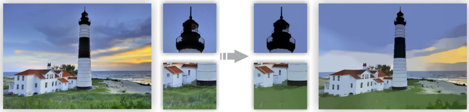  

所谓的L0范数优化在图像处理中表现为最小化全图的下面的能量函数. 这个式子中后面的项称为L0范数或者零模, 会返回这个处理的向量中的非零元素个数, 所以最小化梯度的L0范数就是希望图片中梯度不为0的像素越少越好, 前面一项则约束了处理前后的像素尽量不变.

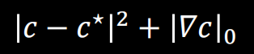  

但是由于很显然这个式子很难求解, 因为对c的调整会同时影响两项的能量, 且梯度项的影响很难分析, 作者采用了下面的新式子, 将问题转为了迭代优化c和δ的过程. 当我们固定c不变时, 可以直接得到令能量函数最小化的δ的解, 当我们固定c不变时, 可以通过求解一个二次方程来得到令当前能量最小化的c. 通过迭代这两个参数可以逐渐逼近合理的最终解

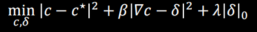  

## 网格L0范数平滑

将图像上的算法用到网格上的核心是处理好如何在网格上找到对应图像的亮度值和微分算子操作. 文章Mesh denoising via L_0 minimization首先直接采用网格顶点p的位置来代替图像亮度值(这个操作有待改进, 对法线之类的间接量优化更直观), 然后尝试了三种不同的微分算子.

微分算子的选择需要满足两个条件:
- 平面上微分得到的值为0
- 算子操作与网格的旋转移动等无关

首先文章尝试了余切形式的拉普拉斯算子, 但效果不好

然后文章尝试优化拉普拉斯算子作用在顶点上的特性, 将其扩展为以边为中心, 得到的算子形式如下:

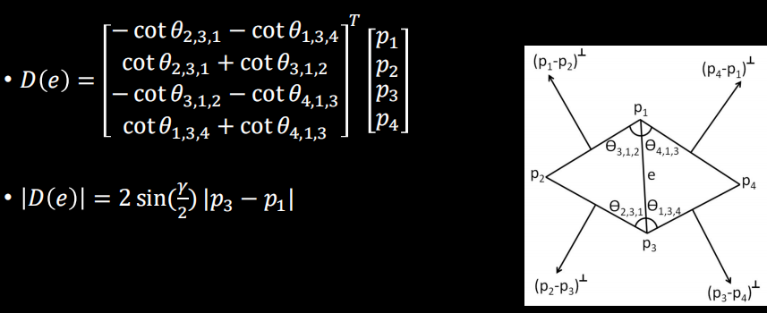  

这个算子的效果好了很多但是上面的式子可以看到优化后的两个三角面间的二面角γ可能为0, 两侧顶点p3和p1也可能相等, 这两种情况分别称为三角形翻转和三角形退化, 是缺陷.

最终文章提出了基于面积的边算子, 表达式如下:

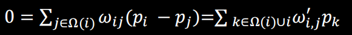  

算子的核心是将拉普拉斯权重变为了四个三角形的面积, 这样能让这个二面角上的两个三角形要么尽量垂直要么尽量变平. 其中需要注意的是为了让面积计算尺度无关, 实际使用的时候面积都除了面积之和, 且234和124这两个三角形由于比较难计算都是投影到同一平面上来进行计算的

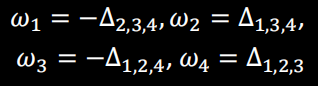  

## 网格L0优化方法的法线改进

由于上一篇文章直接对顶点处理不够直观, 文章Variational Mesh Denoising using Total Variation and Piecewise Constant Function Space学习了法线平滑的方法, 选择对网格的法线进行优化然后再从法线还原出顶点. 优化的核心是下面的式子, 让两个三角面的法线尽量相等且输入和输出的法线尽量相等

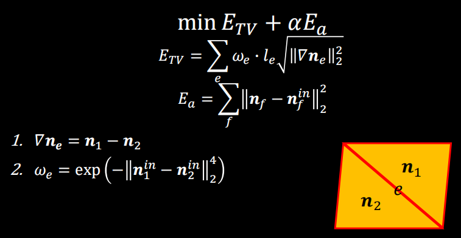  

## 数据驱动的网格平滑算法

数据驱动的算法例如大火多年的深度学习方法, 核心是在网格上构建出输入-输出对. 常见的作法是输入当前处理的面片和其邻域给网络, 输出这个面片去噪后的法向, 然后再从法向恢复顶点. 文章Mesh Denoising via Cascaded Normal Regression提出了较好的一种处理方法.

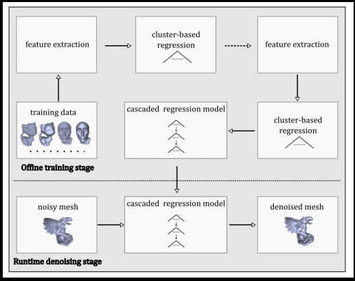  

其流水线如上图, 先对训练数据进行特征提取, 然后将特征聚类防止过拟合, 然后输入簇回归网络, 得到输出, 重建网格, 然后再提取特征, 输入网格... 重复多次训练这个网络, 最后这个网络就可以用来去噪. 这个过程的核心就是对网格的特征提取部分. 这篇文章采用了前面提到过的双边法线滤波提取特征如下, 称为B-FND:

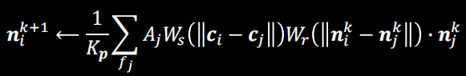  

还采用了先进行高斯滤波然后再双边滤波的引导双边滤波如下, 称为G-FND:

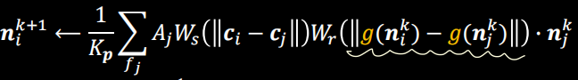  

两种提取特征方法一起使用能得到更好的效果, 输入网络的特征用下面的损失函数进行回归预测

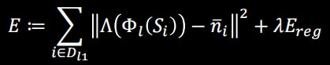  

这里预测的时候要让网络调参的实际上是前面提到的双边滤波的两个高斯分布参数, 网络内部不断尝试不同的参数来尽量得到好的结果, 最后实际使用的时候就会自动得到较好的平滑参数对表面进行平滑了. 最后的效果如下, 比较理想:

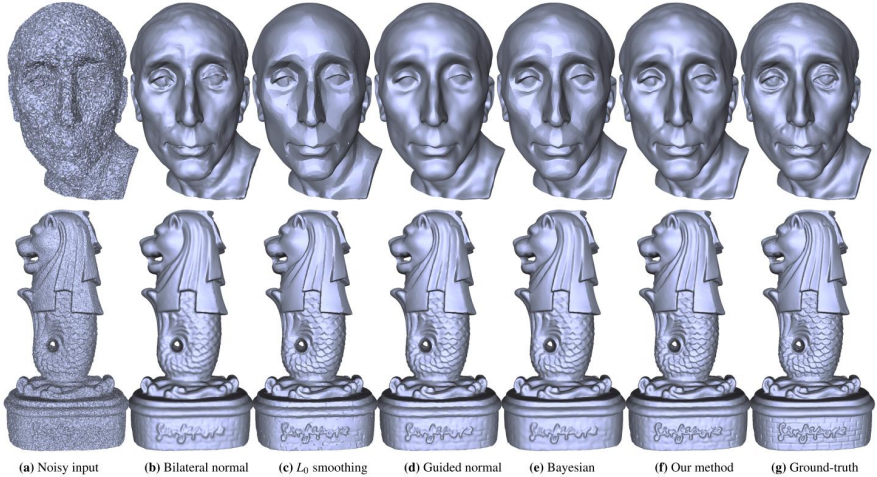  

## 作业

  

  

在处理平滑的位置更新时, 要注意是否需要使用一份备忘来保证更新得到的结果不会立刻反馈给接下来的平滑处理.

OpenMesh的向量类Vec的默认构造很糟糕, 要记得用000初始化

平滑算法应用时的比例参数和两个高斯参数很重要, 可能会导致平滑效果有很大不同. 且不要对简单的拉普拉斯平滑的效果抱有太多的期待, 复杂的算法得到的效果还是要远好于简单的.