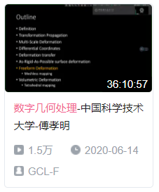
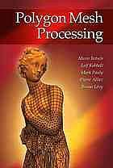

# 中国科学技术大学-数字几何处理 笔记

  

[数字几何处理-中国科学技术大学-傅孝明](https://www.bilibili.com/video/BV1B54y1B7Uc)

参考教材是[Polygon mesh processing](https://book.douban.com/subject/5463738/)

  

## 课程笔记
1. [P1 Representations 表示](./P1%20Representations%20表示/README.md)
2. [P2 Discrete differential geometry 离散微分几何](./P2%20Discrete%20differential%20geometry%20离散微分几何/README.md)
3. [P3 Smoothing 平滑化](./P3%20Smoothing%20平滑化/README.md)

## 相关材料

[作业环境配置](./作业环境配置/README.md)

[OpenMesh教程文档](./OpenMesh教程文档/README.md)