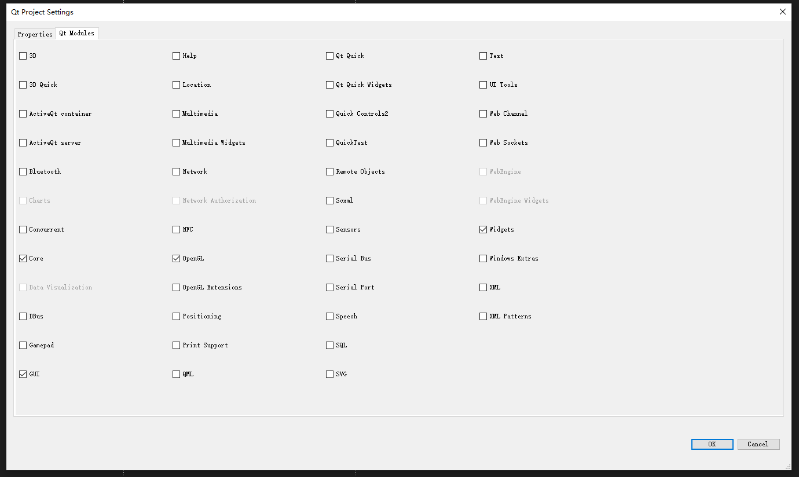
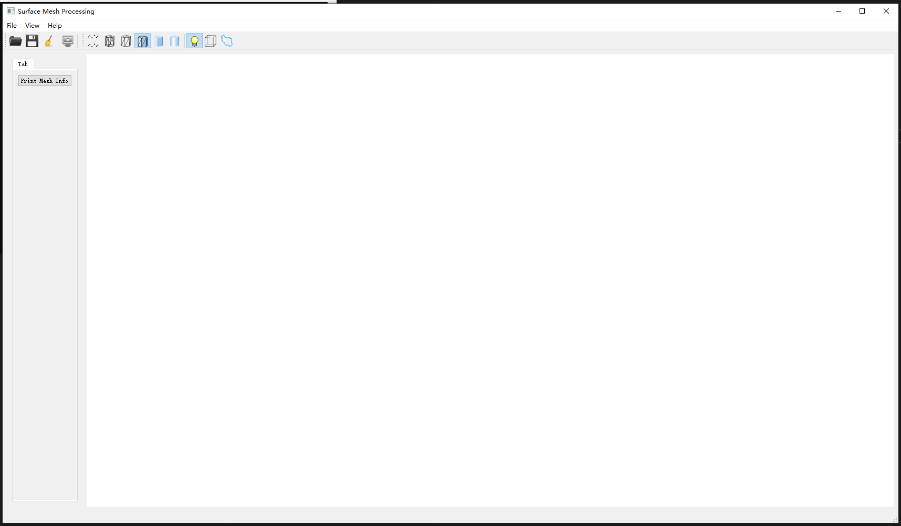

# Digital Geometry Processing作业环境配置

## 导读

这是中科大傅孝明老师的[Digital Geometry Processing课程](http://staff.ustc.edu.cn/~fuxm/course/2020_Spring_DGP/index.html)的作业框架安装指南, 由于其采用的教科书就是Polygon Mesh Processing因此归在一起

## 知乎总教程(自己取舍, OpenGL那部分我没遇到问题)
[Surface Mesh Framework 框架搭建指南](https://zhuanlan.zhihu.com/p/111022607)

## 框架本体

[点击下载](http://staff.ustc.edu.cn/~fuxm/code/Surface_Framework_VS2017.zip)

## OpenMesh

[点击下载](https://www.graphics.rwth-aachen.de/media/openmesh_static/Releases/8.1/OpenMesh-8.1-VS2017-64-Bit-DLL-no-apps.exe)

## Eigen(非必要)

[点击下载](https://gitlab.com/libeigen/eigen/-/archive/3.3.9/eigen-3.3.9.zip)

## QT下载(自己选择想要的版本, 不用和教程一致, 5.13也是可以运行的)

[清华镜像站本体](https://mirrors.tuna.tsinghua.edu.cn/qt/archive/qt/)

## QT安装

[教程](http://c.biancheng.net/view/3858.html)

## 配置流程

大体和[上面知乎教程](#知乎总教程自己取舍-opengl那部分我没遇到问题)一致, 但是要注意设置QT项目属性的时候要导入下图的包才能读取到相应的头文件

  

## 效果

自己找喜欢的网格文件去测试即可

  
