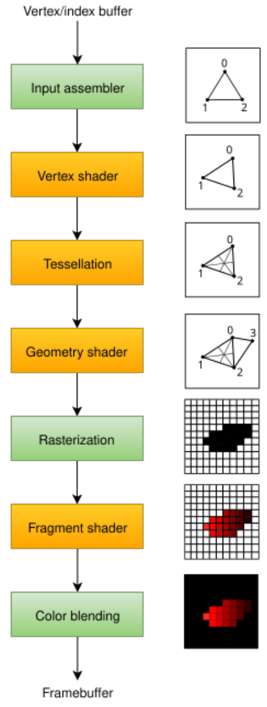
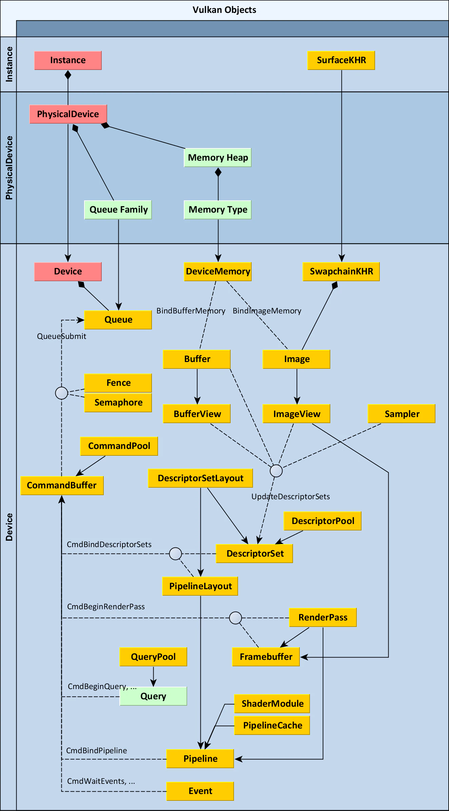
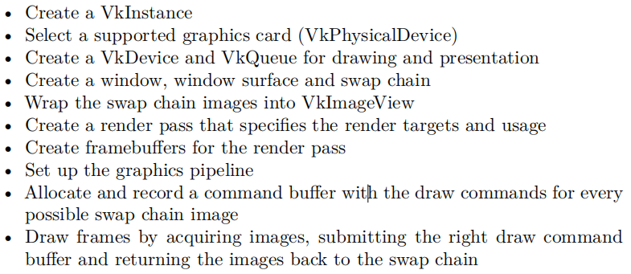

# Vulkan Tutorial 学习笔记

- [Vulkan Tutorial 学习笔记](#vulkan-tutorial-学习笔记)
  - [命名规范](#命名规范)
  - [Vulkan杂项](#vulkan杂项)
  - [Vulkan的种种对象](#vulkan的种种对象)
    - [总览](#总览)
    - [核心对象](#核心对象)
    - [其他主要对象](#其他主要对象)
  - [Vulkan程序的基本流程](#vulkan程序的基本流程)
  - [Vulkan Tutorial流程总结](#vulkan-tutorial流程总结)

## 命名规范

1. 函数以`vk`开头
2. 枚举和结构体以`Vk`开头
3. 枚举值以`VK_`开头
4. 几乎所有的API函数都返回枚举值VkResult表示执行效果

## Vulkan杂项

1. Vulkan有一个用于Debug的验证层validation layer, 其处于API和GPU驱动之间, 我们可以自己编写要在验证层进行哪些debug操作, 同时在发布版关闭它
2. Vulkan的Pipeline阶段和Dx11的标准管线是一样的
3.   
4. Vulkan的着色器都采用了编译后的二进制形式, 这是为了避开不同驱动厂商对高级着色器语言的编译适配问题, 带来了不便但提高了兼容性. 为了方便Vulkan同样有运行时自动编译的操作可以使用
5. Vulkan的着色器坐标采用了和Dx一样的左上角为原点的设计

## Vulkan的种种对象

> 如何正确的入门Vulkan？ https://www.zhihu.com/question/424430509
>
> Understanding Vulkan® Objects https://gpuopen.com/learn/understanding-vulkan-objects/
> 
> Vulkan® Guide https://github.com/KhronosGroup/Vulkan-Guide
>
> Vulkan® Renderpasses https://gpuopen.com/learn/vulkan-renderpasses/
> 
> Pipeline Management https://arm-software.github.io/vulkan_best_practice_for_mobile_developers/samples/performance/pipeline_cache/pipeline_cache_tutorial.html
>
> Introduction to Vulkan Render Passes https://developer.samsung.com/galaxy-gamedev/resources/articles/renderpasses.html#app
> 
> Can multiple subpass be used with single pipeline in vulkan https://stackoverflow.com/questions/44654037/can-multiple-subpass-be-used-with-single-pipeline-in-vulkan
> 
> What is actually a Queue family in Vulkan? https://stackoverflow.com/questions/55272626/what-is-actually-a-queue-family-in-vulkan

### 总览

  

上图是常用的Vulkan对象的相互关系, Vulkan的所有对象都以`Vk`开头, 所有的函数都以`vk`开头. Vulkan的这些对象的实际类型比较多, 但主要是指针, 枚举和结构体. 但在实际使用中我们不应该过度理解这类对象的类型, 而应该就将其看作纯粹的数据, 对其结构体类型的对象进行属性设置, 然后所有对象都像数值一样交给其他函数去代我们进行处理.

上图中绿色对象代表其仅仅是`uint32_t`这样的普通数据类型, 红色则代表这个对象是此部分的核心操作对象, 其余的对象都需要这些核心对象的协作.

### 核心对象

**Instance**

1. 是Vulkan程序需要创建的第一个Vk对象, 代表了Vulkan系统与程序的关联, 声明应该持续到Vulkan部分结束
2. 其中指定了程序所需的Vulkan内容, 因此需要使用的Layers(如Validation Layer)和extensions在创建Instance的时候就需要配置好

**PhysicalDevice**

1. 代表了设备相关的Vulkan设备, 例如GPU
2. 我们主要通过PhysicalDevice获取和设备相关的信息, 例如其支持哪些功能, 其诸如队列, 内存等物理硬件的支持类型, 从而方便我们的程序跨硬件运行
3. PhysicalDevice中从系统内存硬件中抽象出了Memory Heaps和Memory Types, 通过指定所需的Memory Types后就可以从抽象的Memory Heaps中申请内存

**Device**

1. 相当于将硬件设备完全抽象出来, 从此不同平台的Vulkan可以表现出相同的抽象
2. 在这里我们通常进行是否使用各向异性过滤, 使用何种队列等基础特性的选择

### 其他主要对象

**Queue**

1. Vulkan中, 提交给GPU的命令一般通过vkCmd录制, 然后用vkQueueSubmit提交执行
2. Queue实际上是对GPU上真实存在的Queue的抽象. GPU处理的时候不断从队列Queue中顺序取出CommandBuffer来执行, GPU上可能并行执行多个不同的Queue
3. 对于同一个Queue我们只能互斥地进行Submit, 但多个Queue之间就可以多线程并行提交了
4. 在处理多个Queue的时候, 要注意尽管单个Queue上的CommandBuffer是顺序执行的, 但多个Queue间的顺序无法保证, 因此需要同步时我们要自己用信号量等机制进行处理

**QueueFamily**

1. GPU上实际上存在多个不同种类的Queue, Vulkan指定VkQueueFlagBits来区分, 他们实际上是在硬件上对某些指令进行了效率优化同时限制了其他指令的执行, 通常分为以下三种
2. Graphic: 最全能的Queue, 可以执行最多的指令, 是渲染时的主力
3. Compute: 只能进行并行计算指令, 数量有限, 一般用来作为并行单元进行一些通用计算
4. Transfer: 只能进行传输指令, 一般会用到GPU上主机与内存进行信息传输的DMA组件, 使得实际计算与IO分离并行执行

**CommandPool**

1. 用于申请CommandBuffer, 属于一种抽象
2. 连接在某个QueueFamily上

**CommandBuffer**

1. 从某个CommandPool上申请得到, 其顺序录制一组需要执行的命令作为缓冲, 然后一口气提交给Queue, Queue中会缓冲多个CommandBuffer顺序进行
2. CommandBuffer中填充了我们摆放的一系列GPU指令, GPU顺序但无阻塞地将CommandBuffer中的Command调度给GPC运行
3. 进入record状态后用vkCmd系列函数就能往CommandBuffer上顺序写入(录制)命令
4. 由于CommandBuffer上的命令是异步无阻塞执行的, 所以需要在合适的时机使用同步对象来维护数据依赖

**Buffer & Image**

1. 这两个对象都是一种对已申请的内存的抽象
2. Buffer概念上比较简单, 只代表一组二进制内容并维护一些简单的配置属性
3. Image概念上代表图像, 相当于一组像素的集合, 但实际的内存内容则可以通过配置修改, 例如布局, 维度, 深度等
4. 因此Image不一定是可以直接访问的, 可能出于优化考虑需要改变内存排布

**BufferView & ImageView**

1. 由于内存排布等原因, Buffer和Image不能直接用来查询和渲染, 需要进一步包装为View来统一读写接口
2. 经过包装后BufferView让我们可以直接取值, ImageView让我们在使用中可以方便调整格式, 提取通道之类
3. 着色器只能处理View状态的数据

**Sampler**

1. 采样器并不与具体的Image绑定, 其仅仅是一套配置列表, 可以在不同的Image上复用, 也无所谓Image具体的维度之类
2. Sampler通过和Uniform Variable类似的方法传入着色器进行纹理采样

**DeviceMemory**

1. Buffer和Image只是创建的话还不会在设备(GPU)上申请真正的显存, 需要我们手动分配内存然后进行绑定
2. DeviceMemory代表从硬件内存中申请出来的一块内存, 由于申请内存效率较低, Vulkan鼓励我们在程序开始的时候申请一大块内存然后自己再进行运行时分配和回收. 为此官方还提供了现成的Vulkan Memory Allocator
3. Buffer和Image的通常构建流程: 1) 用vkAllocateMemory从device申请所需的DeviceMemory, 2) 创建Buffer或Image对象, 3) 用vkBindBufferMemory或vkBindImageMemory进行内存绑定
4. vkAllocateMemory的时候分配器作为参数传入, Destroy的时候也作为参数传入进行回调
5. 申请的内存在无用或程序退出时记得回收, 不回收的话Validation Layer会及时提示

**SurfaceKHR & SwapchainKHR**

1. Vulkan程序总需要创建用于显示的窗口并显示帧缓冲, 因此抽象了SurfaceKHR和SwapchainKHR
2. SurfaceKHR是对窗口的抽象, 其由各种平台相关的函数例如vkCreateWin32SurfaceKHR创建, 需要一系列平台相关的参数例如windows的HWND
3. 有了SurfaceKHR后就可以创建交换链SwapchainKHR, 一般一个设备只有一个. 其相当于对一系列Buffer的包装, 双缓冲三缓冲等机制都在这里设置

**Descriptor**

1. Shader访问内存资源是需要借助Descriptor来定位和读取, 但是Descriptor并不是一个单独存在的对象
2. 首先需要配置DescriptorSetLayout, 其指定了每个Descriptor的元素布局, 规格为slot+format, 这样才能在Shader中用layout(binding = slot) format name来定位获取元素
3. 随后是DescriptorPool, 这是一个简单的对象仅仅用来辅助申请DescriptorSet
4. DescriptorSet代表了Descriptor真正的内容, 其由vkAllocateDescriptorSets创建, 通过配置VkWriteDescriptorSet数组并用vkUpdateDescriptorSets来更新其中的内容

**Pipeline**

1. Pipeline实际上是GPU上下文(Context)的抽象. 这部分要配合GPU渲染架构理解, GPU并非状态机, 而是一套可配置的硬件
2. 与之前常见的GAPI设计不同, Vulkan的Pipeline并不是由多个分离的对象组成, 而是一个固定的大对象, 代表对GPU作为一个整体进行考虑. 可以分为ComputePipeline和GraphicsPipeline两种类型
3. ComputePipeline比较简单, 其只需要配置ComputeShader(本质是PixelShader)部分, 因此只需要设置ShaderModule和PipelineLayout
4. GraphicsPipeline则包括了整个GPU管线, 也就是经典的图形渲染管线. 我们通过设置States来配置不同GPU阶段(硬件或抽象)的属性, 当前渲染所需的ShaderModule, 对应的PipelineLayout和这个Pipeline配置所服务的Renderpass中的Subpass

**PipelineLayout**

1. 渲染的时候Pipeline可以绑定多个DescriptorSet, 所以同样需要布局PipelineLayout来管理
2. PipelineLayout使用vkCmdBindDescriptorSets配置DescriptorSet与CommandBuffer的绑定

**RenderPass**

1. Renderpass是对GPU一套渲染流程的抽象, 需要和GPU渲染架构尤其是TBDR架构一起理解. 在TBDR中, 数据流会在GPU计算中出现一次或两次缓冲延迟. Vulkan将一整次完整的pass称为Renderpass, 然后中间每一个阶段都人认为可以插入延迟缓冲作为输出, 抽象为Subpass
2. 之所以Vulkan要抽象出Subpass是因为传统的GAPI中, 我们都只能假定指令在GPU中以即时执行的状态发送给流水线, 一旦流水线后面的部分依赖于前面的部分就会引起一次卡顿, 后面的部分需要等待前面的部分完成后再执行
3. Vulkan通过将这种数据依赖问题拆解出来来达到优化, 当GPU某个单元执行完此Subpass后, 其将数据写入对应的Attachment, 然后无需跟以前一样在那里等待其他内容的计算, 而是可以由编译优化自动切换到其他指令的计算上, 知道此依赖的数据都准备好后再回到节点上继续执行
4. 由于增加了对依赖关系的配置选项和中途的Attachment流输出能力, GPU也可以更进一步地对到来的指令进行调度得到更高的计算效能
5. 所以SubPass之间需要配置好阶段依赖关系(利用SRC和DST项), 也因此不允许编写例如SRC为PS, DST为VS这样逆转数据流的SubPass
6. 当需要进行Multipass渲染时和其他API类似, 编写多个RenderPass来实现, 为了实现多个renderpass(实际最小单位是SubPass)自然也需要多个不同的pipeline配置
7. Vulkan为此还支持了称为Transient Attachments的输出缓冲, 这种缓冲只会在GPU中执行, 渲染后直接丢弃, 从而减少DMA的压力进一步提高效率

**Framebuffer**

1. Attachment相当于其他GAPI中的RenderTarget, 也就是渲染输出的Image. 但Attachment只是一个接口, 并不指向任何具体的Image
2. 将Attachment与Image联系起来的中介是Framebuffer, 可以代表这一帧GPU所有输出缓冲的整体, 其指向多个ImageView, 然后用下标的方式与Attachment关联
3. Framebuffer配置的时候绑定所需的ImageView, 然后Renderpass绑定目标Framebuffer, 渲染的时候就会自动输出到Framebuffer的正确的ImageView中
4. 通过切换Framebuffer中的元素我们就可以很轻松地在不改变架构的情况下实现多重缓冲

**ShaderModule**

1. Shader本质是编译后在GPU上直接运行的代码, 但是在主机上用高级语言进行编写
2. Vulkan的Shader则是采用称为SPIR-V的半编译代码, 其可以用任意高级语言编写, 然后经编译器转为接近编译的状态节省空间并提高后续编译效率
3. 我们需要将SPIR-V文件读取并创建ShaderModule对象, 然后设定好Pipeline的不同阶段Core要使用的Shader后, ShaderModule会被编译为GPU可运行的状态

**PipelineCache**

1. 由于Vulkan的Pipeline本质上代表了GPU Context设定, 因此一旦我们想要更改其中的某些选项就需要构建Pipeline(Context), 如果改变Shader部分就需要重新编译, 这使得改变Pipeline的时候开销很大
2. 因此Vulkan引入了PipelineCache作为对之前构造好的Pipeline的缓存, 是否使用PipelineCache的切换耗时可能有一倍的差距
3. PipelineCache不但可以提高切换构建Pipeline的速度, 同时可以被保存到文件中提高下次初始化的速度
4. 很多游戏第一次读取场景的时候会动态编译着色器并写入缓存, 造成第一次进入场景发生卡顿然后以后就不再卡顿的现象, 与这种机制可能存在关联

**Query**

1. Query对象用于让CPU向GPU查询某些信息, 例如某个像素是否被渲染
2. Query并非一个独立的对象, 独立对象称为QueryPool, 其可以包含多个不同的Query, 以命令的形式进行查询

**Fence, Semaphore, Barrier, Event**

1. 这几个对象都是用于同步Vulkan命令的, 因为所有命令都是异步执行的, vkQueueSubmit后很快就会返回, 如果需要处理依赖就必须手动阻塞同步
2. Fence: 用于CPU与GPU之间同步执行状态, 作为vkQueueSubmit的参数一起提交给设备执行, 当任务完成的时候会自动置位. 这样CPU在需要阻塞的地方用vkWaitForFences等待并置位即可
3. Semaphore: 用在GPU上对多个Queue进行依赖同步/ 同样作为vkQueueSubmit的参数, 但在submitInfo中设置需要wait的信号量和需要signal的信号量, 这样就无须在CPU端进行阻塞
4. Barrier: 主要用于通知GPU各个管线阶段之间的同步关系, 用vkCmdPipelineBarrier使用, 指定哪些阶段可以在此barrier前进行, 哪些要等到barrier完成后才能进行, 同时指定前后内存的AccessMask之类
5. Event: 其通过vkCmd在CommandBuffer中设置, 核心是vkCmdSetEvent和vkCmdWaitEvents. 因此可以细化到命令之间进行同步, 常用在subpass之间进行通信
6. 此外, subpass之间本身就带有dependency配置, 这也属于一种多线程同步机制

## Vulkan程序的基本流程

  

## Vulkan Tutorial流程总结

1. 创建Vulkan实例
   1. 配置程序名, 程序版本号等基本信息
   2. 申请Debugger并绑定
   3. 用vkCreateInstance创建
2. 创建窗口
   1. 用glfw创建窗口
   2. 将获得的句柄绑定
   3. 用vkCreateWin32SurfaceKHR将Vulkan绑定到窗口上
3. 选取合适的硬件设备
   1. 遍历当前拥有的所有硬件设备, 检查设备是否支持我们所需的extension和queue family和其他一些功能
   2. 将符合要求的最好的设备记录下来
4. 创建逻辑设备
   1. 将选定的硬件设备支持的queue family去重然后合并绑定
   2. 设置逻辑设备的一些基础设定和extension的开关设定
   3. 设置所需的ValidationLayer
   4. 利用选好的硬件设备和配置用vkCreateDevice创建逻辑设备
5. 创建交换链
   1. 对VkSwapchainCreateInfoKHR进行一系列配置, 例如格式, 数量, 色彩空间, 图像大小等
   2. 配置交换链的Queue Family
   3. vkCreateSwapchainKHR创建交换链
6. 创建ImageView
   1. 一般采用双缓冲机制, 因此用数组保存多个VkImageView, 在循环中用CreateImageView创建
   2. 数组大小就是Swapchain的大小
7. 创建RenderPass
   1. 先配置此RenderPass的目标VkAttachmentDescription信息
   2. 将Description绑定到VkAttachmentReference上, 作为Attachment的实体
   3. 将Refernence绑定到VkSubpassDescription的不同接口上
   4. 设置当前Subpass的前后依赖关系
   5. 将Subpass配置设置到Renderpass上并用vkCreateRenderPass创建
8. 创建DescriptorSetLayout
   1. 按照需要绑定的元素配置多个Type不同的VkDescriptorSetLayoutBinding
   2. 组合成数组并绑定到CreateInfo
   3. 用vkCreateDescriptorSetLayout创建
9.  创建Pipeline
    1.  先读取并创建所需的VkShaderModule
    2.  将着色器配置到VkPipelineShaderStageCreateInfo
    3.  逐个配置GPU其他的阶段选项
    4.  配置Uniform变量的布局绑定
    5.  将所有配置项连接在VkGraphicsPipelineCreateInfo配置上
    6.  用vkCreateGraphicsPipelines创建Pipeline
    7.  回收着色器资源
10. 创建CommandPool
    1.  获取queue的graphicsFamily, 设置到CreateInfo
    2.  用vkCreateCommandPool创建
11. 创建颜色缓冲
    1.  为了实现MSAA, 用一个ColorResources作为结果的缓存, 本质只是一个ImageView
12. 创建深度缓冲
    1.  深度缓冲也是一个ImageView
13. 创建Framebuffer
    1.  帧缓冲对象是renderpass的渲染目标
    2.  循环对swapChainImageViews的每个元素用vkCreateFramebuffer初始化, 主要是配置所属的renderpass, attachment和大小
14. 创建材质图像
    1.  用来渲染模型, 读取模型的材质图片, 用CreateImage创建为ImageObject
    2.  然后录制command生成所有等级对应的Mipmaps
    3.  最后包装为ImageView以供使用
15. 创建采样器
    1.  配置VkSamplerCreateInfo的上下采样和, 超出纹理大小时的处理方法等一系列设置
    2.  用vkCreateSampler创建采样器
16. 读取模型
    1.  实际上应该与外部的应用程序阶段对接
    2.  读取模型文件, 遍历所有索引三角面片, 准备模型的顶点信息
    3.  用一个unordered_map去重从而压入得到模型的顶点数组, 并得到对应的索引数组
17. 创建模型顶点缓冲VertexBuffer
    1.  先准备一个stagingBuffer负责GPU和CPU之间信息交互的中介, 作为CPU端的缓冲
    2.  Map-memcpy-Unmap, 从而将顶点数组中的数据复制到stagingBuffer
    3.  再创建一个用于GPU的顶点缓冲区, CopyBuffer进行数据复制
    4.  最后Destroy并Free掉stagingBuffer
18. 创建模型索引缓冲IndexBuffer
    1.  流程和创建VertexBuffer一致, 也需要stagingBuffer作为中间缓冲
19. 创建UniformBuffer
    1.  UniformBuffer也是普通的VkBuffer, 但是为了满足多重缓冲机制实现一定程度的并行渲染, UniformBuffer也是Vector构成
    2.  循环中CreateBuffer即可
20. 创建DescriptorPool和DescriptorSet
    1.  先用array包装多个VkDescriptorPoolSize, 每个元素指定对应的type(Uniform, Image...)和需要的个数(缓冲次数)
    2.  这个创建完的array的内容设置到VkDescriptorPoolCreateInfo中
    3.  用vkCreateDescriptorPool创建对应的DescriptorPool
    4.  随后申请布局VkDescriptorSetLayout, 自然也是vector, 配置中需要连接刚才的pool
    5.  然后循环缓冲次数, 准备需要传递给着色器的数据内容, 逐个设置到申请的VkWriteDescriptorSet数组中
    6.  设置完的数组相当于目标帧的要用到的数据, 调用vkUpdateDescriptorSets进行更新, GPU就会将其传递给着色器
21. 创建CommandBuffers
    1.  同样由于多重缓冲机制的存在, CommandBuffer也是vector
    2.  用vkAllocateCommandBuffers进行初始化
22. 创建SyncObjects
    1.  这部分是为Tick做最后的准备, 初始化了若干个Semaphores和Fences
23. Tick
    1.  在Tick函数中我们编写的内容都是在CPU上进行的, GPU是通过构造command然后用vkQueueSubmit提交并异步执行的
    2.  先用vkWaitForFences阻塞等待上一帧GPU绘制完成
    3.  然后从交换链中取出一个空白帧并设置当前帧的信号量防止其他线程重复获取
    4.  更新当前要处理的帧的Uniform信息
    5.  手动重置fence并清空当前Commandbuffer, 然后开始录制
    6.  指令就是配置当前RenderPass的目标区域和一些默认配置, 然后vkCmdBeginRenderPass并vkCmdBindPipeline配置当前绘制所需的RenderPass和Pipeline
    7.  然后绑定顶点, 索引和DescriptorSet这三个绘制必要的信息
    8.  调用vkCmdDrawIndexed进行索引绘制
    9.  绘制结束后用vkCmdEndRenderPass和vkEndCommandBuffer结束录制
    10. 录制完成后配置一份VkSubmitInfo, 主要包括了要用到的commandBuffer和Semaphores
    11. 调用vkQueueSubmit提交指令到GPU, 这一步在GPU上并行执行因此会立即返回, 但是GPU执行完成后会自动设置我们传入的fence也就是开头的阻塞
    12. 后面进行一些其他的CPU操作充分利用时间, 主要是从交换链中获取上一帧链上的图像进行显示, 因此CPU逻辑和显示的内容始终差1帧
    13. 最后更新Frame计数
24. End
    1.  按照上面申请的逆顺序进行回收, 由于ValidationLayer的存在回收不彻底的话会有提示方便debug