# 形态抗锯齿MLAA的详解与Python实现

- [形态抗锯齿MLAA的详解与Python实现](#形态抗锯齿mlaa的详解与python实现)
  - [总览](#总览)
    - [流程概览](#流程概览)
    - [参考资料](#参考资料)
  - [细节](#细节)
    - [查找边缘](#查找边缘)
    - [模式分类](#模式分类)
    - [重新矢量化](#重新矢量化)
    - [计算权重](#计算权重)
    - [混合颜色](#混合颜色)
  - [结果](#结果)

## 总览

Morphological Antialiasing(MLAA), 中文一般翻译为形态抗锯齿(反走样), 是一种常见的抗锯齿算法. 其于2009年由Intel的Alexander Reshetov提出, 启发了后续一批基于图像自身形态进行抗锯齿操作的算法例如FXAA和CMAA. 相比传统的基于超采样的抗锯齿算法, MLAA是一种纯粹的后处理算法, 无须法线和深度等信息就可以直接对渲染器的帧缓冲进行抗锯齿处理, 因此这类方法由于即插即得的易用性而得到广泛的应用.

MLAA的思路基于人眼感知的一大特征: 对形状失真的敏感性远强于对颜色失真的敏感性. 因此类似MSAA的想法, MLAA通过一定的策略插值将失真强烈的几何边缘进行模糊, 又保留平滑部分不进行处理, 一方面防止了纹理部分出现额外的失真, 另一方面大大减少了计算量.

而形态抗锯齿的核心是"形态"部分, MLAA先在图片中找到代表几何边缘的部分, 然后将这些边缘分为多种不同的形态模式(pattern), 根据模式实施不同的模糊策略, 这个过程本质上是对边缘重新矢量化和再光栅化的过程. 经过MLAA处理的图片如下图边缘较为平滑, 而内部纹理保持原样, 有效减少了图片失真又不至于产生过多的模糊.

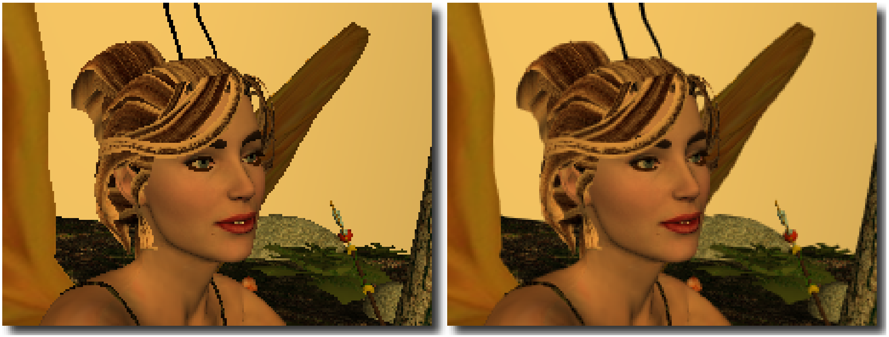  

### 流程概览

MLAA分为下面五大步骤:

1. 查找图片中明显的像素不连续区域作为需要处理的边缘
2. 将这些边缘分类为不同的模式(pattern)
3. 重新矢量化图像的边缘
3. 按照矢量化的边缘计算用于颜色混合的权重
4. 将像素与周围像素进行按照权重进行混合得到平滑后的结果

### 参考资料

这里参考的核心文章是Reshetov的原始论文"Morphological Antialiasing"和Jimenez一年后发表的"Practical Morphological Anti-Aliasing". 两者的区别在于Reshetov的MLAA是在CPU上实现的, 目的是优化光线追踪渲染的图像, 计算量比较大, 而Jimenez针对光栅化渲染, 以牺牲一部分效果为代价在GPU上以极低的计算量实现了MLAA, 将MLAA的实用性提升了一大截.

这里我的Python实现综合了上面两篇文章. 主体仍然是Reshetov的实现方式, 但使用Jimenez的实现中利用图像来储存临时数据的思路辅助. 此文章的代码仓库的路径如下. 文章为了简洁采用的是提炼的部分代码作为伪代码辅助介绍:

> https://github.com/ZFhuang/MLAA-python

下面是一些可供查阅的辅助资料:

> Intel的MLAA主页
> 
> https://software.intel.com/content/www/cn/zh/develop/articles/morphological-antialiasing-mlaa-sample.html
> 
> 2009到2017形态抗锯齿系列算法的发展
> 
> http://www.iryoku.com/research-impact-retrospective-mlaa-from-2009-to-2017
> 
> Jimenez实现的MLAA的项目主页
> 
> http://www.iryoku.com/mlaa/
> 
> 从零开始的游戏引擎编写之路：形态学抗锯齿
> 
> https://www.bilibili.com/read/cv2269091
> 
> 图形学基础 - 着色 - 空间抗锯齿技术
> 
> https://zhuanlan.zhihu.com/p/363624370

## 细节

### 查找边缘

抗锯齿技术处理的目标是图像中边缘部分的锯齿状走样. MLAA首先需要查找出图像中的边缘信息. 在MLAA中, 图像边缘信息的查找相对单个通道进行的, 因此对于彩色图像来说, 需要通过某个方法将其转为单通道形式. 常用的方法是逐通道计算和转为灰度图再计算, 由于常见的图像三个通道的信息可能有很大差异, 因此将彩色图像转为灰度图像后再进行边缘查找是比较合适的算法. 对于图形学渲染得到的图像则还可以采用场景的深度图配合法线图来计算边缘, Jimenez论文中提到使用转换的灰度图效果最好, 深度图执行效率最高但是容易忽略深度接近但颜色差异大的边缘. Jimenez实现的论文中给出了RGB图转灰度图的计算公式:

$$
L=0.2126*R+0.7152*G+0.0722*B
$$

下面是与Jimenez论文中的测试样例相同的太空侵略者的经典敌人, 一张外星人单通道点阵图. 本文后续的流程展示皆以此图为例. 由于实现稍有不同所以后面展示的中间结果会有些许差别, 但最终结果是一样的.

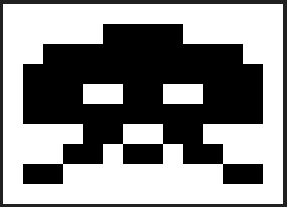  

得到单通道图像后就是查找边缘的步骤了. MLAA将图像的边缘划分为两种: 横向边缘和纵向边缘. 遍历图像中每个像素, 将当前像素与左边和上边相邻的像素做差对比, 当差别大于某个阈值th时认为此像素覆盖边缘. Jimenez的论文中提到对于颜色域是[0,1]的图像来说, th=0.1是比较实用的选择.

对于查找边缘阶段, 可以用一个初始全为0的三通道图片保存边缘信息. 当出现差别的像素处于当前像素左侧时, 我们认为边缘在两个像素相邻的那条边也就是左侧边, 将图片的R通道设置为1; 当出现差别的像素处于当前像素上方时, 边缘处于当前像素上侧, 将图片的G通道设置为1. 一个像素可能同时存在两个边缘, 完成边缘查找阶段后得到的边缘信息图会是由如下红绿黄三色构成的:

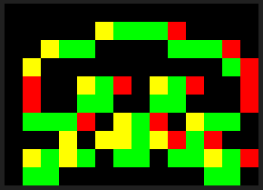  

代码如下:

```python
def _find_edges(img, th=0.1):
    buffer = np.zeros((img.shape[0], img.shape[1], 3))
    for y in range(1, img.shape[0]):
        for x in range(0, img.shape[1]):
            if abs(img[y, x]-img[y-1, x]) > th:
                buffer[y, x, 1] = 1
    for y in range(0, img.shape[0]):
        for x in range(1, img.shape[1]):
            if abs(img[y, x]-img[y, x-1]) > th:
                buffer[y, x, 0] = 1
    return buffer
```

### 模式分类

得到图片边缘之后, MLAA论文中将边缘视作走样并分为三个模式: L型, Z型, U型. 下面是Reshetov对这三种模式给出的示意图:

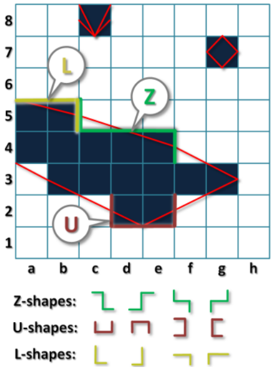  

但想要用程序直接寻找着三种模式是比较困难的, 所以这里我们对模式搜索算法进行优化, 将所有模式都转为长边与短边的组合. 注意到这些走样模式都是由长度为1的一到两条短边与长度未知的一条长边组成, 所有的模式都需要长边的存在, 因此我们将长边的出现视作模式搜索的起点, 当模式遇到短边或达到尽头时模式结束, 所以将短边或空像素视作模式搜索的终点, 从而将所有模式转换为两个子模式的组合. 

然后首先将模式搜索分为基于X和基于Y两种搜索顺序, 以X优先搜索为例, 当遍历发现G通道的值为1时, 也就是当前像素上方有横边存在, 认为遇见了走样, 判断上面相邻像素和自身像素的R通道是否有1存在. 若上方相邻像素R通道为1, 此走样的前半段定为B型, 表示长边在短边下方, 若当前像素R通道为1, 此走样前半段定为T型, 表示长边在短边上方, 若当前和上方像素R通道都为1, 定为H型, 表示长边的上下都有短边, 若R通道都为0, 此走样前半段定为L型, 表示形如原论文的L走样, 即一侧缺少短边. 

完成了前半段的搜索后就开始后半段的搜索, 关注点在于计算出走样的长度和后半段的走样模式. 当遍历途中的像素或上方像素的R通道为1时, 表示这段走样来到了终点, 记录下走样所经过的像素数量就是走样的长度, 然后用和起点处相同的判断模式判断出终点处的走样属于TBHL四个模式中的某一个, 记录下来.

熟悉了这个流程后再看下面的两种典型走样情况, 第一个走样是原论文的Z型走样, 经过上面的拆解变为了TB型走样, 第二个走样是原论文的L型走样, 经过拆解变为了LB型走样. 图的下面是对应搜索的代码, 基于X优先遍历搜索完走样模式后, 再以类似的方法按Y搜索一次走样模式, 保存在一个列表里即可.

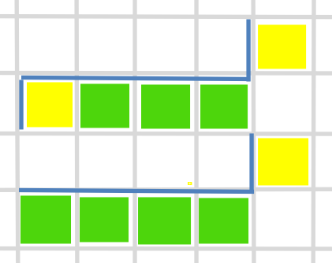  

```python
def _find_aliasings_x(img_edges):
    list_aliasings = []
    mask = np.zeros((img_edges.shape[0], img_edges.shape[1], 1))
    for y in range(1, img_edges.shape[0]):
        for x in range(0, img_edges.shape[1]):
            if mask[y, x] == 0:
                if img_edges[y, x, 1] == 1:
                    if img_edges[y, x, 0] == 1 and img_edges[y-1, x, 0] == 1:
                        start_pattern = 'H'
                    elif img_edges[y, x, 0] == 1:
                        start_pattern = 'T'
                    elif img_edges[y-1, x, 0] == 1:
                        start_pattern = 'B'
                    else:
                        start_pattern = 'L'
                    dis, end_pattern, mask = _cal_aliasing_info_x(
                            img_edges, x+1, y, mask)
                    list_aliasings.append(
                        [y, x, dis, start_pattern+end_pattern])
    return list_aliasings

def _cal_aliasing_info_x(img_edges, start_x, start_y, mask):
    dis = 1
    for x in range(start_x, img_edges.shape[1]):
        if img_edges[start_y, x, 0] == 1 and img_edges[start_y-1, x, 0] == 1:
            pattern = 'H'
            return dis, pattern, mask
        if img_edges[start_y, x, 0] == 1:
            pattern = 'T'
            return dis, pattern, mask
        if img_edges[start_y-1, x, 0] == 1:
            pattern = 'B'
            return dis, pattern, mask
        if img_edges[start_y, x, 1] == 0:
            break
        mask[start_y, x] = 1
        dis+=1
    pattern = 'L'
    return dis, pattern, mask
```

### 重新矢量化

完成对整张图走样模式的分类后, 我们就得到了两个列表分别保存了X方向的走样和Y方向的走样. 随后我们需要按照这些走样计算出每个像素用于与周围像素值混合的权重. 在计算权重之前, 开头的时侯我们说到MLAA是在对图像的边缘进行重新矢量化以计算混合颜色的权重. 重新矢量化实际上就是在依据查找到的走样来估计真实的边缘.

对于每个走样, 我们取短边的1/2位置所为一侧的端点, 若两个短边属于同一侧, 则属于原论文的U型走样, 计算长边中点为分界点, 连接三点得到U型矢量, 若两个短边方向相反, 则属于原论文的Z型走样, 直接连接两个端点, 若短边长度为0, 则属于原论文的L型走样, 直接采用为0的一侧的顶点作为端点连接, 当出现两个短边也就是一侧是H型走样时, 为了图像边缘的平滑我们优先判定为Z型走样.

根据上面的步骤我们可以将X方向所有模式的走样重新矢量化, 下图是所有模式矢量化后的结果与对应的部分代码. 

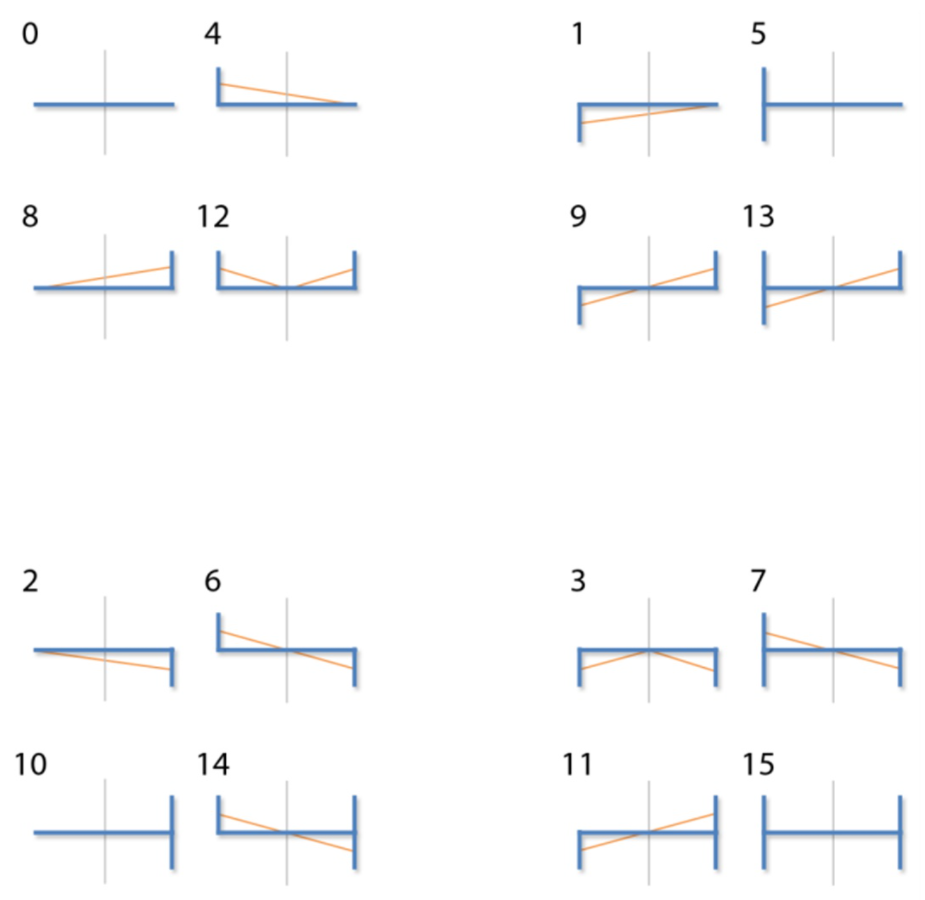  

```python
def _analyse_pattern(pattern):
    if pattern[0] == 'H':
        if pattern[1] == 'H':
            start = 0
            end = 0
        elif pattern[1] == 'T':
            start = -0.5
            end = 0.5
        elif pattern[1] == 'B':
            start = 0.5
            end = -0.5
        elif pattern[1] == 'L':
            start = 0
            end = 0
    elif pattern[0] == 'T':
        ...
    elif pattern[0] == 'B':
        ...
    elif pattern[0] == 'L':
        ...
    return start, end
```

### 计算权重

得到重新矢量化的边缘后, 关键就是计算用于混合颜色的权重信息. 首先观察下面的Z型走样, 显然(2,1)处的像素被重建的边缘切分为两部分, 因此我们想到新的(2,1)像素的颜色应该是由C_opp和C_old按照对应的面积比例混合而成的, 每个被重建后的边缘线划过的像素的颜色都应该是当前像素和线的另一侧的像素按照面积比例混合的结果.

再观察像素(2,2), 我们可以看到此时像素的边缘正好被重建的边缘线经过, 因此两个像素处于相互混合的状态, 为了处理这种特殊的状态, 我们为每个像素都保存两个值, 一个储存指向上方的三角形面积, 代表了当前像素影响外部像素的溢出面积, 一个储存指向下方的三角形面积, 代表当前像素被外部像素影响的侵入面积. 对于这两个三角形面积的计算我采用了相似三角形的面积公式来处理, 面积比=相似比的平方, 整体计算比较繁琐且L型和Z型U型的计算差别较大, 下面的代码只展现了最通用的非偶数边长Z型和U型计算过程:

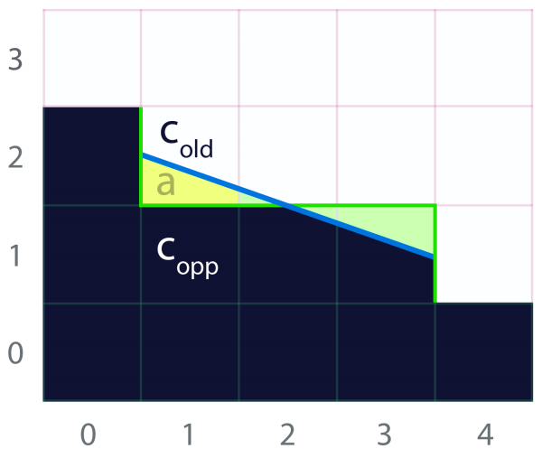  

```python
def _cal_area_list(dis, pattern):
    start, end = _analyse_pattern(pattern)

    if start == 0 and end == 0:
        return None
    elif end == 0:
        h = start
        tri_len = dis
    elif start == 0:
        h = end
        tri_len = dis
    else:
        h = start
        tri_len = dis/2.0

    list_area = np.zeros((dis, 2))
    tri_area = abs(h)*tri_len/2

    if start==0:
        ...
    elif end==0:
        ...
    elif tri_len % 2 == 0:
        ...
    else:
        for i in range(0, dis+1):
            if abs(i-tri_len) <= 0.5:
                if i < tri_len:
                    area = (start*2)*(tri_area*(((tri_len-i)/tri_len)**2))
                    if area > 0:
                        list_area[i, 0] += area
                    else:
                        list_area[i, 1] -= area
                else:
                    area = (end*2)*(tri_area*(((i-tri_len)/tri_len)**2))
                    if area > 0:
                        list_area[i-1, 0] += area
                    else:
                        list_area[i-1, 1] -= area
            elif i < tri_len:
                area = (start*2)*(tri_area*(((tri_len-i)/tri_len)**2)-tri_area*(((tri_len-i-1)/tri_len)**2))
                if area > 0:
                    list_area[i, 0] = area
                else:
                    list_area[i, 1] = -area
            elif i > tri_len:
                area = (end*2)*(tri_area*(((i-tri_len)/tri_len)**2) -
                                tri_area*(((i-tri_len-1)/tri_len)**2))
                if area > 0:
                    list_area[i-1, 0] = area
                else:
                    list_area[i-1, 1] = -area
    return list_area
```

计算得到的面积权重可以分别用图像的一个通道来保存, 也就是保存为RGBA的四通道图像. 根据这个步骤计算后保存下来的权重图如下, 这张图和论文中的范例有些许差别可能是实现细节的不同, 最终的混合结果是一样的.

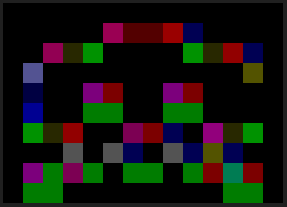 

在计算面积的过程中我们注意到走样的模式是有限的, 假如我们对走样的长边的长度进行限制的话, 就可以将每个模式下对应的面积权重提前计算出来并保存在一张四通道图片中, 这样在计算面积权重的时侯就可以通过查表直接免去重复的面积计算, 这是Jimenez对MLAA的一大性能优化. 下面是将面积预计算后保存在一张图中的形式.

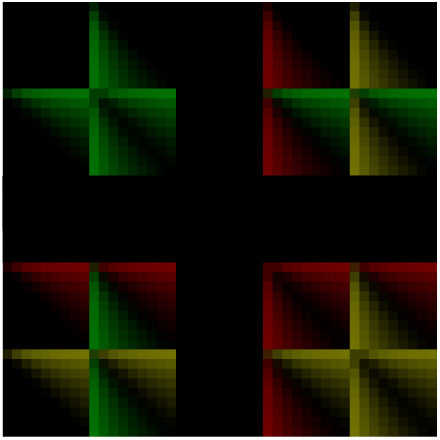  

### 混合颜色

得到每个像素用于混合颜色的面积权重后, MLAA就只剩下最后一步了. 对于每个像素, 按照计算好的X方向权重和Y方向权重, 与周边的颜色进行对应的加权平均. 混合公式结果如下, 可以看到边缘原先十分锐利的像素得到了有效的模糊, 且模糊后的图像整体形状没有太大的改变. 后面是实际使用时的代码, 为了处理图像边缘时算法也能正常工作而做出了一些优化.

$$
C_{newX}=(1-W_{top_{out}}-W_{old_{in}})*C_{old}+W_{top_{out}}*C_{top}+W_{old_{in}}*C_{down}
$$
$$
C_{newY}=(1-W_{right_{out}}-W_{old_{in}})*C_{old}+W_{right_{out}}*C_{right}+W_{old_{in}}*C_{left}
$$
$$
C_{new}=(C_{newX}+C_{newY})/2
$$

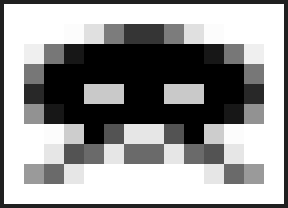  

```python
def _blend_color(img_in, img_weight):
    img_blended= np.zeros((img_in.shape[0],img_in.shape[1]))
    for y in range(0, img_in.shape[0]):
        for x in range(0, img_in.shape[1]):
            img_blended[y, x]=(2-img_weight[y,x,0]-img_weight[y,x,2])*img_in[y,x]
            if y!=0:
                img_blended[y, x]+=img_in[y-1,x]*img_weight[y,x,0]
            if y!=img_in.shape[0]-1:
                img_blended[y, x]+=(img_in[y+1,x]-img_in[y,x])*img_weight[y+1,x,1]
            if x!=0:
                img_blended[y, x]+=img_in[y,x-1]*img_weight[y,x,2]
            if x!=img_in.shape[1]-1:
                img_blended[y, x]+=(img_in[y,x+1]-img_in[y,x])*img_weight[y,x+1,3]
            img_blended[y, x]/=2
    return img_blended
```

## 结果

​在Jimenez的实现中, MLAA中除了预计算的面积索引图外还借助显卡硬件加速的线性插值特性在边缘图中简化了模式分类的步骤, 具体的优化流程在这就不详细介绍了. 高度优化后MLAA的执行效率远高于效果相近倍率下的MSAA, 有很强的实用性.

​需要注意到MLAA仅仅是形态抗锯齿系列算法的开创者, 其仍然存在非常多的缺点: 例如剧烈变换的场景下容易产生鬼影现象, 对走样边缘的判断只有一个像素也不够准确, 抗锯齿后文字容易模糊等. 后续人们在MLAA的基础上优化开发了例如SMAA, FXAA, CMAA等更实用的抗锯齿算法, 以后有机会再介绍.

下图是Jimenez论文中给出的结果, 可以看到MLAA能够达到和MSAA接近的抗锯齿效果. 

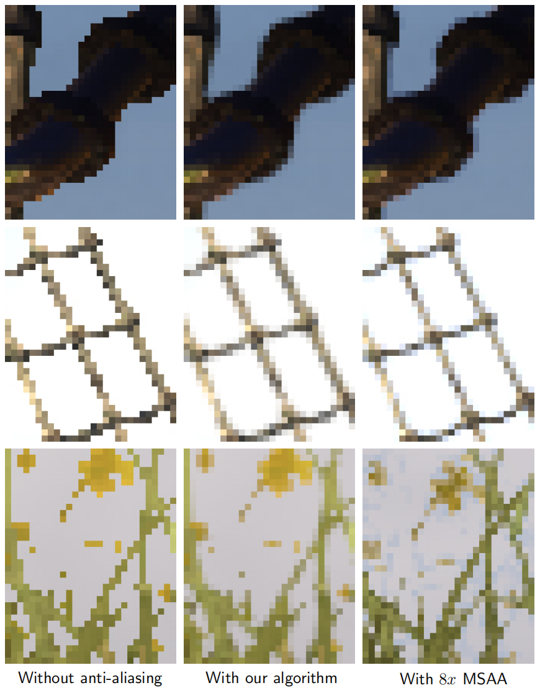  

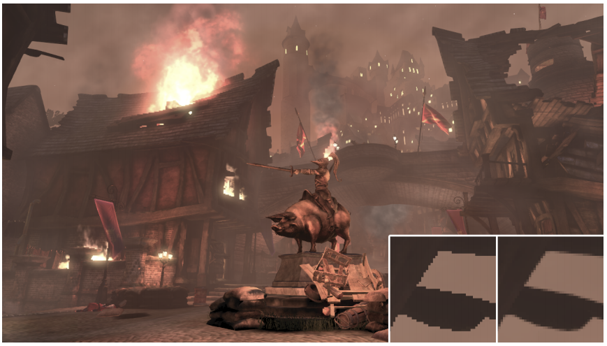  