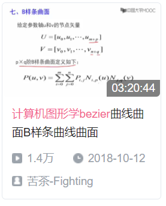
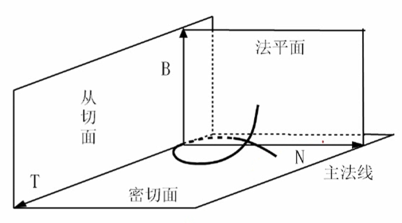
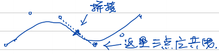
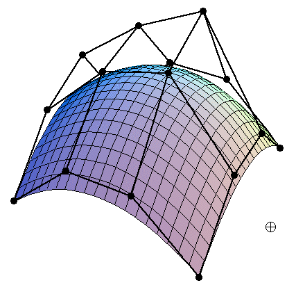
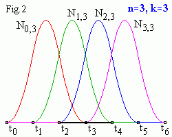
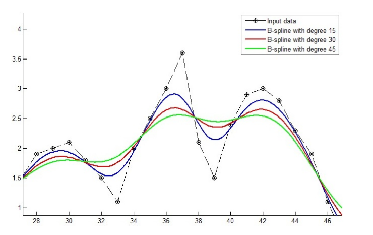
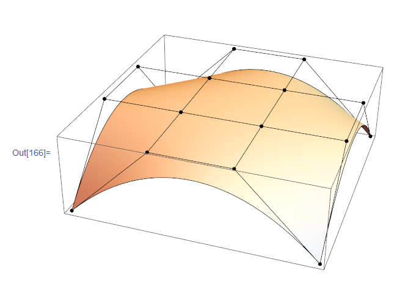

# 样条曲线曲面 笔记

- [样条曲线曲面 笔记](#样条曲线曲面-笔记)
  - [概览](#概览)
  - [参数曲线曲面和数学(P2~P8)](#参数曲线曲面和数学p2p8)
    - [参数方程的优势](#参数方程的优势)
    - [参数方程中的曲线几何性质](#参数方程中的曲线几何性质)
    - [光顺](#光顺)
    - [曲线连续性](#曲线连续性)
    - [参数曲线插值](#参数曲线插值)
  - [贝塞尔曲线(P9~P17)](#贝塞尔曲线p9p17)
    - [定义](#定义)
    - [伯恩斯坦基函数性质](#伯恩斯坦基函数性质)
    - [贝塞尔曲线性质](#贝塞尔曲线性质)
    - [绘制贝塞尔曲线](#绘制贝塞尔曲线)
    - [分段贝塞尔曲线](#分段贝塞尔曲线)
    - [升阶和降阶](#升阶和降阶)
  - [贝塞尔曲面(P18~P20)](#贝塞尔曲面p18p20)
    - [贝塞尔曲面定义](#贝塞尔曲面定义)
    - [贝塞尔曲面性质](#贝塞尔曲面性质)
    - [绘制贝塞尔曲面](#绘制贝塞尔曲面)
  - [B样条曲线(P21~P26)](#b样条曲线p21p26)
    - [B样条曲线定义](#b样条曲线定义)
    - [B样条曲线性质](#b样条曲线性质)
    - [B基函数性质](#b基函数性质)
    - [绘制B样条曲线](#绘制b样条曲线)
    - [几种B样条曲线](#几种b样条曲线)
  - [B样条曲面(P27)](#b样条曲面p27)

## 概览

这是看[中国农大的图形学公开课](https://www.bilibili.com/video/BV1Dt411f7Qj)的笔记, 简单介绍了贝塞尔*Bezier*曲线曲面和B样条*B-Spline*曲线曲面, 能够带来一个大概视角和总览. 

  

所谓样条指的是计算机出现前设计者所用的一系列形状固定的模具, 用于拼接绘制复杂的曲线. 样条曲线这个名字形象地表达出这种用多个有规律的多项式函数拼接拟合复杂曲线的方法, 并也最常用于设计行业. 

## 参数曲线曲面和数学(P2~P8)

### 参数方程的优势

参数方程形如$p(t)=x(t)+y(t)+z(t)$, 即由$p=p(t)$组成的一个有界点集, 其中t是参数, 样条曲线就常用参数方程表达, 有下面几个优势:

1. 几何不变性: 只与点间相对位置有关, 与坐标系选择无关
2. 自由度高: 每个维都有自己独立的方程, 因此可调整的参数比直接表达要多
3. 可以通过直接调整参数方程来进行几何变换
4. 方便处理斜率无穷大的情况
5. 方便查找边缘, 可以归一化定义域
6. 容易转为向量或矩阵形式来计算

### 参数方程中的曲线几何性质

- 切向量: $T=\frac{dP}{ds}=P'(t)$
- 单位切向量: $T=\frac{P'(t)}{|P'(t)|}$
- 曲率: 对切向量再求导
- 曲率半径: 曲率的导数
- 法向量: 切向量T和副法向量B的叉乘
- 挠率: 曲线的扭曲程度(离开密切面的程度), 与副法线的夹角在弦长上的导

  

### 光顺

插值和拟合都可以被称为逼近, 但是插值必须经过所有输入点, 样条曲线属于对输入点的拟合, 不会经过所有点.

描述曲线的平滑, 最好能够:

1. 尽量高阶的连续性
2. 没有多余的拐点和奇异点
3. 曲率变化较小

### 曲线连续性

参数连续性:

- 0阶连续性$C^0$, 判断处的两端点的值相同
- 1阶连续性$C^1$, 判断处的两端一阶导相同
- 2阶连续性$C^2$, 判断处的两端二阶导相同...

几何连续性:

- 0阶连续性$G^0$, 判断处的两端点的值相同
- 1阶连续性$G^1$, 判断处的两端一阶导成比例
- 2阶连续性$G^2$, 判断处的两端二阶导成比例...

### 参数曲线插值

两点间有无数种插值方法, 使用不同的参数方程和参数化会插值出不同的值

- 节点: 每个待得的参数值
- 型值点: 已有的点
- 参数分割: 参数域上决定的一种节点取值的分割
- 参数化: 对一组型值点确定出来的参数分割
- 均匀参数化: 在参数轴上等距分割
- 累加弦长参数化: 根据线的长度分割
- 向心参数化: 用线与某点之间的转角角度

## 贝塞尔曲线(P9~P17)

### 定义

贝塞尔曲线, 是后面B样条曲线的一种特例, 属于几何形式的参数化曲线, 目的是输入一系列有序的控制点组成特征多边形, 然后是对特征多边形进行逼近得到光滑曲线. 公式如下

$$
p(t)=\sum^n_{i=0}P_iB_{i,n}(t), \quad t\in[0,1]
$$

其中$B_{i,n}(t)$是伯恩斯坦基函数, 实际上是$[t+(1-t)]^n$的牛顿二项式展开形式, 具体公式如下:

$$
B_{i,n}(t)=\frac{n!}{i!(n-i)!}t^i(1-t)^{n-i}=C^i_nt^i(1-t)^{n-i}, \quad i=0,1,...,n
$$

一次的贝塞尔曲线由两个控制点组成, 展开后相当于两点间的线性插值, 二次贝塞尔曲线相当于抛物线插值等等...

### 伯恩斯坦基函数性质

1. 非负性: $B_{i,n}(t)>=0$
2. 权性: 所有基函数在当前参数上的值的和为1
3. 端点性: $B_{0,n}(0)=1$, $B_{n,n}(1)=1$
4. 对称性: 顶点顺序反向则形状不变, 曲线方向反向
5. 递推性: n次的B可由两个n-1次的B线性组合得到
6. 导函数: $B'_{i,n}(t)=n[B_{i-1,n-1}(t)-B_{i,n-1}(t)]$
7. 最大值: $t=\frac{1}{n}$处最大
8. 积分: $\int^1_0B_{i,n}(t)dt=\frac{1}{n+1}$
9. 凸包: 曲线落在控制点产生的凸包中, 使得控制点重合或共线时也能正常计算

### 贝塞尔曲线性质

1. 端点性: 曲线只会经过头尾两个端点
2. 导函数: 曲线的起点与终点的切线和第一与倒数第一条特征线一致
3. 几何不变: 曲线形状只与点的相对位置有关
4. 变差缩减: 面上任一直线与曲线的交点个数不多于此直线与曲线的特征多边形产生的交点个数, 意味着曲线比多边形更光顺

### 绘制贝塞尔曲线

代入法: 直接用定义式来绘制, 计算复杂

递推法: 由于n次的B可由两个n-1次的B线性组合得到, 一次的贝塞尔曲线由两个控制点组成, 展开后相当于两点间的线性插值, 所以二次的贝塞尔曲线是由三个控制点, 这三个控制点按顺序连成两个线段, 各自进行对应参数的线性插值, 然后得到的两个新点连成新的线段, 在线段上同样线性插值得到. 高次的贝塞尔曲线就是不断插值得到. 写为递推式:

$$
P_i^k=
\left\{
\begin{array}{lcl}
P_i,& &{k=0} & \\
(1-t)P_i^{k-1}+tP_{i+1}^{k-1},& &{k=1,2,...,n,} &{i=0,1,...,n-k}\\
\end{array} \right.
$$

绘制示意图如下:

  

### 分段贝塞尔曲线

即便迭代法可以大大加快贝塞尔曲线的绘制, 但是绘制高次贝塞尔曲线仍然很大, 且由于贝塞尔曲线是由作用域在整个定义域上的大量基函数线性组合得到, 因此高次的贝塞尔曲线会由于组合过于复杂而很不稳定且难以控制, 因此实际中常常通过多个不高于4次的小段贝塞尔曲线组合得到整个曲线.

组合分段曲线要注意头尾拼接的问题, 常用的拼接需要满足$G^1$连续性, 由于贝塞尔曲线曲线的起点与终点的切线和第一与倒数第一条特征线一致, 因此只要保证连接的两段贝塞尔曲线的连接点和相邻两点形成的三点共线即可.

  

### 升阶和降阶

升阶就是增加曲线控制点的数量而不改变曲线形状, 下面的定义式可以计算出可以在i处插入的新控制点的位置, 顶点越多, 形成的特征多边形就会越逼近实际曲线:

$$
P_i^*=\frac{i}{n+1}P_{i-1}+(1-\frac{i}{n+1})P_i
$$

降阶则是在尽量不改变曲线形状的情况下减少控制点的数量, 这是个比较复杂的问题, 下面的递推式是一种比较简单的方法:

$$
P_i^*=\frac{nP_i-iP_{i-1}^*}{n-i}\\
P_{i-1}^*=\frac{nP_i-(n-i)P_i^*}{i}
$$

## 贝塞尔曲面(P18~P20)

### 贝塞尔曲面定义

贝塞尔曲面实际上是贝塞尔曲线的扩展, 将特征多边形增加一个维度变为特征网格, 然后同样是利用线性组合得到所需的点. 定义式如下:

$$
p(u,v)=\sum^m_{i=0}\sum^n_{j=0}P_{i,j}B_{i,m}(u)B_{j,n}(v), \quad u,v \in[0,1]
$$

函数B仍然是伯恩斯坦基函数. 曲面由四角的四个角点和角点组成的四条边界线构成.

### 贝塞尔曲面性质

1. 曲面必过四个角点
2. 最外的一圈点决定了曲面的边界
3. 和贝塞尔曲线一样有几何不变性, 对称性, 凸包性等...
4. 顶点过多时也会产生波动且计算复杂
5. 复杂的贝塞尔曲面也是由多段拼接得到的, 通常使用不超过4次的子曲面拼接
6. 拼接算法比曲线复杂
7. 也有递推性, 可以递推绘制
8. 同样不能局部修改, 牵一发而动全身

### 绘制贝塞尔曲面

除了使用定义法绘制外, 常用方法同样是递推法. 曲面是曲线在不同维度上的线性组合得到的, 核心思想是依次插值每个轴, 逐步缩小范围. 以先u再v为例, 首先在每个拥有参数分割的v上, 固定v不变, 得到一串串控制点, 对这些计算贝塞尔曲线, 得到一系列对应输入u新的点. 得到的这一系列点再对参数v进行贝塞尔曲线计算, 这样迭代到只有一个点时这个点就是曲面对应的点.

实际上这个递推就是如下在定义式上加个优先级约束从而将曲面计算转为递推的曲线计算而已:

$$
p(u,v)=\sum^m_{i=0}(\sum^n_{j=0}P_{i,j}B_{i,m}(u))B_{j,n}(v), \quad u,v \in[0,1]
$$

  

## B样条曲线(P21~P26)

### B样条曲线定义

B样条曲线实际上是对贝塞尔曲线的扩展, B指Basic, 或者说贝塞尔曲线是B样条曲线的特例, B样条曲线通过一系列范围有限的基函数组合来解决贝塞尔曲线牵一发而动全身的缺点. 其定义式和贝塞尔曲线相似:

$$
p(t)=\sum^n_{i=0}P_iB_{i,k}(t), \quad t\in[t_{k-1},t_{n+1}]
$$

B样条曲线的核心是其基函数, 称为k阶(k-1次)基函数. 这也是有递推性的基函数, 定义如下, 这里还要注意到基函数的作用域变小了, 有限的作用域使得计算复杂度降低且更稳定:

$$
B_{i,k}=
\left\{
\begin{array}{lcl}
B_{i,1}=
\left\{
\begin{array}{lcl}
    1,& &t_i<t<t_{i+1}\\
    0,& &else\\
\end{array} \right.\\
\\
B_{i,k}=
\frac{t-t_i}{t_{i+k-1}-t_i}B_{i,k-1}(t)+\frac{t_{i+k}-t}{t_{i+k}-t_{i+1}}B_{i+1,k-1}(t)\\
\end{array} \right.
$$

### B样条曲线性质

1. 局部性: 一个控制点的作用范围只能影响k个点, 这是B样条改进的核心
2. 其它的变差缩减性, 几何不变性, 凸包性和贝塞尔曲线一样

### B基函数性质

1. 局部支撑性: 各个基函数只在对应小区间上对曲线有影响
2. 权性: 区间内权和为1
3. 连续性: r重节点处连续性不低于k-1-r, 只有当节点处包含了足够多的基函数时才满足$G^2$连续性
4. 分段多项式: 计算快, 稳定, 容易修改

B基函数的示意图:

  

### 绘制B样条曲线

如果将这个绘制出来的话, 一阶的B样条是两个节点组成的一个区间, 区间本身就是值为1的常函数. 插值的核心发生于大于1阶的时候加入的这个线性插值系数, 这个参数使得常函数被折为折线, 再形成三阶的抛物线...具体绘制的方法就是利用这个线性插值系数得到递推的点, 总体上和贝塞尔曲线的绘制是一样的.

  

### 几种B样条曲线

1. 均匀B样条曲线: 指的是参数轴形如(0,1,2,3,4)均匀分割, 这会使得基函数呈周期性, 后续的基函数只是前面基函数在新位置上的重复, 这种情况下曲线不一定经过两个端点
2. 准均匀B样条曲线: 两端节点有k重复度形如(0,0,0,1,2,3,4,4,4), 使得曲线必然经过两个端点
3. 分段贝塞尔曲线: 两端处有k重复度, 同时内部节点有k-1的重复度
4. 非均匀B样条曲线: 是不等距的分割, 这会使得$t_{i+1}-t_i$不是常数, 这种B样条曲线能够更加自由的使用, 其中限制除法结果必须是有理数的非均匀有理B样条(NURBS)由于计算代价较小而使用自由因此在设计行业中广为使用

## B样条曲面(P27)

定义式如下, 构造方法原理与贝塞尔曲面相同:

$$
p(u,v)=\sum^m_{i=0}\sum^n_{j=0}P_{i,j}B_{i,p}(u)B_{j,p}(v)
$$

  
