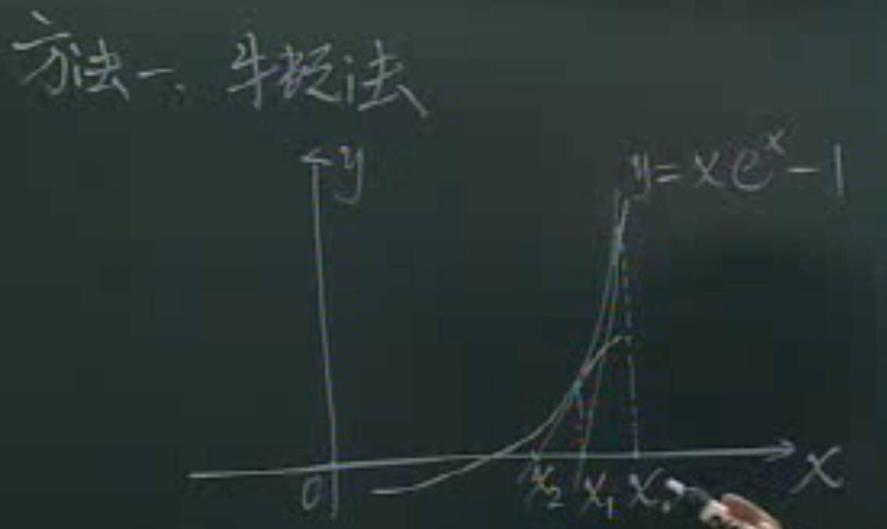
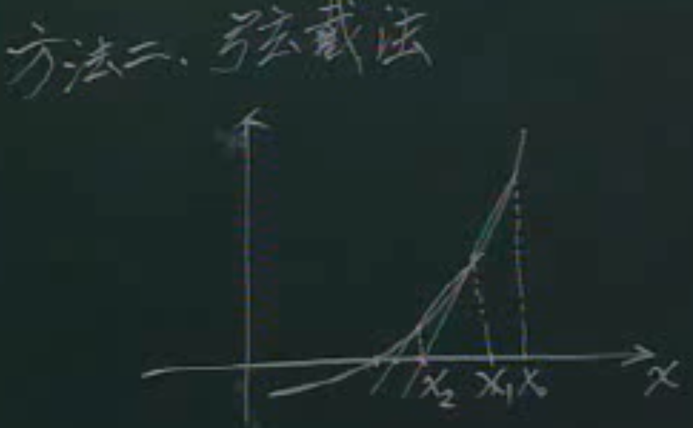

# 1 数值计算方法的意义及内容

- [1 数值计算方法的意义及内容](#1-数值计算方法的意义及内容)
  - [1.1 意义](#11-意义)
  - [1.2 内容](#12-内容)

## 1.1 意义

学习高效求解数值模型，也就是适用于计算机的求解数学模型的算法，很多问题求解精确解很难甚至做不到，这种方法得到的结果会是数值解(近似解)。

`例`
求解$y=xe^x-1$

- 牛顿法

从任意一个点x0开始，得到切线，根据切线移动到x1，再切线...迭代多次得到的x是解

  

- 弦截法

从两个点开始，连接两个点，得到弦，延长交于另一个点，又能连接，迭代多次...

  

## 1.2 内容

- 非线性方程的求解
- 线性方程组的求解
- 插值运算
- 数值微积分
- 矩阵特征值的求解