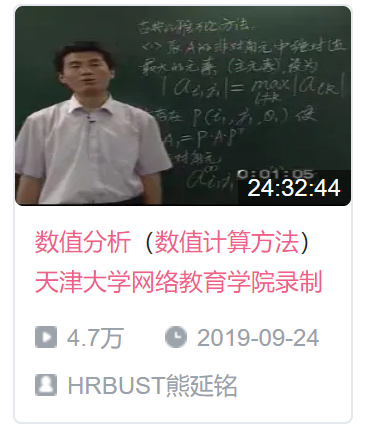

# 天津大学-数值计算方法 笔记

 

[Bilibili：数值分析（数值计算方法）天津大学网络教育学院录制](https://www.bilibili.com/video/BV1FJ411u7uZ)

## 暂时坑住, 但是迟早回来看

## 课程笔记

1. [第一章-绪论](./第一章%20绪论/README.md)
2. [第二章-非线性方程的求解](./第二章%20非线性方程的求解/README.md)