# 数值计算方法笔记 第一章 绪论

- [数值计算方法笔记 第一章 绪论](#数值计算方法笔记-第一章-绪论)
  - [1 数值计算方法的意义及内容](#1-数值计算方法的意义及内容)
    - [1.1 意义](#11-意义)
    - [1.2 内容](#12-内容)
  - [2 误差和有效数字](#2-误差和有效数字)
    - [2.1 误差的来源](#21-误差的来源)
    - [2.2 绝对误差与绝对误差限](#22-绝对误差与绝对误差限)
    - [2.3 相对误差与相对误差限](#23-相对误差与相对误差限)
    - [2.4 有效数字](#24-有效数字)
  - [3 数值计算中应该注意的问题](#3-数值计算中应该注意的问题)
    - [3.1 防止相近的两个数直接相减](#31-防止相近的两个数直接相减)
    - [3.2 防止大数"吃掉"小数](#32-防止大数吃掉小数)
    - [3.3 防止除法中除数的数量级远小于被除数](#33-防止除法中除数的数量级远小于被除数)
  - [4 向量和矩阵范数](#4-向量和矩阵范数)
    - [4.1 向量范数](#41-向量范数)
    - [4.2 矩阵范数](#42-矩阵范数)

## 1 数值计算方法的意义及内容

### 1.1 意义

学习高效求解数值模型，也就是适用于计算机的求解数学模型的算法，很多问题求解精确解很难甚至做不到，这种方法得到的结果会是数值解(近似解)。

`例`
求解$y=xe^x-1$

- 牛顿法

从任意一个点x0开始，得到切线，根据切线移动到x1，再切线...迭代多次得到的x是解

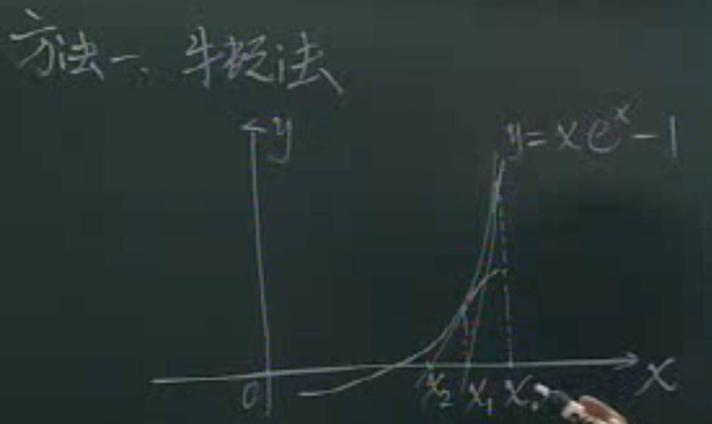  

- 弦截法

从两个点开始，连接两个点，得到弦，延长交于另一个点，又能连接，迭代多次...

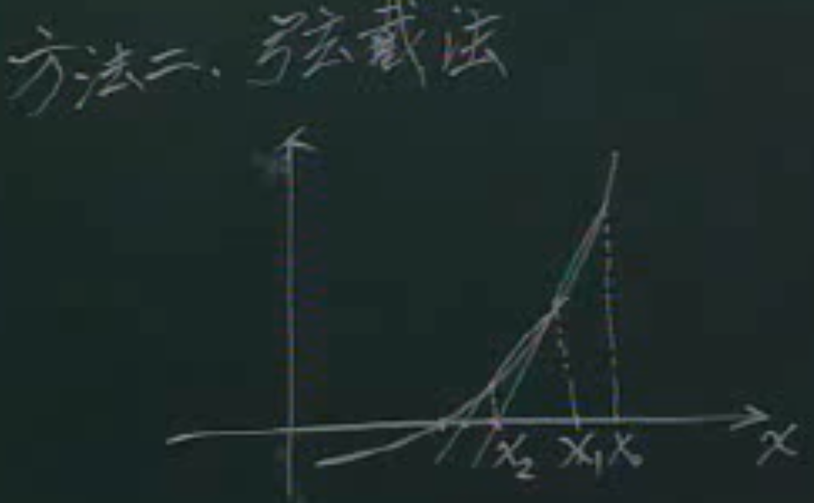  

### 1.2 内容

- 非线性方程的求解
- 线性方程组的求解
- 插值运算
- 数值微积分
- 矩阵特征值的求解

## 2 误差和有效数字

### 2.1 误差的来源

1. 模型误差：建立的数学模型因为条件不完美而出现误差
2. 观测误差：测量时候导致的
3. 截断误差：迭代时无法达到无限次而省去的部分
4. 舍入误差：无限位的数舍入的时候导致的误差

### 2.2 绝对误差与绝对误差限

绝对误差：设 $x^*$ 是x的一个近似值，则称 $\epsilon^*=x^*-x$ 为绝对误差。

绝对误差限：因为很多时候我们不知道x的真值，所以要有个范围。使 $|x^*-x|<=e^*$ 成立的最小的 $e^*$ 称为绝对误差限。

`例`
光速为$C_0=299792458\pm 1.2m/s$，说明若以299792458为光速近似值，则误差限为1.2m/s。

### 2.3 相对误差与相对误差限

$\frac{x^*-x}{x}$ 称为相对误差，使 $\frac{x^*-x}{x}<=e^*$ 成立的最小的 $e^*$ 称为相对误差限。

### 2.4 有效数字

称x的第一位非零数字到最后一位数字之间的所有位数称为x的有效数字。

某值的近似值，有效数字位数越多，误差就越小。

## 3 数值计算中应该注意的问题

### 3.1 防止相近的两个数直接相减

容易造成有效数字的减少

`例` 23.034-22.993=0.041

这里本来5位有效数字现在只剩下两位了

`例` 求 $\sqrt{2.01}-\sqrt{2}$ ，要求准确到5位有效数字

通过将减法编程加法，例如分子有理化：

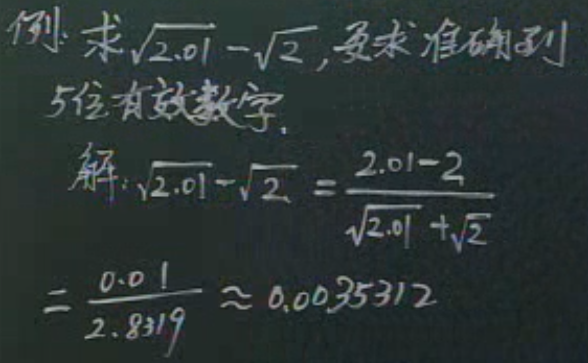  

### 3.2 防止大数"吃掉"小数

`例` 求$x^2-(10^8+1)x+10^8=0$的根

准确解是$x_1=1, x_2=10^8$

数值方法1：用求根公式，导致 $x_1$ 出现很大的误差，这是因为 $10^8$ 比1大太多，将小数吃掉了

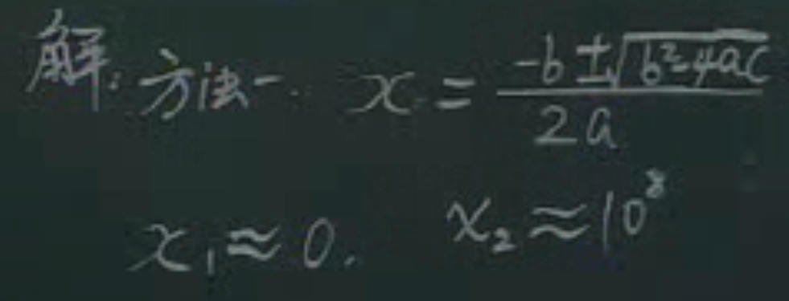  

数值方法2：$x_2$ 仍然用求根公式， $x_1$ 用韦达定理

>韦达定理：$x_1+x_2=-\frac{b}{a}, x_1x_2=\frac{c}{a}$

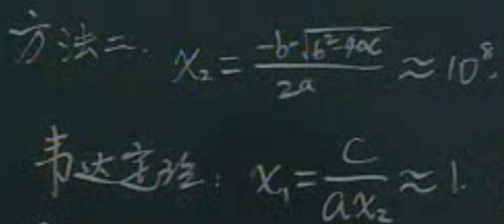  

### 3.3 防止除法中除数的数量级远小于被除数

要注意计算机的数值表示范围，防止超出范围

## 4 向量和矩阵范数

### 4.1 向量范数

范数和数的绝对值接近，用来衡量向量/矩阵的大小

定义：设 $x\in R^n$ ，若存在一个 $||x||\in R$ 使以下成立

1. $||x|| >= 0$ 且 $||x|| = 0 \Leftrightarrow x=0$
2. $\forall \alpha \in R, ||\alpha \cdot x||=|\alpha| \cdot ||x||$
3. $||x+y||<=||x||+||y||$

则称$||x||$为x的范数，和绝对值的定义差不多。只要满足以上规则都是范数，因此范数可以有多种定义

常用的向量范数：

1. 1范数：各个分量的绝对值之和
   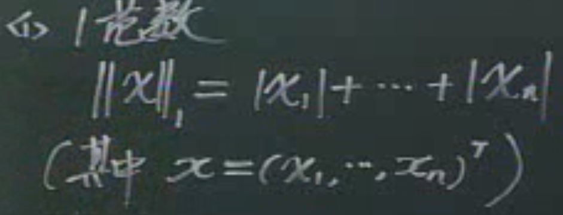  
2. 2范数：分量平方和开根
   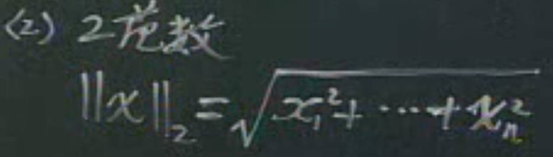  
3. $\infin范数$：求各个分量绝对值的最大值作为范数
     

`例` 求向量$x=(0,1,-2,3)^T$的1，2，无穷范数

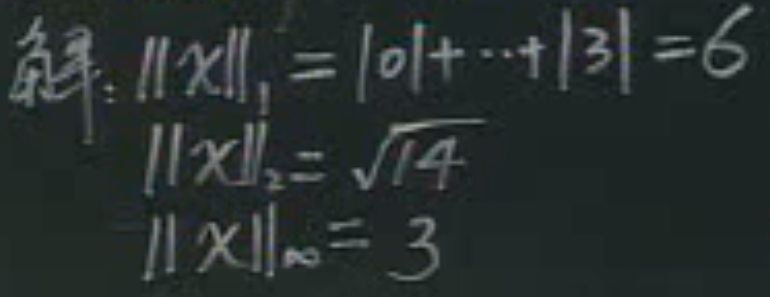  

### 4.2 矩阵范数

必须是方阵

定义：设A是n阶方阵，若存在一个 $||A||\in R$ 使以下成立

1. $||A|| >= 0$ 且 $||A|| = 0 \Leftrightarrow A=0$
2. $\forall \alpha \in R, ||\alpha \cdot A||=|\alpha| \cdot ||A||$
3. $||x+y||<=||x||+||y||$
4. $||AB||<=||A|| \cdot ||B||$
  
常用的矩阵范数：

1. 1范数(列范数)：各列绝对值之和，取最大的一个
   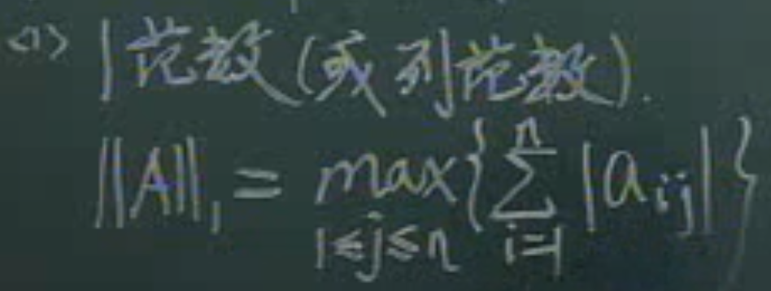  
2. 无穷范数(行范数)：各行绝对值之和，取最大的一个
   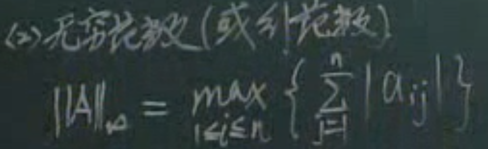  
3. F范数：所有元素的平方和，开方
   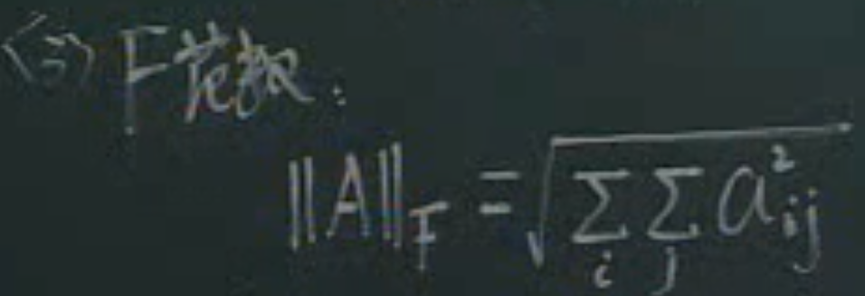  
4. 2范数：$A^TA$最大特征值开根号，是常用的范数
   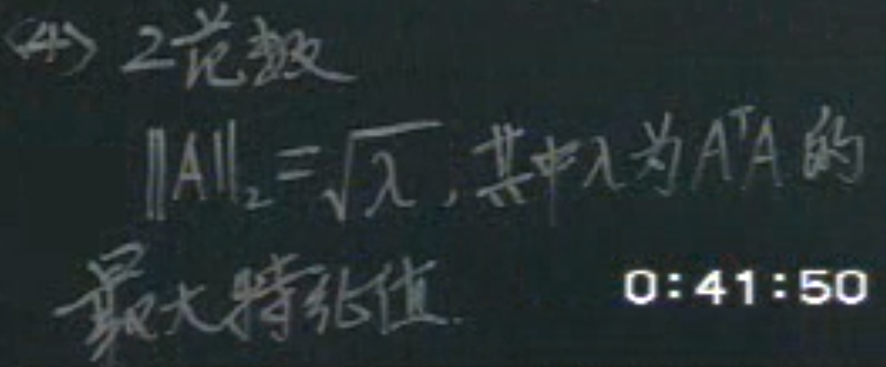  

`例` 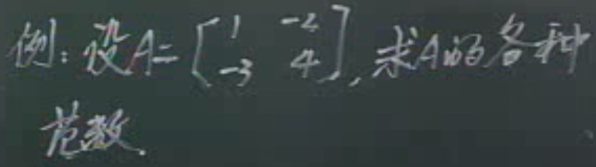  
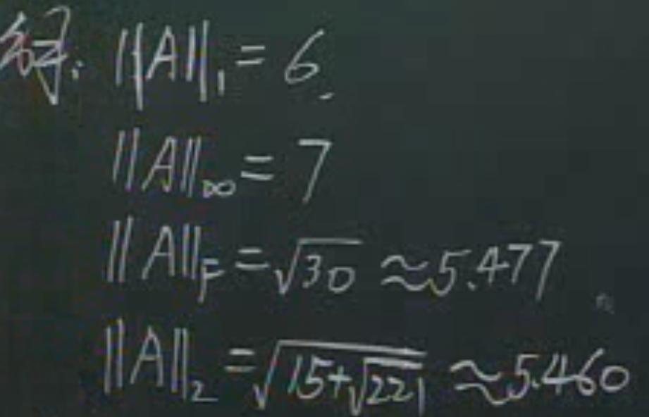  