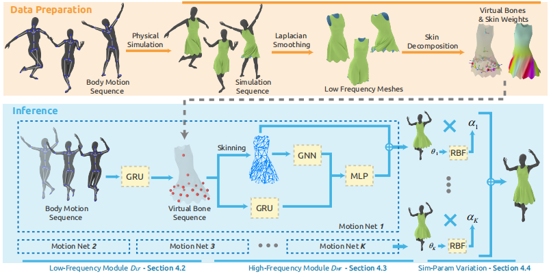

# 来用机器学习来加速布料模拟吧!

- [来用机器学习来加速布料模拟吧!](#来用机器学习来加速布料模拟吧)
  - [引言](#引言)
  - [实时布料模拟](#实时布料模拟)
  - [传统方法](#传统方法)
  - [统计方法-直接预测形变后的顶点](#统计方法-直接预测形变后的顶点)
  - [统计方法-预测法线进行高频优化](#统计方法-预测法线进行高频优化)
  - [机器学习布料模拟的难点](#机器学习布料模拟的难点)
  - [相关资料](#相关资料)

## 引言

**好久不见, 大家新年快乐!**

我们知道布料模拟在目前的游戏中虽然很常用, 但实际上开销很大而精度偏低, 为此我在前段时间了解了一些借助机器学习进行布料模拟的方法. 基于机器学习的方法的本质都是令神经网络将离线模拟器中的布料模拟结果进行记忆, 再采用近似于查表的方法快速预测出高精度的布料模拟结果, 从而用更低的时间开销换来更好的模拟效果(当然缺陷是带来了更大的内存开销并存在一定的不稳定性).

本文不会就具体算法进行深入的介绍, 而是就这个话题进行一些简单的总结性介绍, 更接近一份调研记录. 文中的部分参考资料可能无法直接在网上看到(例如需要GDC会员权限), 见谅.

## 实时布料模拟

有关实时布料模拟的方法大致可以划分为以下两大类, 传统方法是目前游戏中比较常用的方法, 统计方法则是目前在学术界比较常见但还没有充分落地的基于机器学习的前沿方法. 在这些方法中, 传统方法在大多数游戏引擎中都有支持, 使用起来相对简单; 统计方法目前常见的只有UE5.1新出的ML Deformer这个还处于测试阶段的插件, 整体用起来还不太方便, 很多时候还是需要我们自己基于论文进行实现和优化.

  

## 传统方法

在传统方法中, 前两个方法在游戏中非常常见, 以UE为例, 骨骼方案可以对应Kawaii Physics这样的插件, 网格方案可以对应Chaos Cloth这样的官方系统. 这两种方法的优点是调试简单且算法成熟, 缺点是为了更高的执行效率不得不在布料复杂度上做出妥协, 这些方法将整个需要模拟的布料抽象为被数量并不多的骨骼或低精度三角形网格代表的插值网格, 因此活动的时候会显得比较僵硬, 且容易产生奇怪的穿模效果.

传统方法中的第三个方法比较特别, 其思路有些类似BlendShape在面部肌肉动画中的应用方式, 在过场动画等需要更高模拟精度的场景中会应用到, 2018年的蜘蛛侠和TLOU2中都有相关的应用, 其中TLOU2在这方面的探索更加深入而成熟, 可能能够成为未来实时布料模拟的一种发展方向, 相关资料可以观看下面对应的两个GDC.

> Real-Time Cloth Solutions on 'Marvel's Spider-Man'
> 
> Character Technology of 'The Last of Us Part II'

## 统计方法-直接预测形变后的顶点

用基于统计的方法来实现快速的布料模拟并不是什么新鲜的想法, 最直观的思路就是输入与所需的模拟有关的参数(如碰撞体位置, 或人体姿态各个关节的旋转之类), 然后利用统计模型输出布料形变后的顶点位置. 早在下面这篇2010年的论文中实现了这种思路, 其借助人体骨骼在某个姿态下的骨骼旋转(以下称为pose)来作为方法的输入, 输出形变后的网格顶点. 

> Example-Based Wrinkle Synthesis for Clothing Animation

  

上面的这个早期方案还没有引入神经网络, 而后来的方法引入了神经网络. 下面的Virtual Try-On方案就是比较典型的模型, 其使用了神经网络, 且在输入pose的同时考虑了与身体形状有关的body shape参数, 从而实现了较高质量的实时试穿效果. 值得一提的是这篇文章的Related Works总结的不错, 需要寻找思路的时候可以从这里开始索引.

> Learning-Based Animation of Clothing for Virtual Try-On

  

常见的布料模拟为了节省计算量都是只针对人物的局部运动进行处理, 并没有考虑与周边环境的碰撞. 下面的论文中育碧通过将两个物体的参数化信息一起引入神经网络训练从而实现对物体交互的推理, 效果还不错. 但这种方法显然在建模上不够自由, 难以支持更多数量的物体, 也难以支持更多种类的物体.

> Subspace Neural Physics Fast Data-Driven Interactive Simulation

  

除开直接预测形变后的完整表面, 研究者从人眼观察的角度注意到, 尽管人能灵敏察觉出低频的衣物褶皱是否合理, 但更为细节褶皱的正确性其实并不容易分辨, 因此将目标模拟效果分为高频和低频两阶段分别进行处理是近来方法的潮流.

在这系列方法中, TailorNet是常用作Baseline比较的神经网络方法之一, 其首先用网络预测某个pose下衣物会产生的低频褶皱作为整体的形变, 然后只按照当前衣物的style和人体的shape用RBF方法插值得到高频褶皱, 二者相加后再进行skinning得到最终的衣物. 尽管RBF得到的细节并不够合理和准确, 但这仍然是合理的效率与效果上的权衡.

> TailorNet: Predicting Clothing in 3D as a Function of Human Pose, Shape and Garment Style

  

同样在分离高低频处理的思路上, 2022年的VirtualBones方法则通过引入称为virtual bones的虚拟节点, 从而引入了Smooth Skinning Decompostion优化skinning效果, 在效率和效果上得到 了较好的平衡.

> Predicting Loose-Fitting Garment Deformations Using Bone-Driven Motion Networks

  

下面2022年的另一篇文章PBNS则没有进行高低频分离, 其创新点在于提出了一系列loss实现布料模拟的无监督训练, 解决了以上这些基于机器学习的布料模拟方法在训练效率上的问题. 然而如论文中所述, 这种方法的缺点是无监督训练并不能得到与离线模拟器得到的模拟结果那样符合物理规律的结果, 尽管很多时候人眼不会察觉出褶皱的错误, 但在极端情况下或存在对比的情况下这种方法会产生很强的穿帮感.

> PBNS: Physically Based Neural Simulation for Unsupervised Garment Pose Space Deformation

  

## 统计方法-预测法线进行高频优化

上一点中提到的分高低频分别处理的思路的核心优化是让开销较大的算法用来得到视觉上较为明显的低频形变, 再用开销较小的算法得到能够有效提高视觉质量而又很难实时模拟的高频内容的形变. 然而直接对网格顶点进行预测即便有这种优化仍然在效率上存在问题, 主要是高质量的形变效果需要网络输出大量的顶点才能实现. 由于高频形变一般不会很大地影响目标布料的外观轮廓, 因此研究者想到借助法线来代替高频内容的顶点变换, 从而进一步提高方法的效率.

在基于法线进行高频优化的方法中, 较早的有影响力的方法是下面的DeepWrinkles, 这个方法先用统计模型得到低频的衣物变形形状, 再用一个图像生成网络CGAN将形变后的低频表面的法线进行增强操作得到代表高频褶皱的法线, 再重新应用到衣物上. 这个方法思路比较直观, 但受限于目前图像生成网络的执行效果和执行效率问题, 实际应用中大量的耗时应用到了图像生成网络上, 且得到的效果也不够理想.

> DeepWrinkles: Accurate and Realistic Clothing Modeling

  

2021年, mihoyo的下面这篇文章将DeepWrinkles的低频生成阶段改为用实时物理模拟来得到. 由于在低频上利用模拟进行计算, 因此在泛用性上更高一些, 能够支持更宽松的衣物(如裙子), 但同样存在效率和效果问题.

> Deep Detail Enhancement for Any Garment

  

2021年的EA的论文Swish是落地在体育游戏NFL2021的方案, 前面提到了图像生成网络存在效率和效果两大问题, 因此Swish将网络推理法线图改为从预生成的法线图数据库中进行搜索并直接替换使用, 令这两个问题得到了解决, 内存占用和时间消耗都降低到可以接受的状态, 且在静态画面中无懈可击. 然而这个方案如文中所示在邻近法线切换的时候存在跳变的问题(即便应用平滑过渡效果).

> Swish: Neural Network Cloth Simulation on Madden NFL 21

  

在工业界中, 望尘科技则在他们的足球游戏中对一套类似Swish混合的布料方案进行了落地, 但从介绍中看到它们通过PCA直接生成了法线数据, 这是Swish论文中提到的由于最终得到的法线数据精度不足而放弃的废案之一. 从它们的Demo视频中感觉法线存在较严重的切换不流畅问题.

> Unity技术开放日 | 绝对干货 - 基于Unity开发跨平台的主机级体育游戏 https://www.bilibili.com/read/cv14230043
> 
> 布料Demo https://www.zhihu.com/zvideo/1266012043703627776

  

## 机器学习布料模拟的难点

以上的这么多方案中, 经过我的调研, 机器学习布料模拟主要存在以下几个较难解决的问题:

1. 统计学习模型在每套布料, 每个身体形状中大多需要对模型进行重新训练, 这带来了大量的时间和空间开销. 虽然有将布料和身体也作为参数输入网络的方案, 但这些额外参数的选择需要大量取舍且无法保证正确的效果.
2. 无论是传统的物理模拟方案还是基于机器学习的方案, 在网格精度不高的时候都很可能出现穿模问题, 且这个问题由于神经网络的不确定性, 在基于机器学习的方案中更加严重. 一般只能通过后处理并在训练中加入碰撞loss来进行优化.
3. 无论是传统的物理模拟方案还是基于机器学习的方案, 如果需要处理布料与环境碰撞的问题, 都需要引入额外的碰撞体. 在传统方法中引入额外碰撞体是比较简单的事情, 而机器学习方法则需要重新训练模型, 因此基于机器学习的方案面对这种问题更难处理.
4. 机器学习方法本质是用空间换时间, 因此使用机器学习方法就要抱有消耗更多内存的决心.
5. 现阶段的图像生成网络的实时计算性能依然不足, 这在很大程度上限制了基于法线优化的方法的发挥.
6. 目前业界对于如何将物理模拟的结果与机器学习的结果进行联合使用还没有很好的思路, 这方面研究可能会是未来业界的其中一个发展方向.

以上这些问题大多一直有研究者在进行探索, 且从UE5.1的发布中可能看到业界对这方面研究的热情是在上升中, 希望未来能有更好的解决方案.

## 相关资料

想要入门基于机器学习的布料模拟领域, 经过我的调研至少需要掌握以下的资料:

**动画**

衣物模拟与人物动画息息相关, 要快速入门人物动画推荐GAMES104的第八节.

> 08.游戏引擎的动画技术基础(上) https://www.bilibili.com/video/BV1jr4y1t7WR/
> 
> 08.游戏引擎的动画技术基础(下) https://www.bilibili.com/video/BV1fF411j7hA/

同时推荐GAMES105, 其中第七节Skinning相关知识在基于机器学习的布料模拟研究中比较常用, 学懂了看很多论文都不会那么吃力.

> GAMES105-计算机角色动画基础 https://www.bilibili.com/video/BV1GG4y1p7fF/

**物理**

这部分知识主要应用在基于物理模拟的传统布料模拟方法中. 游戏中实时应用的基于物理的布料大多没有用到很复杂的数学算法, 基于神经网络的算法更是黑盒为主. GAMES103的第五节和下面的参考书的内容足够覆盖. 这部分知识在机器学习方法中也有可能用到, 例如很多loss就启发自传统的布料模拟方法中.

> GAMES103-基于物理的计算机动画入门 https://www.bilibili.com/video/BV12Q4y1S73g
>
> 基于物理的建模与动画 https://book.douban.com/subject/35287308//

**DCC工具**

为了训练神经网络, 时常需要生成物理模拟数据进行训练. 业界目前常用Maya的n-Cloth系统来生成模拟数据, 这方面推荐下面两个视频, 并结合Maya编程来实现自动化的脚本.

> Maya VFX Series: Introduction to nCloth https://www.youtube.com/watch?v=RRQ0C4wVj7I
> 
> Maya VFX Series: nCloth for Character Animation https://www.youtube.com/watch?v=RhAxSgPpZww

**引擎**

目前业界常用的公开落地的相关机器学习系统就是UE5.1的ML Deformer插件, 这部分内容的资料还比较少, 官方文档对于插件本身的操作介绍已经比较详细了.

> Using the Machine Learning Deformer in Unreal Engine https://docs.unrealengine.com/5.1/en-US/how-to-use-the-machine-learning-deformer-in-unreal-engine/

而ML Deformer有关的数据生成操作则可以参考下面的视频进行理解和尝试.

> UE5 | 機械学習デフォーマ（ML Deformer）を使ってみよう！ https://www.youtube.com/watch?v=lEAG7lvWfZw