# 超分辨率实践

- [超分辨率实践](#超分辨率实践)
  - [SRCNN(2014) 最基础的卷积神经网络](#srcnn2014-最基础的卷积神经网络)
    - [SRCNN网络结构](#srcnn网络结构)
    - [SRCNN简单实现](#srcnn简单实现)
    - [SRCNN一些经验](#srcnn一些经验)
  - [FSRCNN(2016) 更快的SRCNN](#fsrcnn2016-更快的srcnn)
    - [FSRCNN网络结构](#fsrcnn网络结构)
    - [FSRCNN简单实现](#fsrcnn简单实现)
    - [FSRCNN一些经验](#fsrcnn一些经验)
  - [ESPCN(2016) 实时进行的亚像素卷积](#espcn2016-实时进行的亚像素卷积)
    - [ESPCN网络结构](#espcn网络结构)
    - [ESPCN简单实现](#espcn简单实现)
    - [ESPCN一些经验](#espcn一些经验)
  - [VDSR(2016) 深度残差神经网络](#vdsr2016-深度残差神经网络)
    - [VDSR网络结构](#vdsr网络结构)
    - [VDSR简单实现](#vdsr简单实现)
    - [VDSR一些经验](#vdsr一些经验)
  - [DRCN(2016) 深度递归残差神经网络](#drcn2016-深度递归残差神经网络)
    - [DRCN网络结构](#drcn网络结构)
    - [DRCN简单实现](#drcn简单实现)
    - [DRCN一些经验](#drcn一些经验)
  - [RED(2016) 编码-解码残差](#red2016-编码-解码残差)
    - [RED网络结构](#red网络结构)
    - [RED简单实现](#red简单实现)
    - [RED一些经验](#red一些经验)
  - [DRNN(2017) 改进的深度递归残差网络](#drnn2017-改进的深度递归残差网络)
    - [DRNN网络结构](#drnn网络结构)
    - [DRNN简单实现](#drnn简单实现)
    - [DRNN一些经验](#drnn一些经验)
  - [LapSRN(2017) 递归拉普拉斯金字塔](#lapsrn2017-递归拉普拉斯金字塔)
    - [LapSRN网络结构](#lapsrn网络结构)
    - [LapSRN简单实现](#lapsrn简单实现)
    - [LapSRN一些经验](#lapsrn一些经验)
  - [SRDenseNet(2017) 稠密超分辨](#srdensenet2017-稠密超分辨)
    - [SRDenseNet网络结构](#srdensenet网络结构)
    - [SRDenseNet简单实现](#srdensenet简单实现)
    - [SRDenseNet一些经验](#srdensenet一些经验)
  - [SRGAN(2017) 生成对抗超分辨](#srgan2017-生成对抗超分辨)
    - [SRGAN网络结构](#srgan网络结构)
    - [SRGAN简单实现](#srgan简单实现)
    - [SRGAN一些经验](#srgan一些经验)
  - [EDSR(2017) 改进的残差超分辨](#edsr2017-改进的残差超分辨)
    - [EDSR网络结构](#edsr网络结构)
    - [EDSR简单实现](#edsr简单实现)
    - [EDSR一些经验](#edsr一些经验)
  - [DBPN(2018) 反向投影网络](#dbpn2018-反向投影网络)
    - [DBPN网络结构](#dbpn网络结构)
    - [DBPN简单实现](#dbpn简单实现)
    - [DBPN一些经验](#dbpn一些经验)
  - [RCAN(2018) 引入注意力机制](#rcan2018-引入注意力机制)
    - [RCAN网络结构](#rcan网络结构)
    - [RCAN简单实现](#rcan简单实现)
    - [RCAN一些经验](#rcan一些经验)
  - [ZSSR(2018) 无监督超分辨率](#zssr2018-无监督超分辨率)
    - [ZSSR网络结构](#zssr网络结构)
    - [ZSSR简单实现](#zssr简单实现)
    - [ZSSR一些经验](#zssr一些经验)

[从SRCNN到EDSR，总结深度学习端到端超分辨率方法发展历程](https://zhuanlan.zhihu.com/p/31664818)

[深度学习端到端超分辨率方法发展历程（二）](https://zhuanlan.zhihu.com/p/50192019)

## SRCNN(2014) 最基础的卷积神经网络

Learning a Deep Convolutional Network for Image Super-Resolution

### SRCNN网络结构

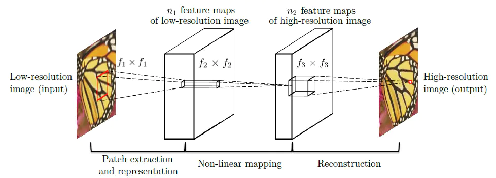  

作为最早的超分辨率神经网络, 结构很简单, 就是三个卷积层, 两个激活层的组合, 效果自然也不敢恭维

### SRCNN简单实现

```python
class SRCNN(nn.Module):
    def __init__(self):
        super(SRCNN, self).__init__()
        # 输出大小计算: O=（I-K+2P）/S+1
        # 三层的大小都是不变的, 通道数在改变
        # 原文没有使用padding因此图片会变小, 这里使用了padding
        self.conv1=nn.Conv2d(1,64,9, padding=4)
        self.conv2=nn.Conv2d(64,32,1, padding=0)
        self.conv3=nn.Conv2d(32,1,5, padding=2)
    
    def forward(self, img):
        # 三层的学习率不同
        # 两个激活层
        img=torch.relu(self.conv1(img))
        img=torch.relu(self.conv2(img))
        # 注意最后一层不要激活
        return self.conv3(img)
```

### SRCNN一些经验

- 多通道超分辨率训练难度大且效果不佳, 因此通过将RGB图像转到YCrCb空间中, 然后只取其Y通道进行超分辨率计算, 完成计算后再配合简单插值处理的CrCb通道. 这种处理方法也被用在了后来的很多超分辨率网络中
- 尽管卷积网络不好训练, 原文使用了ImageNet这样庞大的数据集, 但事实上对于这样很浅的网络用T91就可以得到训练效果
- 用阶段改变学习率的动量SGD效果比Adam更好
- 小batch收敛起来更有效些

## FSRCNN(2016) 更快的SRCNN

Accelerating the Super-Resolution Convolutional Neural Network

### FSRCNN网络结构

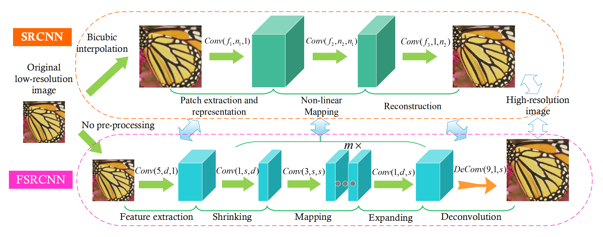  

从上面论文中的对比图可以发现其与SRCNN最大的区别就是结尾使用的反卷积层, 反卷积让我们可以直接用没有插值的低分辨率图片进行超分辨率学习, 从而减少超分辨途中的参数数量, 加快网络效率. 并且使用了PReLU作为激活层, 使得激活层本身也可以被学习来提高网络效果

### FSRCNN简单实现

```python
class FSRCNN(nn.Module):
    def __init__(self,d,s,m,ratio=2):
        super(FSRCNN, self).__init__()
        feature_extraction=nn.Conv2d(1,d,5, padding=2)
        shrinking=nn.Conv2d(d,s,1)
        seq=[]
        for i in range(m):
            seq.append(nn.Conv2d(s,s,3,padding=1))
        non_linear=nn.Sequential(*seq)
        expanding=nn.Conv2d(s,d,1,padding=0)
        # 反卷积尺寸计算 O=(I-1)×s+k-2P 
        deconvolution=nn.ConvTranspose2d(d,1,9,stride=ratio,padding=4)
        self.body=nn.Sequential(
            feature_extraction,
            nn.PReLU(),
            shrinking,
            nn.PReLU(),
            non_linear,
            nn.PReLU(),
            expanding,
            nn.PReLU(),
            deconvolution
        )
    
    def forward(self, img):
        return self.body(img)
```

### FSRCNN一些经验

- 由于输入输出大小不一样, 因此误差计算等需要注意写好
- 由于反卷积的计算问题, 实际输出的结果图会比HR图小一个像素, 因此在使用的时候需要将HR层手动裁剪一个像素来适配网络

## ESPCN(2016) 实时进行的亚像素卷积

Real-Time Single Image and Video Super-Resolution Using an Efficient Sub-Pixel Convolutional Neural Network

### ESPCN网络结构

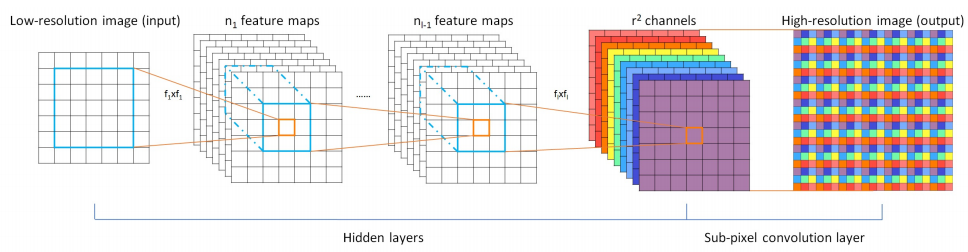  

核心的优化在于最后一层的亚像素卷积过程, 其思想就是将卷积得到的多通道低分辨率图的像素按照周期排列得到高分辨率的图片, 这样训练出能够共同作用来增强分辨率的多个滤波器. 借用[一边Upsample一边Convolve：Efficient Sub-pixel-convolutional-layers详解](https://oldpan.me/archives/upsample-convolve-efficient-sub-pixel-convolutional-layers)的示意图可以更好理解亚像素卷积的过程.

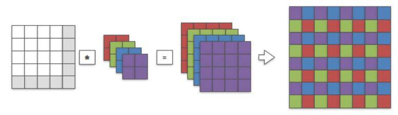  

### ESPCN简单实现

```python
class ESPCN(nn.Module):
    def __init__(self, ratio=2):
        super(ESPCN, self).__init__()
        self.add_module('n1 conv', nn.Conv2d(1,64,5,padding=2))
        self.add_module('tanh 1',nn.Tanh())
        self.add_module('n2 conv', nn.Conv2d(64,32,3,padding=1))
        self.add_module('tanh 2',nn.Tanh())
        self.add_module('n3 conv', nn.Conv2d(32,1*ratio*ratio,3,padding=1))
        # 亚像素卷积
        self.add_module('pixel shuf',nn.PixelShuffle(ratio))
    
    def forward(self, img):
        for module in self._modules.values():
            img = module(img)
        return img
```

### ESPCN一些经验

- ESPCN用小LR块训练效果更好
- 注意网络最后一层不要再放入激活层了, 会有反作用
- 这个网络训练很快效果也很不错, 思路也有很大参考价值

## VDSR(2016) 深度残差神经网络

Accurate Image Super-Resolution Using Very Deep Convolutional Networks

### VDSR网络结构

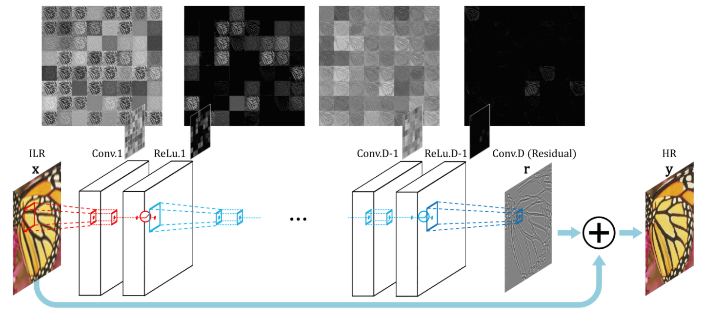  

使用大量3*3的 卷积-激活块 进行串联, 用padding保证输入输出的尺寸, 整体用一个残差来优化训练. 网络的目标是得到的残差尽可能接近HR-LR, 用MSE作为loss训练. 

### VDSR简单实现

```python
class VDSR(nn.Module):
    def __init__(self):
        super(VDSR, self).__init__()
        self.body=VDSR_Block()
    
    def forward(self, img):
        img=self.body(img)
        for i in range(img.shape[0]):
            # 由于Relu的存在, 得到的残差需要移动平均来应用
            img[i,0,:,:]-=torch.mean(img[i,0,:,:])
        # 由于网络只有一个残差块, 所以把残差的相加写到了loss计算中
        return img
        
class VDSR_Block(nn.Module):
    def __init__(self):
        super(VDSR_Block, self).__init__()
        self.inp=nn.Conv2d(1,64,3,bias=False,padding=1)
        seq=[]
        # 20层卷积
        for j in range(20):
            seq.append(nn.Conv2d(64,64,3,padding=1))
            seq.append(nn.ReLU(True))
        self.conv=nn.Sequential(*seq)
        self.out=nn.Conv2d(64,1,3,padding=1)
    
    def forward(self, img):
        img=torch.relu(self.inp(img))
        img=self.conv(img)
        img=self.out(img)
        return img
```

### VDSR一些经验

- 很不好训练, 效果也不理想, 不知道是不是实现有问题, 也可能是只有一个残差块的缺点, 梯度很快消失
- 用阶段改变学习率的动量SGD来训练

## DRCN(2016) 深度递归残差神经网络

Deeply-Recursive Convolutional Network for Image Super-Resolution

### DRCN网络结构

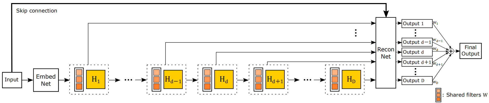  

DRCN的亮点就在于中间的递归结构, 其使得每层都按照相同的参数进行了一次处理, 得到的残差通过跳接层相加得到一份结果, 然后所有级数的结果加权合在一起得到最终图像. 由于中间的递归结构每层使用的滤波都是相同的参数, 因此网络的训练难度低了很多, 训练比较高效而且效果也很不错.

### DRCN简单实现

```python
class DRCN(nn.Module):
    def __init__(self, recur_time=16):
        super(DRCN, self).__init__()
        self.recur_time = recur_time
        self.Embedding = nn.Sequential(
            nn.Conv2d(1, 256, 3, padding=1),
            nn.ReLU(True)
        )
        self.Inference = nn.Sequential(
            nn.Conv2d(256, 256, 3, padding=1),
            nn.ReLU(True)
        )
        self.Reconstruction = nn.Sequential(
            nn.Conv2d(256, 1, 3, padding=1),
            nn.ReLU(True)
        )
        self.WeightSum = nn.Conv2d(recur_time, 1, 1)

    def forward(self, img):
        skip = img
        img = self.Embedding(img)
        output = torch.empty(
            (img.shape[0], self.recur_time, img.shape[2], img.shape[3]),device='cuda')
        # 残差连接, 权值共享
        for i in range(self.recur_time):
            img = self.Inference(img)
            output[:, i, :, :] = (skip+self.Reconstruction(img)).squeeze(1)
        # 加权合并
        output = self.WeightSum(output)
        return output
```

### DRCN一些经验

- 论文用到了自适应衰减的学习率和提前终止机制, 这能让训练效率大大提升, pytorch中对应的学习率调整器是: torch.optim.lr_scheduler.ReduceLROnPlateau
- 显存足够的话用大batch大学习率也能得到很好的效果, 还能加快训练
- 论文中提到了越深的递归效果越好, 实践中10层左右的递归就已经能有很好的结果了
- DRCN还用到了称作递归监督的组合损失, 一边计算每个递归层输出的损失一边评判最后的加权损失, 以求所有递归都能得到较好的训练, 目的是避免梯度爆炸/消失. 这是个值得一试的思想, 能让网络一开始更好收敛, 不过直接使用最后的加权误差来进行训练效果也不错.

## RED(2016) 编码-解码残差

Image Restoration Using Convolutional Auto-encoders with Symmetric Skip Connections

### RED网络结构

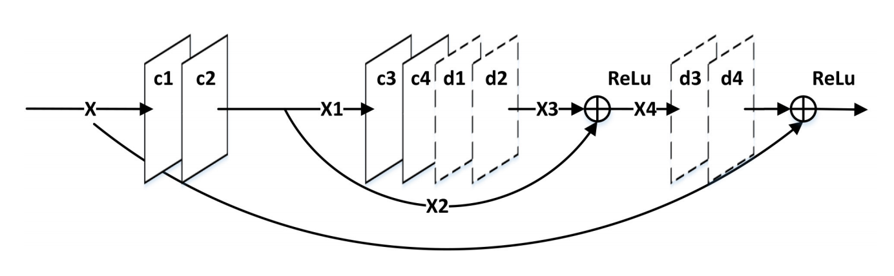  

可以看作FSRCNN和VDSR的结合体, 网络自身是卷积和反卷积组合成的对称结构, 每step层就进行一次残差连接, 通过这样反复的特征提取以期望得到质量更高的低分辨率图, 最后用一个反卷积恢复大小. 对称的特征提取组合有学习意义, 可惜最后的反卷积层过于粗暴使得效果不佳

### RED简单实现

```python
class RED(nn.Module):
    def __init__(self,ratio=2, num_feature=32, num_con_decon_mod=5, filter_size=3, skip_step=2):
        super(RED, self).__init__()
        if num_con_decon_mod//skip_step < 1:
            print('Size ERROR!')
            return
        self.num_con_decon_mod = num_con_decon_mod
        self.skip_step = skip_step
        self.input_conv = nn.Sequential(
            nn.Conv2d(1, num_feature, 3, padding=1),
            nn.ReLU(True)
            )
        # 提取特征, 要保持大小不变
        conv_seq = []
        for i in range(0, num_con_decon_mod):
            conv_seq.append(nn.Sequential(
                nn.Conv2d(num_feature, num_feature,
                          filter_size, padding=filter_size//2),
                nn.ReLU(True)
            ))
        self.convs= nn.Sequential(*conv_seq)
        # 反卷积返还特征, 要保持大小不变
        deconv_seq = []
        for i in range(0, num_con_decon_mod):
            deconv_seq.append(nn.Sequential(
                nn.ConvTranspose2d(num_feature, num_feature, filter_size,padding=filter_size//2),
                nn.ReLU(True)
            ))
        self.deconvs=nn.Sequential(*deconv_seq)
        # 真正的放大步骤
        self.output_conv = nn.ConvTranspose2d(num_feature, 1, 3,stride=ratio,padding=filter_size//2)

    def forward(self, img):
        img = self.input_conv(img)
        skips = []
        # 对称残差连接
        for i in range(0, self.num_con_decon_mod):
            if i%self.skip_step==0:
                skips.append(img)
            img = self.convs[i](img)
        for i in range(0, self.num_con_decon_mod):
            img = self.deconvs[i](img)
            if i%self.skip_step==0:
                img=img+skips.pop()
                # 测试中这里不激活效果更好
                # img=torch.relu(img+skips.pop())
        img=self.output_conv(img)
        return img

```

### RED一些经验

- 论文的原始结构中每次残差合并后需要进行一次relu激活, 实践中发现没有这个激活效果也足够
- 嵌套残差连接的写法要记住

## DRNN(2017) 改进的深度递归残差网络

Image Super-Resolution via Deep Recursive Residual Network

### DRNN网络结构

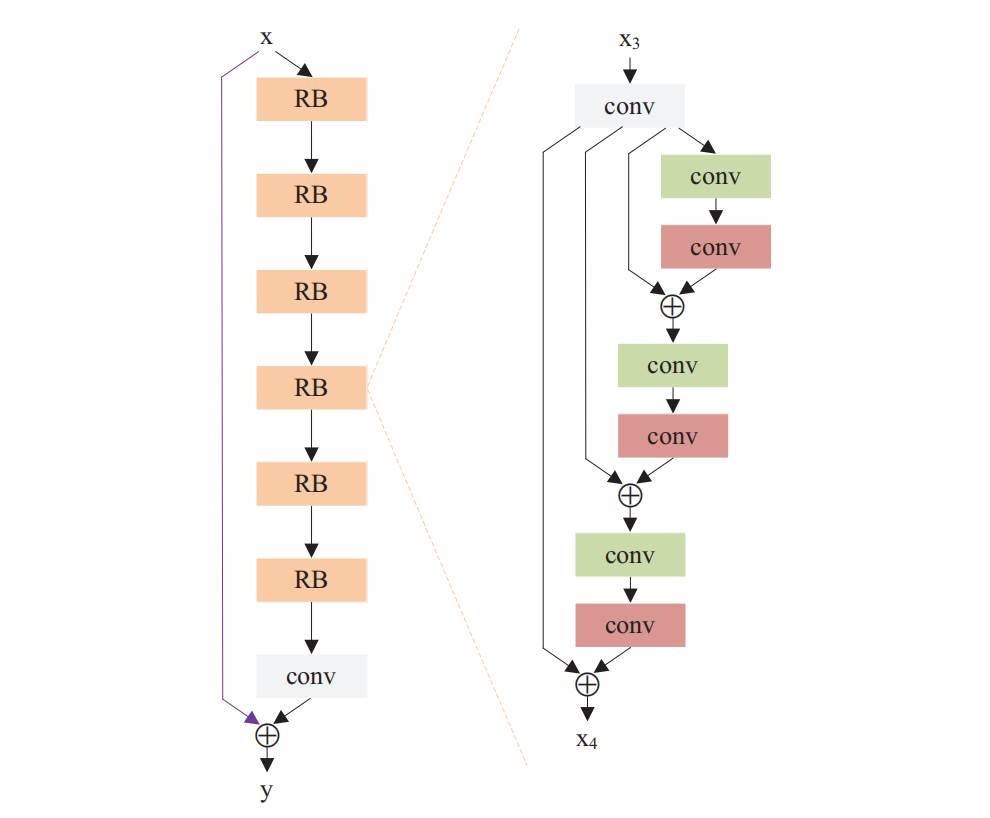  

可以理解为VDSR和DRCN的结合体, 网络的大骨架是VSDR式的全残差型, 但是图中每个RB块都是多个递归的小残差块组成, 也就是右图中的conv-conv组合是参数共享的递归形式的, 这样的结构使得不断学习之下也能较好表征深度特征. 但是和其它深度网络类似, 由于参数数目过多导致训练起来非常耗时, 而且要注意在训练函数中进行梯度裁剪减少梯度爆炸或梯度弥散的出现.

### DRNN简单实现

```python
class DRRN(nn.Module):
    # 文中建议的各层组合是令 d=(1+2*num_resid_units)*num_recur_blocks+1 为 20左右
    def __init__(self, num_recur_blocks=1, num_resid_units=15, num_filter=128, filter_size=3):
        super(DRRN, self).__init__()
        # 多个递归块连接
        seq = []
        for i in range(num_recur_blocks):
            if i == 0:
                # 第一个递归块
                seq.append(RecursiveBlock(
                    num_resid_units, 1, num_filter, filter_size))
            else:
                seq.append(RecursiveBlock(num_resid_units,
                                          num_filter, num_filter, filter_size))
        self.residual_blocks = nn.Sequential(*seq)
        # 最终的出口卷积
        self.last_conv = nn.Conv2d(
            num_filter, 1, filter_size, padding=filter_size//2)

    def forward(self, img):
        skip = img
        img = self.residual_blocks(img)
        img = self.last_conv(img)
        # 总残差
        img = skip+img
        return img


class RecursiveBlock(nn.Module):
    # 类似DRCN的递归残差结构, 在RecursiveBlock内部的多个ResidualBlock权值是共享的
    def __init__(self, num_resid_units=3, input_channel=128, output_channel=128, filter_size=3):
        super(RecursiveBlock, self).__init__()
        self.num_resid_units = num_resid_units
        # 递归块的入口卷积
        self.input_conv = nn.Conv2d(
            input_channel, output_channel, filter_size, padding=filter_size//2)
        self.residual_unit = nn.Sequential(
            # 两个conv组, 都有一套激活和加权
            nn.Conv2d(output_channel, output_channel, filter_size,
                      padding=filter_size//2),
            nn.BatchNorm2d(output_channel),
            nn.ReLU(True),
            nn.Conv2d(output_channel, output_channel, 1),

            nn.Conv2d(output_channel, output_channel, filter_size,
                      padding=filter_size//2),
            nn.BatchNorm2d(output_channel),
            nn.ReLU(True),
            nn.Conv2d(output_channel, output_channel, 1)
        )

    def forward(self, x_b):
        x_b = self.input_conv(x_b)
        skip = x_b
        # 多次残差, 重复利用同一个递归块
        for i in range(self.num_resid_units):
            x_b = self.residual_unit(x_b)
            x_b = skip+x_b
        return x_b
```

### DRNN一些经验

- 深度学习非常难训练, 如果想要短时间出效果的话务必使用较少的递归块并减少滤波器通道数来减少参数数量, 然后通过增加递归次数来弥补性能损失, 例如可以采用B1U5F32的组合
- 网络上有些实现将batchnorm层删去, 但实验证明保留着batchnorm层也能得到效果
- 论文中提到减少递归块的数目, 增加递归次数能够得到好的效果, 论文最后使用了B1U25F128的组合, 两块TITANX在Mix291上训练了4天, 非常耗时, 而且结果仅仅比DRCN好一点, 这个结构很值得怀疑
  
## LapSRN(2017) 递归拉普拉斯金字塔

Deep Laplacian Pyramid Networks for Fast and Accurate Super-Resolution

### LapSRN网络结构

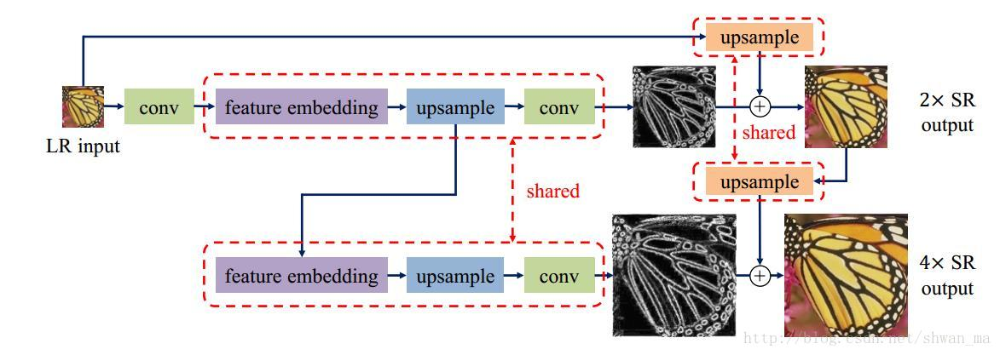  

借用[【超分辨率】Laplacian Pyramid Networks（LapSRN）](https://blog.csdn.net/shwan_ma/article/details/78690974)的网络配图, 可以看到LapSRN的特点是递归结构减少参数量和逐级上采样的结构, 这使得即使面对高倍率的放大任务这个网络也能得到比较稳定的重建结果. 

且由于使用了递归结构和逐级的参数共享, 残差与原始图分流的金字塔结构, 这个网络执行高效, 训练也不困难, 很值得学习.

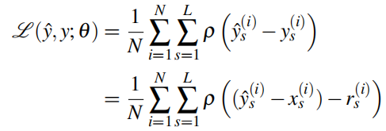  

网络还采用了Charbonnier损失函数, 称这个L1loss的变种可以让重建出来的图片不像MSEloss那么模糊, 测试中感觉实际效果有限.

### LapSRN简单实现

```python
class LapSRN(nn.Module):
    def __init__(self, fea_chan=64, scale=2, conv_num=3):
        super(LapSRN, self).__init__()
        # 根据所需的放大倍数计算递归次数
        self.level_num = int(scale/2)
        # 名字带有share的层会在递归中共享参数
        self.share_ski_upsample = nn.ConvTranspose2d(
            1, 1, 4, stride=scale, padding=1)
        self.input_conv = nn.Conv2d(1, fea_chan, 3, padding=1)
        seq = []
        for _ in range(conv_num):
            seq.append(nn.Conv2d(fea_chan, fea_chan, 3, padding=1))
            seq.append(nn.LeakyReLU(0.2, True))
        self.share_embedding = nn.Sequential(*seq)
        self.share_fea_upsample = nn.ConvTranspose2d(
            fea_chan, fea_chan, 4, stride=scale, padding=1)
        self.share_output_conv = nn.Conv2d(fea_chan, 1, 3, padding=1)

    def forward(self, img):
        # 特点是既要准备一个向深层传递的残差层, 也要保持一个向下传递的原始层
        tmp = self.input_conv(img)
        for _ in range(self.level_num):
            skip = self.share_ski_upsample(img)
            img = self.share_embedding(tmp)
            img = self.share_fea_upsample(img)
            tmp = img
            img = self.share_output_conv(img)
            img = img+skip
        return img
```

### LapSRN一些经验

- 反卷积层别忘了要进行双线性参数化
- 实际使用中对于较小的放大倍率很多的卷积层(3-5层足矣)就能得到很好的效果


## SRDenseNet(2017) 稠密超分辨

Image Super-Resolution Using Dense Skip Connections

### SRDenseNet网络结构

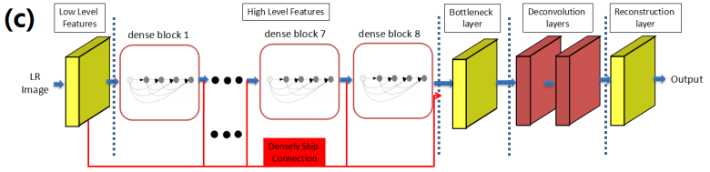  

SRDenseNet的结构比较复杂, 结合了稠密块和残差网络的思想. 其完整形式就是上图的结构, 用类似残差的思想连接多个稠密块, 目的是提取出最深层有效的特征, 然后用瓶颈层减少前面过多的通道数, 最后反卷积得到超分辨率. 这个结构的特点是稍微改改超参数网络的规模就会极具扩大, 尽管稠密块可以较好地复用之前的参数让深度网络训练变得容易, 但是稠密块和残差连接使得显存消耗很大, 而且训练时推理速度较慢, 由于没有使用论文中那么大的数据集(5w)因此本地实验结果效果不是很好.

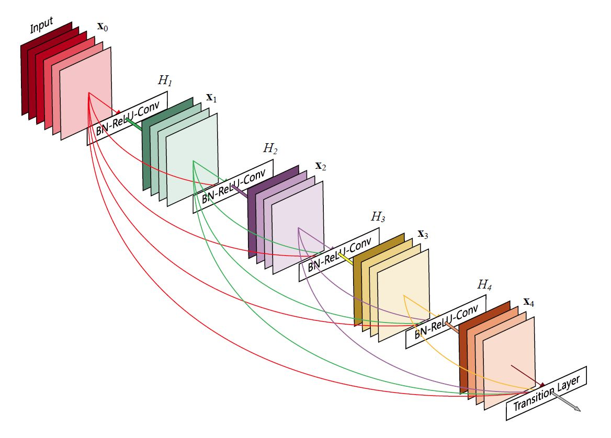  

稠密块就是上图的结构, 网上有很多介绍, 核心特点是其内部每层卷积向前传递时都会把当前的参数直接连接到下一层, 使得网络训练起来变得更容易.

### SRDenseNet简单实现

```python
class SRDenseNet(nn.Module):
    def __init__(self, scale=4, dense_input_chan=16, growth_rate=16, bottleneck_channel=256, num_dense_conv=8, num_dense=8):
        super(SRDenseNet, self).__init__()
        self.dense_input_chan = dense_input_chan
        self.growth_rate = growth_rate
        self.num_dense_conv = num_dense_conv
        self.num_dense = num_dense

        # 输入层, 通道数转为dense_input_chan
        self.input = nn.Sequential(
            nn.Conv2d(1, dense_input_chan, 3, padding=1),
            nn.ReLU(True)
        )

        # 稠密层, 由多个稠密块组成, 有skip连接, 输出通道num_dense*num_dense_conv*growth_rate+dense_input_chan
        seq = []
        for i in range(num_dense):
            seq.append(DenseBlock((i*num_dense_conv*growth_rate) +
                                  dense_input_chan, growth_rate, num_dense_conv))
        self.dense_blocks = nn.Sequential(*seq)

        # 缩小输出时候的维度的瓶颈层, 输出通道bottleneck_channel
        self.bottleneck = bottleneck_layer(
            num_dense*num_dense_conv*growth_rate+dense_input_chan, bottleneck_channel)

        # 用于上采样的反卷积层, 通道保持bottleneck_channel
        seq = []
        for _ in range(scale//2):
            seq.append(nn.ConvTranspose2d(bottleneck_channel,
                                          bottleneck_channel, 3, stride=2, padding=1))
        self.deconv = nn.Sequential(*seq)

        # 输出层, 输出通道1
        self.output = nn.Conv2d(bottleneck_channel, 1, 3, padding=1)

    def forward(self, x):
        x = self.input(x)
        dense_skip = x
        for i in range(self.num_dense):
            x = self.dense_blocks[i](x)
            # 稠密残差连接, 不断连接新加入的维度的输出
            dense_skip = torch.cat(
                (dense_skip, x[:, (i*self.num_dense_conv*self.growth_rate)+self.dense_input_chan:, :, :]), dim=1)
        x = self.bottleneck(dense_skip)
        x = self.deconv(x)
        x = self.output(x)
        return x


def bottleneck_layer(in_channel, out_channel):
    return nn.Sequential(
        nn.Conv2d(in_channel, out_channel, 1),
    )


def conv_layer(in_channel, out_channel):
    return nn.Sequential(
        nn.BatchNorm2d(in_channel),
        nn.ReLU(True),
        nn.Conv2d(in_channel, out_channel, 3, padding=1),
    )


class DenseBlock(nn.Module):
    def __init__(self, in_channel=16, growth_rate=16, num_convs=8):
        super(DenseBlock, self).__init__()
        self.num_convs = num_convs
        seq = []
        for _ in range(num_convs):
            # 不断连接并增加着的特征图
            seq.append(conv_layer(in_channel, growth_rate))
            in_channel = in_channel+growth_rate
        self.convs = nn.Sequential(*seq)

    def forward(self, x):
        for i in range(self.num_convs):
            # 拼接之前得到的特征图
            y = self.convs[i](x)
            x = torch.cat((x, y), dim=1)
        return x
```

### SRDenseNet一些经验

- 深度网络一如既往地难训练, 量化结果似乎也不是很好
- Adam训练深度网络时可能在中间出现loss反弹
- 训练时可以将目标高分辨率图片归一化到(-1,1), 对训练结果有一点加强
- 瓶颈层不要有batchnorm, 过度的激活让输出效果很差

## SRGAN(2017) 生成对抗超分辨

Photo-Realistic Single Image Super-Resolution Using a Generative Adversarial Network

### SRGAN网络结构

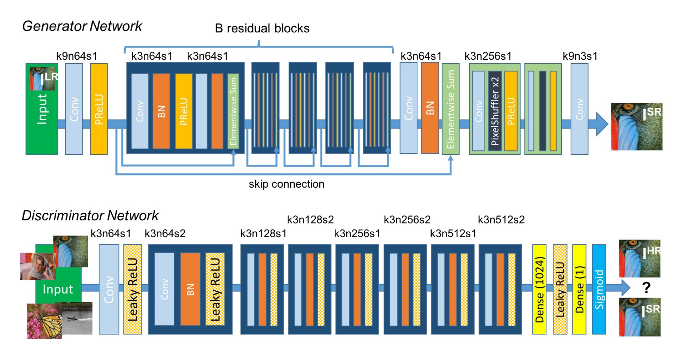  

GAN就是需要两个网络共同运作, 一个称为生成网络, 用来产生超分辨率的图, 一个判别网络, 用来检测生成的图是不是与真实高分辨率图很接近. 需要在迭代中依次训练两个网络, 让判别网络的结果作为loss强化生成网络的生成, 更强的生成网络又反过来让判别网络更难判断. 通过GAN的网络结构可以得到视觉表现上更好的超分辨率结果(不过在量化结果上没有其它方法那么好).

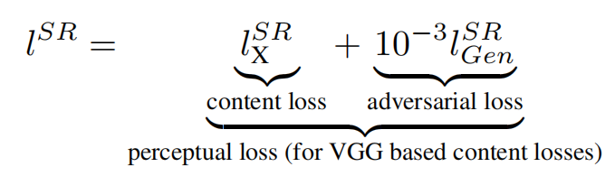  

GAN超分辨率除了两个网络互相配合外, 核心就是将两个网络连接在一起的损失函数. 文章让生成网络的损失是MSE损失和判别网络判别概率求和加权如上式, 这个权值的改变将影响生成出来的图片是更偏向于MSE指标还是更偏向人眼特征.

### SRGAN简单实现

```python
class SRGAN_generator(nn.Module):
    # 基于SRResNet, 用来生成图像
    def __init__(self, scale=4, in_channel=3, num_filter=64, num_resiblk=16):
        super(SRGAN_generator, self).__init__()
        self.num_filter = num_filter
        self.num_resiblk = num_resiblk
        self.input_conv = nn.Sequential(
            nn.Conv2d(in_channel, num_filter, 9, padding=4),
            nn.PReLU()
        )
        # 大量的残差块
        seq = []
        for _ in range(num_resiblk):
            seq.append(nn.Sequential(
                nn.Conv2d(num_filter, num_filter, 3, padding=1),
                nn.BatchNorm2d(num_filter),
                nn.PReLU(),
                nn.Conv2d(num_filter, num_filter, 3, padding=1),
                nn.BatchNorm2d(num_filter),
            ))
        self.residual_blocks = nn.Sequential(*seq)
        self.resi_out = nn.Sequential(
            nn.Conv2d(num_filter, num_filter, 3, padding=1),
            nn.BatchNorm2d(num_filter),
        )
        # 上采样
        seq = []
        for _ in range(scale//2):
            seq.append(nn.Sequential(
                nn.Conv2d(num_filter, num_filter*4, 3, padding=1),
                nn.PixelShuffle(2),
                nn.PReLU()
            ))
        self.upsample = nn.Sequential(*seq)
        self.output_conv = nn.Conv2d(num_filter, in_channel, 3, padding=1)

    def forward(self, x):
        x = self.input_conv(x)
        # 内外两种残差连接
        skip = x
        resi_skip = x
        for i in range(self.num_resiblk):
            x = self.residual_blocks[i](x)+resi_skip
            resi_skip = x
        x = self.resi_out(x)+skip
        x = self.upsample(x)
        return self.output_conv(x)


class SRGAN_discriminator(nn.Module):
    # 基于VGG19, 用来判别当前图像是否是真实的
    def __init__(self, in_channel=3):
        super(SRGAN_discriminator, self).__init__()
        self.input_conv = nn.Sequential(
            nn.Conv2d(in_channel, 64, 3, padding=1),
            nn.LeakyReLU(inplace=True)
        )
        # 大量卷积层来提取特征
        self.convs = nn.Sequential(
            conv_layer(64, 64, 2),
            conv_layer(64, 128, 1),
            conv_layer(128, 128, 2),
            conv_layer(128, 256, 1),
            conv_layer(256, 256, 2),
            conv_layer(256, 512, 1),
            conv_layer(512, 512, 2)
        )
        self.output_conv = nn.Sequential(
            # 这里通过池化和卷积将高维数据变为单一的正负输出
            nn.AdaptiveAvgPool2d(1),
            nn.Conv2d(512, 1024, 1, padding=0),
            nn.LeakyReLU(0.2),
            nn.Conv2d(1024, 1, 1, padding=0)
        )

    def forward(self, x):
        batch_size = x.size(0)
        x = self.input_conv(x)
        x = self.convs(x)
        x = self.output_conv(x)
        # 注意分类网络最后的激活
        return torch.sigmoid(x.view(batch_size))


def conv_layer(in_channel, out_channel, stride):
    return nn.Sequential(
        nn.Conv2d(in_channel, out_channel, 3, stride=stride, padding=1),
        nn.BatchNorm2d(out_channel),
        nn.LeakyReLU(inplace=True)
    )


class Adversarial_loss(nn.Module):
    # 损失函数, 是两种损失的结合
    def __init__(self, disc_alpha=1e-3):
        super(Adversarial_loss, self).__init__()
        self.alpha = disc_alpha
        self.mse_loss = nn.MSELoss()

    def forward(self, X, Y, loss_disc):
        # 图像本身loss是MSE
        loss = self.mse_loss(X,Y)
        # 判别器loss
        _loss_disc=loss_disc.detach()
        _loss_disc=torch.sum(-torch.log(_loss_disc))
        # 结合
        loss = loss+self.alpha*_loss_disc
        return loss
```

### SRGAN一些经验

- 训练GAN网络需要仔细的调参和大量的数据与训练时间
- 判别器的训练类似二分类网络, 按照二分类网络思路进行编写和训练即可

## EDSR(2017) 改进的残差超分辨

Enhanced Deep Residual Networks for Single Image Super-Resolution

### EDSR网络结构

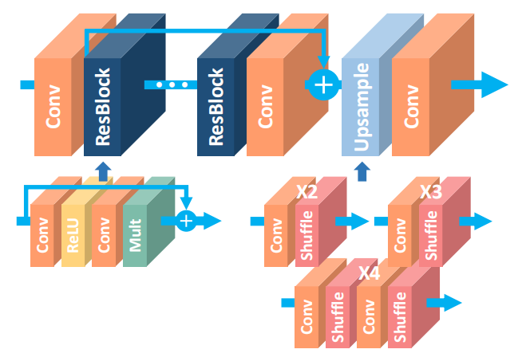  

EDSR是从SRResNet改进而来的, 主要是删去了SRResNet的大量batchnorm层, 因为文中说batchnorm大大影响了网络的灵活性, 删去batchnorm层后每个残差块结尾都加上了一个scale层降低残差输出的强度, 目的是减少多层残差网络容易出现的数值不稳定性. 实际测试中EDSR表现还算不错, 训练比较快效果也不错.

### EDSR简单实现

```python
class EDSR(nn.Module):
    def __init__(self, scale=4, in_channel=3, num_filter=256, num_resiblk=32, resi_scale=0.1):
        super(EDSR, self).__init__()
        self.num_filter = num_filter
        self.num_resiblk = num_resiblk
        self.resi_scale=resi_scale
        self.input_conv = nn.Sequential(
            nn.Conv2d(in_channel, num_filter, 9, padding=4),
        )
        # 大量的残差块, 去掉了bn层, 且残差以外不再有relu
        seq = []
        for _ in range(num_resiblk):
            seq.append(nn.Sequential(
                nn.Conv2d(num_filter, num_filter, 3, padding=1),
                nn.ReLU(),
                nn.Conv2d(num_filter, num_filter, 3, padding=1),
            ))
        self.residual_blocks = nn.Sequential(*seq)
        self.resi_out = nn.Sequential(
            nn.Conv2d(num_filter, num_filter, 3, padding=1),
        )
        # 上采样
        seq = []
        for _ in range(scale//2):
            seq.append(nn.Sequential(
                nn.Conv2d(num_filter, num_filter*4, 3, padding=1),
                nn.PixelShuffle(2),
            ))
        self.upsample = nn.Sequential(*seq)
        self.output_conv = nn.Conv2d(num_filter, in_channel, 3, padding=1)

    def forward(self, x):
        x = self.input_conv(x)
        # 内外两种残差连接
        skip = x
        resi_skip = x
        for i in range(self.num_resiblk):
            x = self.residual_blocks[i](x)*self.resi_scale+resi_skip
            resi_skip = x
        x = self.resi_out(x)+skip
        x = self.upsample(x)
        return self.output_conv(x)
```

### EDSR一些经验

- 文中提到了MSEloss过于平滑的问题, 因此改用L1loss, 实验中确实能收敛到更好的结果
- 文章在测试的时候使用了self-ensemble strategy测试方法, 也就是对于每个测试样例都进行8中变换得到8种输出, 然后对这8个输出变换回正常状态后取平均. 这样操作可以让量化结果再有些许增长
- 文章还提出了可以训练多个缩放倍率的网络MDSR, 在此不表

## DBPN(2018) 反向投影网络

DeepBack-Projection Networks For Super-Resolution

### DBPN网络结构

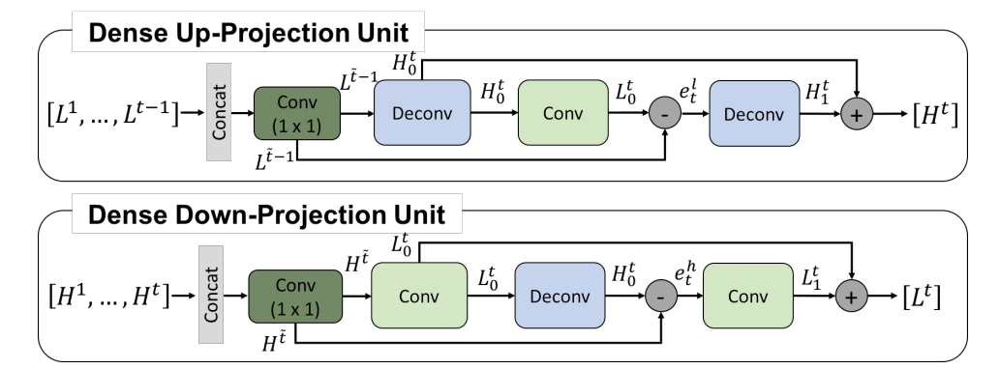  

DBPN的特点是其使用了反向投影结构来优化超分辨率, 核心思想就是将提高分辨率后的特征图重新进行下采样然后与一开始的低分辨率特征图做差比较, 尽量使得两张图接近, 这样重建出的高分辨率图能够在纹理上保持稳定性, 在高倍率缩放上能够得到更符合原图的效果而不会因为一开始重建的误差不断强化导致纹理走样.

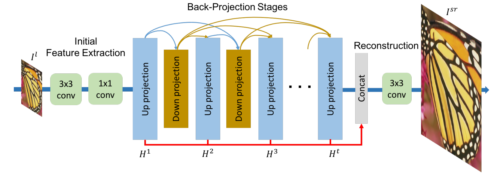  

然后到具体的模型搭建整体是DenseNet的结构, 轮流使用上下投影块然后进行Dense相连, 这样增加层数下确实能得到更好的效果.

### DBPN简单实现

```python
class Dense_DBPN(nn.Module):
    def __init__(self, in_channel=1, scale=2, num_pair=2,  num_filter=18, grow_rate=18):
        super(Dense_DBPN, self).__init__()
        self.num_pair = num_pair
        self.feature_extraction = nn.Sequential(
            nn.Conv2d(in_channel, 64, 3, padding=1),
            nn.Conv2d(64, num_filter, 1, padding=0)
        )

        # pair+1个上采样块, 需要数量比下采样多一个
        seq = []
        seq.append(Up_projection(num_filter, grow_rate, scale))
        for i in range(num_pair):
            seq.append(Up_projection((i+1)*grow_rate, grow_rate, scale))
        self.up_proj = nn.Sequential(*seq)

        # pair个下采样块
        seq = []
        for i in range(num_pair):
            seq.append(Down_projection(
                (i+1)*grow_rate, grow_rate, scale))
        self.down_proj = nn.Sequential(*seq)

        self.reconstruction = nn.Conv2d(
            (num_pair+1)*grow_rate, 1, 3, padding=1)

    def forward(self, x):
        x = self.feature_extraction(x)
        up_skip = self.up_proj[0](x)
        down_skip = []
        for i in range(self.num_pair):
            if i == 0:
                down_skip = self.down_proj[i](up_skip)
            else:
                down_skip = torch.cat(
                    (self.down_proj[i](up_skip), down_skip), dim=1)
            up_skip = torch.cat((self.up_proj[i+1](down_skip), up_skip), dim=1)
        x = self.reconstruction(up_skip)
        return x


class Up_projection(nn.Module):
    # 每导入一次块就x2
    def __init__(self, in_channel, out_channel=28, scale=2, deconv_size=8):
        super(Up_projection, self).__init__()
        self.input_conv = nn.Conv2d(in_channel, out_channel, 1, padding=0)
        self.deconv_base = nn.Sequential(
            nn.ConvTranspose2d(out_channel, out_channel,
                               deconv_size, stride=scale, padding=deconv_size//2-1),
            nn.PReLU()
        )
        self.conv = nn.Sequential(
            nn.Conv2d(out_channel, out_channel, 6, stride=scale, padding=2),
            nn.PReLU()
        )
        self.deconv_fea = nn.Sequential(
            nn.ConvTranspose2d(out_channel, out_channel,
                               deconv_size, stride=scale, padding=deconv_size//2-1),
            nn.PReLU()
        )

    def forward(self, x):
        x = self.input_conv(x)
        skip_fea = x
        x = self.deconv_base(x)
        skip_base = x
        x = self.conv(x)
        x = self.deconv_fea(x-skip_fea)
        return x+skip_base


class Down_projection(nn.Module):
    # 每导入一次块就x2
    def __init__(self, in_channel, out_channel=28, scale=2, deconv_size=8):
        super(Down_projection, self).__init__()
        self.input_conv = nn.Conv2d(in_channel, out_channel, 1, padding=0)
        self.conv_base = nn.Sequential(
            nn.Conv2d(out_channel, out_channel, 6, stride=2, padding=2),
            nn.PReLU()
        )
        self.deconv = nn.Sequential(
            nn.ConvTranspose2d(out_channel, out_channel,
                               deconv_size, stride=scale, padding=deconv_size//2-1),
            nn.PReLU()
        )
        self.conv_fea = nn.Sequential(
            nn.Conv2d(out_channel, out_channel, 6, stride=2, padding=2),
            nn.PReLU()
        )

    def forward(self, x):
        x = self.input_conv(x)
        skip_fea = x
        x = self.conv_base(x)
        skip_base = x
        x = self.deconv(x)
        x = self.conv_fea(x-skip_fea)
        return x+skip_base
```

### DBPN一些经验

- 这个网络结构看起来很fancy但是实际上训练很慢, 而且文章使用了大量的数据才达到了不错的效果
- 启用梯度裁剪可以加速收敛速度
- 使用Adam进行训练时要注意loss反弹的问题, 可以通过定期降低学习率和设置更大的eps值来回避

## RCAN(2018) 引入注意力机制

Image Super-Resolution Using Very Deep Residual Channel Attention Networks

### RCAN网络结构

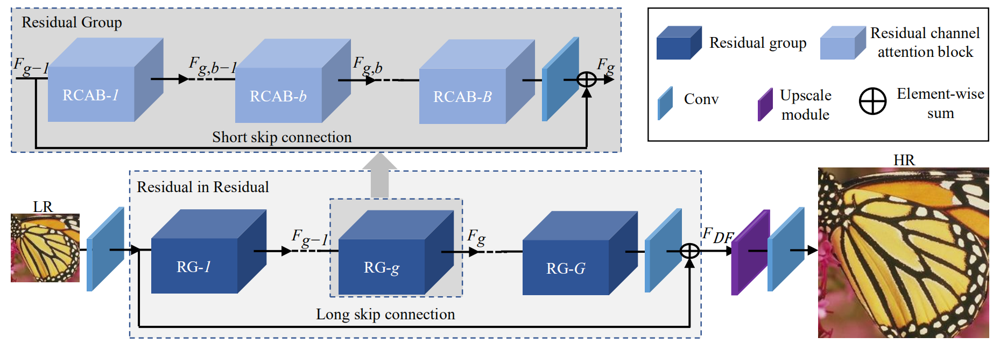  

RCAN在超分辨率任务中引入了注意力机制, 其关注的问题是网络面对提取出来的层层特征没有各自的着重点, 都是平等看待的, 但是这不合理. 所以RCAN使用注意力模块CA将特征转为单个的权值, 然后利用这个权值对特征进行加权. 这个解释是有道理的但是很怀疑网络自己提取特征的时候是不是就已经进行了隐含的加权步骤, 最终网络的效果也不是很理想, 怀疑这个注意力提取不够有效.

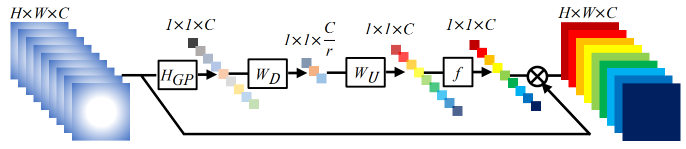  

RCAN所使用的注意力结构CA就是上图的形式, 将一个个特征转为权值进行加权, 而网络本身是由残差结构组成的, 最后的真正的超分辨部分则是由传统的ESPCN进行的.

### RCAN简单实现

```python
class RCAN(nn.Module):
    def __init__(self, in_channel, scale=2, num_filter=64, num_residual_group=10, num_residual=20):
        super(RCAN, self).__init__()
        self.num_residual_group = num_residual_group
        self.input_conv = nn.Conv2d(in_channel, num_filter, 3, padding=1)
        seq = []
        # 残差组
        for _ in range(num_residual_group):
            seq.append(RCAB(num_residual, num_filter))
        self.rir = nn.Sequential(*seq)
        self.rir_conv = nn.Conv2d(num_filter, num_filter, 3, padding=1)
        self.upsample = ESPCN(num_filter, scale)
        self.output_conv = nn.Conv2d(num_filter, in_channel, 3, padding=1)

    def forward(self, x):
        x = self.input_conv(x)
        skip = x
        x = self.rir(x)
        x = skip+self.rir_conv(x)
        x = self.upsample(x)
        return self.output_conv(x)


class CA(nn.Module):
    def __init__(self, num_filter):
        # 注意力模块, 核心是把特征进一步转为加权值, 但是实际意义感觉有限
        super(CA, self).__init__()
        self.HGP = nn.AdaptiveAvgPool2d((1,1))
        self.wD = nn.Conv2d(num_filter, 4, 1)
        self.wU = nn.Conv2d(4, num_filter, 1)
        self.f = nn.Sigmoid()

    def forward(self, x):
        skip = x
        x = self.HGP(x)
        x = torch.relu_(self.wD(x))
        x = self.wU(x)
        x = self.f(x)
        return skip*x


class RCAB(nn.Module):
    def __init__(self, num_residual, num_filter):
        super(RCAB, self).__init__()
        self.num_residual = num_residual
        # 对卷积和注意力模块残差连接
        seq = []
        for _ in range(num_residual):
            seq.append(nn.Sequential(
                nn.Sequential(
                    nn.Conv2d(num_filter, num_filter, 3, padding=1),
                    nn.ReLU(True),
                    nn.Conv2d(num_filter, num_filter, 3, padding=1)
                ),
                CA(num_filter)
            ))
        self.residuals = nn.Sequential(*seq)

    def forward(self, x):
        for i in range(self.num_residual):
            skip = x
            x = skip+self.residuals[i](x)
        return x


class ESPCN(nn.Module):
    def __init__(self, in_channel, scale=2):
        super(ESPCN, self).__init__()
        self.add_module('n1 conv', nn.Conv2d(in_channel, 64, 5, padding=2))
        self.add_module('tanh 1', nn.Tanh())
        self.add_module('n2 conv', nn.Conv2d(64, 32, 3, padding=1))
        self.add_module('tanh 2', nn.Tanh())
        self.add_module('n3 conv', nn.Conv2d(32, in_channel*scale*scale, 3, padding=1))
        self.add_module('pixel shuf', nn.PixelShuffle(scale))

    def forward(self, x):
        for module in self._modules.values():
            x = module(x)
        return x
```

### RCAN一些经验

- 尽管有很多残差块, RCAN对梯度的处理依然不太好, 训练时很容易发生梯度爆炸/消失
- 论文也是用了大量的数据来得到好的结果, 而提升有限

## ZSSR(2018) 无监督超分辨率

“Zero-Shot” Super-Resolution using Deep Internal Learning

### ZSSR网络结构

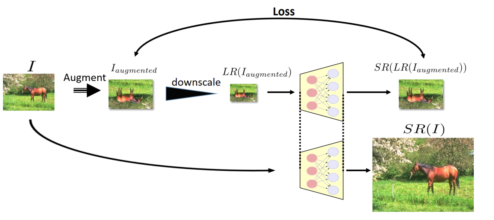  

ZSSR可以说是利用了深度学习容易造成过拟合的特点, 通过对目标图片自身作为高分辨率图来进行常用的一系列下采样, 数据扩容, 加噪声等操作, 然后这样来用自身进行超分辨率训练. 由于训练素材都来自自身所以过拟合反而成为优势, 且由此得到了训练速度快, 可以适应各种不同类型的数据的特性, 思路清晰训练也很有效. ZSSR的核心部分是数据扩容的操作, 网络上倒没有什么特别, 就是一个简单的多层全卷积网络, 然后训练网络输出的残差.

### ZSSR简单实现

```python
class ZSSR(nn.Module):
    def __init__(self, in_channel=1, num_layers=8,num_filter=64):
        # 简单的全卷积残差网络
        super(ZSSR, self).__init__()
        self.input_conv=nn.Conv2d(in_channel,num_filter,3,padding=1)
        seq=[]
        for _ in range(num_layers-2):
            seq.append(nn.Conv2d(num_filter,num_filter,3,padding=1))
            seq.append(nn.ReLU(True))
        self.body=nn.Sequential(*seq)
        self.output_conv=nn.Conv2d(num_filter,in_channel,3,padding=1)


    def forward(self, x):
        x=self.input_conv(x)
        x=self.body(x)
        return self.output_conv(x)
```

### ZSSR一些经验

- 文中所用到的往超分辨率LR图片加噪声的思路也可以借鉴, 文章说可以提高超分辨效果
- 文中还采用了随机高斯核来模拟未知下采样效果, 且在这种情况下验证得到ZSSR能够获得SOTA结果, 这方面是无监督超分辨方法的优势