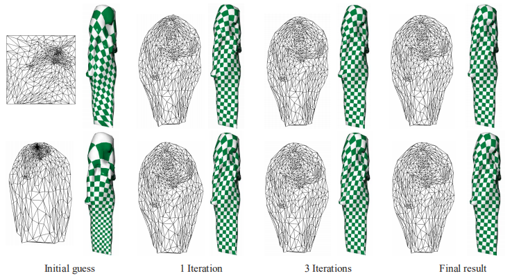
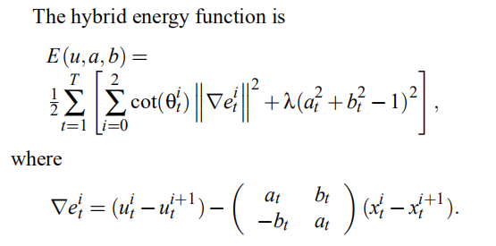
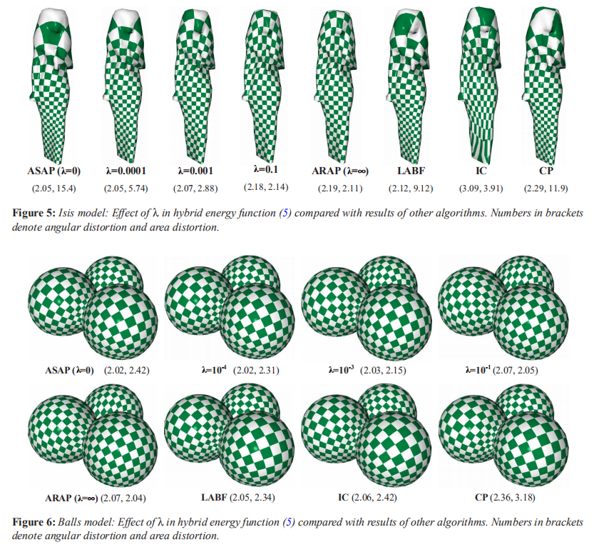
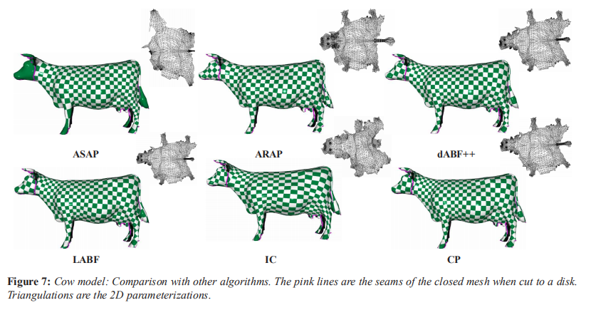
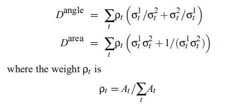
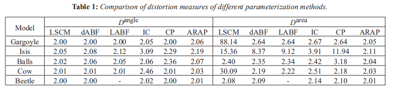

# A Local/Global Approach to Mesh Parameterization 笔记

  

- [A Local/Global Approach to Mesh Parameterization 笔记](#a-localglobal-approach-to-mesh-parameterization-笔记)
  - [总览](#总览)
  - [目标函数](#目标函数)
  - [Jacobian矩阵](#jacobian矩阵)
  - [吻合的矩阵L](#吻合的矩阵l)
  - [奇异值的性质](#奇异值的性质)
  - [目标函数的矩阵形式](#目标函数的矩阵形式)
  - [Local/Global流程](#localglobal流程)
  - [台前幕后](#台前幕后)
  - [混合模型](#混合模型)
  - [实验与总结](#实验与总结)
  - [相关工作](#相关工作)

## 总览

网格模型的表面参数化向来是几何处理中许多算法的基础, 但这个基础操作本身也有很大的难度, 面临着各种各样的问题. 其中比较关键的一个问题就是对于那些不可展开的网格, 展开后的三角形必然或多或少会有扭曲发生, 这篇文章就针对参数化展开途中的三角形扭曲问题进行优化, 借鉴了07年的As-rigid-as-possible surface modeling的思路, 将尽可能刚性(As-rigid-as-possible; ARAP), 也就是尽量保证变形途中三角形维持全等的特性应用到参数化过程中来. Loacl/Global迭代部分的思路与[SfG](...)相似, 在SfG中local操作投影更新点的位置, global操作合并顶点得到新的面片高度, 这篇文章中local操作计算了当前面片最优的旋转, global操作合并顶点得到新的面片二维坐标.

思路:
1. 首先将三维表面用普通方法参数化到UV平面上, 这可以初始化第一个全局变换矩阵J
2. Local操作中, 将每个三角形拆开作为一个独立的面, 固定J求出当前全局变换下每个三角形可以处于的最佳局部变换L
3. Global操作中, 固定局部变换L, 找到最适合目前局部变换的全局变换矩阵J
4. 迭代(2,3)多次直到结果稳定

  

## 目标函数

这篇文章的优化目标是最小化下面的能量函数:

$$
E(u,L)=\sum^T_{t=1}A_t||J_t(u)-L_t||^2_F
$$

这个式子用到了F范数, 就是求矩阵中每一项的平方值的和, 因此这等号能够计算出两个矩阵间元素的差异, 是在求解最接近理想局部变换$L_t$的全局变换$J_t$. 在这里我们既不知道全局变换矩阵是什么, 也不知道局部变换矩阵是什么, 我们需要相互迭代这两组矩阵来得到参数化的结果. 由于操作的直观性, 文章用Jacobian矩阵$J_t$来代表全局变换的矩阵, 并引入辅助变换矩阵$L_t$.

然后根据另一篇文章, 我们可以将这个式子展开为下面的显式表示:

$$
E(u, L)=\frac{1}{2} \sum_{t=1}^{T} \sum_{i=0}^{2} \cot (\theta_{t}^{i})||(u_{t}^{i}-u_{t}^{i+1})-L_{t}(x_{t}^{i}-x_{t}^{i+1})||^{2}
$$

上面式子中的$\theta$是边$(x_{t}^{i}-x_{t}^{i+1})$所对应的角, 我们需要始终使用参数化前的角度以保证局部变换有效, 为了方便可以使用源模型的三维角度充当二维. 然后显然当我们固定L时代入函数可以求解出对应的$(u_{t}^{i}-u_{t}^{i+1})$, 这就是Jacobian矩阵.

## Jacobian矩阵

雅可比矩阵Jacobian, 在几何处理中属于比较常用的工具. Jacobian矩阵在几何处理中常表示从m维到n维的线性映射, 其计算方法就是将函数值的每一维都与映射目标的每一维求导. 在参数化系列的文章中, Jacobian矩阵用来表示从原始三维表面的局部二维微分中转换到二维参数表面的变换. 常见的Jacobian矩阵如下, 在这篇文章中f就是参数化后的三角形面片顶点局部坐标, x就是变形前三角形顶点在自己所处的面片上的局部坐标, 其中变形前三角形顶点在自己所处的面片上的局部坐标不会在迭代中改变, 因此我们可以用这两个坐标不断优化表面, 使得最终每个面片真实的变换J能够尽量接近理想变换L:

  

## 吻合的矩阵L

前面说到优化目标是求解最接近理想局部变换$L_t$的全局变换$J_t$, 这里上面的能量函数中的差值部分我们可以展开写为:

$$
d(J,L)=||J-L||^2_F=tr[(J-L)^T(J-L)]
$$

在上面这个式子中, 第一个等号是计算两个矩阵差之间的F范数, 而进一步的, 这个差异可以展开为乘积的迹的形式.

对于有两个矩阵变量的情况下我们没法优化这个式子, 但是如果我们固定其中的一项, 在这里先对每个面片求出其当前对应的J, 那么04年文章Procrustes Problems告诉我们, 可以通过将Jacobian矩阵进行SVD分解来求出对于这个J差距最小的L的形式. 首先将J用SVD展开成下面的形式:

$$
J=U \Sigma V^T
$$

我们知道, 分解后的矩阵$\Sigma$是对角矩阵, 其元素就是Jacobian矩阵的奇异值排列. 但是这里如果我们将SVD转为分解出奇异值为正的形式(方法: 奇异值对应分解出来的U和V, 对于奇异值为负的矩阵, 取正奇异值, 然后将那个矩阵的某一列全部加上负号即可), 就可以通过$L=UV^T$来直接得到与J最符合的local变换L.

## 奇异值的性质

既然可以直接从J计算出最符合的变换L, 那么现在需要来满足约束令L尽可能刚性了. 所谓的刚性就是面片的变换尽量不要发生变形, 最好是全等变换, 其次是相似(保角)变换, 再次是保面积变换. 而上面的SVD分解组合L正好有个很方便的特性, 当Jacobian矩阵的奇异值满足下面条件时, L会反映出特殊的性质:

- 两个奇异值都为1, L是旋转(全等)变换矩阵
- 两个奇异值相等, L是相似(保角)变换矩阵
- 两个奇异值乘积为1, L是保面变换矩阵

由此对刚性变换L的追求和对全局变换J的追求就结合到了一起. 假如能量函数改写为$\sum^T_{t=1}A_t(\sigma_{1,t}-\sigma_{2,t})^2$, 也就是令奇异值尽量相等, 那么J会产生尽量接近于相似变换的矩阵L, 这被称为尽量相似的变换As-similar-as-possible (ASAP).

假如能量函数改写为$\sum^T_{t=1}A_t[(\sigma_{1,t}-1)^2+(\sigma_{2,t}-1)^2]$, 也就是让奇异值尽量都等于1, 那么J会产生尽量接近于全等变换的矩阵L, 这就是我们要的尽量刚性的变换As-rigid-as-possible (ARAP).

很明显, 这两个能量函数都不好求, 但是论文的附录A和B给出了完整的过程, 证明了求解一开始的目标函数就等价于最小化这两个能量函数.

## 目标函数的矩阵形式

一开始的那个目标函数显然求解起来很不直观, 按照文章中的推导, 我们可以先将其写为半边形式

$$
E(u, L)=\frac{1}{2}\sum_{(i,j) \in he}cot(\theta_{ij})||(u_i-u_j)-L_{t(i-j)}(x_i-x_j)||^2
$$

通过令函数梯度为0求出极值点, 可以得到下面的形式. 将这个式子转化放入线性方程组的矩阵中, 构造出完整的线性方程组. 尽管这个形式是对于每个顶点的邻域进行计算的, 但我们也可以从半边的角度来编写代码, 只要等式右边是不断叠加即可, 思路类似之前计算LAR时的面积累加.

$$
\sum_{j \in N(i)}[\cot(\theta_{ij})+\cot(\theta_{ji})](u_i-u_j)=\sum_{j \in N(i)}[\cot (\theta_{i j}) L_{t(i, j)}+\cot (\theta_{j i}) L_{t(j, i)}](x_i-x_j)
$$

对于这个方程组我们在全局上可以用一系列方法求解, 由于迭代过程中方程的系数部分(也就是等式左边cot部分, 我们要求的是未知的u)仅与源模型有关, 不会发生改变, 因此使用Cholesky分解法求解能够最大化迭代的效率. 在这个式子中要注意尽管ij的反向不会影响局部变换L, 但是会导致cot的值变为相反数.

## Local/Global流程

总结Local/Global流程: 
- Local部分, 对每个面片, 求解当前全局变换矩阵并signed-SVD分解, 然后用$L=UV^T$求解出最吻合的局部变换矩阵
- Global部分, 利用局部变换L组合线性方程组并用全局优化方法求解, 得到下一次迭代的各点位置

## 台前幕后

尽管该算法在一开始的时候需要一个初始参数化用来求解第一个全局变换矩阵J, 但对于这个初始化的参数化方法并没有特殊的要求, 不管使用什么方法进行初始参数化均能快速收敛到正确的结果. 下图就是两种方法的收敛对比:

  

由于该算法仍然不可避免地会导致三角形发生的拉伸, 因此参数化方法常常遇到的三角形反转问题也会出现. 文章中采用了05年文章Free-boundary linear parameterization of 3D meshes in the presence of constraints进行后处理消除三角形反转问题.

## 混合模型

文章中段简单介绍了的ASAP方法和文章重点的ARAP方法可以通过下面的式子结合起来, 这样我们可以通过控制比值$\lambda$来决定参数化结果是更接近相似变换还是全等变换(全等变换在无法满足的情况下会接近保面变换). 下式中的ab文章的附录有给出求解方法.

  

## 实验与总结

和当时流行的多种方法对比, 这篇文章都得到了最好的结果.

  

  

下面的量化评估是通过对每个三角形的Jacobian矩阵特征值进行下面的计算得到:

  

  

## 相关工作

这篇文章是08年的, 比较旧了, 很多所引用的文献可以在Polygon Mesh Processing中简要阅读, 这里只记录比较关键的:
1. 消除三角形反转问题 KARNI Z., GOTSMAN C., GORTLER S. J.: Free-boundary linear parameterization of 3D meshes in the presence of constraints. In Proc. IEEE Shape Modeling and Applications (2005), pp. 268–277.
2. 文章用来对比的操作网格曲率分布进行保角参数化的三个方法:
3. BEN-CHEN M., GOTSMAN C., BUNIN G.: Conformal flattening by curvature prescription and metric scaling. Computer Graphics Forum 27, 2 (2008), 449–458. (Proc. Eurographics 2008).
4. YANG Y., KIM J., LUO F., HU S., GU X.: Optimal surface parameterization using inverse curvature map. IEEE TVCG (2008). To appear
5. SPRINGBORN B., SCHROEDER P., PINKALL U.: Conformal equivalence of triangle meshes. ACM Transactions on Graphics 27, 3 (2008). (Proc. SIGGRAPH 2008).