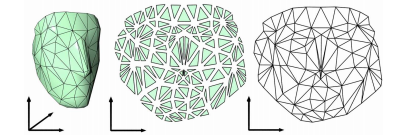

# A Local/Global Approach to Mesh Parameterization 笔记

  

- [A Local/Global Approach to Mesh Parameterization 笔记](#a-localglobal-approach-to-mesh-parameterization-笔记)
  - [总览](#总览)
  - [目标函数](#目标函数)
  - [Jacobian矩阵](#jacobian矩阵)
  - [吻合的矩阵L](#吻合的矩阵l)
  - [奇异值的性质](#奇异值的性质)
  - [目标函数的矩阵形式](#目标函数的矩阵形式)
  - [Local/Global流程](#localglobal流程)
  - [台前幕后](#台前幕后)
  - [实验与总结](#实验与总结)
  - [相关工作](#相关工作)

## 总览

网格模型的表面参数化向来是几何处理中许多算法的基础, 但这个基础操作本身也有很大的难度, 面临着各种各样的问题. 其中比较关键的一个问题就是对于那些不可展开的网格, 展开后的三角形必然或多或少会有扭曲发生, 这篇文章就针对参数化展开途中的三角形扭曲问题进行优化, 借鉴了07年的As-rigid-as-possible surface modeling的思路, 将尽可能刚性(As-rigid-as-possible; ARAP), 也就是尽量保证变形途中三角形维持全等的特性应用到参数化过程中来. Loacl/Global迭代部分的思路与[SfG](...)相似, 在SfG中local操作投影更新点的位置, global操作合并顶点得到新的面片高度, 这篇文章中local操作计算了当前面片最优的旋转, global操作合并顶点得到新的面片二维坐标.

思路:
1. 首先将三维表面用普通方法参数化到UV平面上, 这可以初始化第一个全局变换矩阵$J$
2. Local操作中, 将每个三角形拆开作为一个独立的面, 固定J求出当前全局变换下每个三角形可以处于的最佳局部变换L
3. Global操作中, 固定局部变换$L$, 找到最适合目前局部变换的全局变换矩阵$J$
4. 迭代(2,3)多次直到结果稳定

  

## 目标函数

这篇文章的优化目标是最小化下面的能量函数:

$$
E(u,L)=\sum^T_{t=1}A_t||J_t(u)-L_t||^2_F
$$

这个式子用到了F范数, 就是求矩阵中每一项的平方值的和, 因此这等号能够计算出两个矩阵间元素的差异, 是在求解最接近理想局部变换$L_t$的全局变换$J_t$. 在这里我们既不知道全局变换矩阵是什么, 也不知道局部变换矩阵是什么, 我们需要相互迭代这两组矩阵来得到参数化的结果. 由于操作的直观性, 文章用Jacobian矩阵$J_t$来代表全局变换的矩阵, 并引入辅助变换矩阵$L_t$.

然后根据另一篇文章, 我们可以将这个式子展开为下面的显式表示:

$$
E(u, L)=\frac{1}{2} \sum_{t=1}^{T} \sum_{i=0}^{2} \cot (\theta_{t}^{i})||(u_{t}^{i}-u_{t}^{i+1})-L_{t}(x_{t}^{i}-x_{t}^{i+1})||^{2}
$$

上面式子中的$\theta$是边$(x_{t}^{i}-x_{t}^{i+1})$所对应的角, 我们需要始终使用参数化前的角度以保证局部变换有效, 为了方便可以使用源模型的三维角度充当二维. 然后显然当我们固定$L$时代入函数可以求解出对应的$(u_{t}^{i}-u_{t}^{i+1})$, 这就是Jacobian矩阵.

## Jacobian矩阵

雅可比矩阵Jacobian, 在几何处理中属于比较常用的工具. Jacobian矩阵在几何处理中常常是方阵的形式, 表示从n维到n维的线性映射, 其计算方法就是将函数值的每一维都与映射目标的每一维求导, 表达式如下:

  

在这篇文章中, 由于初始化参数化的存在, 目标表面从一开始就是二维的, 于是文章采用2*2的Jacobian矩阵来表示三角面片上的顶点基于上一次的参数化位置的变换, 文章的global操作就在优化这个Jacobian矩阵, 这个矩阵是global全局变换的核心. 由于这些几何处理都是在离散空间进行的, 因此Jacobian矩阵的效果在离散中会变为$(u_{t}^{i}-u_{t}^{i+1})$和对应的v形式, 这就是目标函数求解出来的结果. 

## 吻合的矩阵L

前面说到优化目标是求解最接近理想局部变换$L_t$的全局变换$J_t$, 这里上面的能量函数中的差值部分我们可以展开写为:

$$
d(J,L)=||J-L||^2_F=tr[(J-L)^T(J-L)]
$$

在上面这个式子中, 第一个等号是计算两个矩阵差之间的F范数, 而进一步的, 这个差异可以展开为乘积的迹的形式.

对于有两个矩阵变量的情况下我们没法优化这个式子, 但是如果我们固定其中的一项, 在这里我们固定global部分$J$, 那么04年文章Procrustes Problems告诉我们, 可以通过将Jacobian矩阵进行SVD分解来求出对于固定的$J$, 差距最小的$L$是什么. SVD展开会成为下面的形式:

$$
J=U \Sigma V^T
$$

我们知道, 分解后的矩阵$\Sigma$是对角矩阵, 其元素就是Jacobian矩阵的奇异值排列. 但是这里如果我们将SVD转为分解出奇异值为正的形式(方法: 奇异值对应分解出来的$U$和$V$, 对于奇异值为负的矩阵, 取正奇异值, 然后将那个矩阵的某一列全部加上负号即可), 就可以通过$L=UV^T$来直接得到与J最符合的local变换$L$.

## 奇异值的性质

既然可以直接从$J$计算出最符合的变换$L$, 那么现在需要来满足约束令$L$尽可能刚性了. 所谓的刚性就是面片的变换尽量不要发生变形, 最好是全等变换, 其次是相似(保角)变换, 再次是保面积变换. 而上面的SVD分解组合$L$正好有个很方便的特性, 当Jacobian矩阵的奇异值满足下面条件时, L会反映出特殊的性质:

- 两个奇异值都为1, L是旋转(全等)变换矩阵
- 两个奇异值相等, L是相似(保角)变换矩阵
- 两个奇异值乘积为1, L是保面变换矩阵

由此对刚性变换$L$的追求和对全局变换$J$的追求就结合到了一起. 假如能量函数改写为$\sum^T_{t=1}A_t(\sigma_{1,t}-\sigma_{2,t})^2$, 也就是令奇异值尽量相等, 那么$J$会产生尽量接近于相似变换的矩阵$L$, 这被称为尽量相似的变换As-similar-as-possible (ASAP).

假如能量函数改写为$\sum^T_{t=1}A_t[(\sigma_{1,t}-1)^2+(\sigma_{2,t}-1)^2]$, 也就是让奇异值尽量都等于1, 那么$J$会产生尽量接近于全等变换的矩阵$L$, 这就是我们要的尽量刚性的变换As-rigid-as-possible (ARAP).

很明显, 这两个能量函数都不好求, 但是论文的附录A和B给出了完整的过程, 证明了求解一开始的目标函数就等价于最小化这两个能量函数.

## 目标函数的矩阵形式

一开始的那个目标函数显然求解起来很不直观, 而且我们希望得到的是在全局上进行的求解. 按照文章中的推导, 我们可以将其写为半边形式, 然后再通过令函数梯度为0求出极值点, 可以得到下面的形式. 这个形式是对于每个顶点的邻域进行计算的, 将这个式子转化放入线性方程组的系数矩阵$A$中, 终于构造出完整的线性方程组. 

$$
\sum_{j \in N(i)}[\cot (\theta_{i j}) L_{t(i, j)}+\cot (\theta_{j i}) L_{t(j, i)}](x_{i}-x_{j})
$$

对于这个方程组我们可以用一系列方法求解, 由于迭代过程中方程的系数部分仅与源模型有关, 不会发生改变, 因此使用Cholesky分解法求解能够最大化迭代的效率.

## Local/Global流程

至此总结一下, 在本文的local部分, 

## 台前幕后

## 实验与总结

## 相关工作