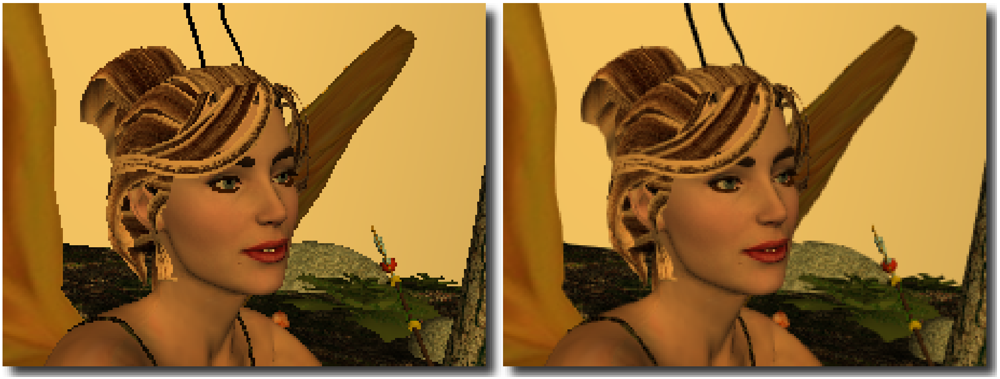

# Morphological Antialiasing 笔记

- [Morphological Antialiasing 笔记](#morphological-antialiasing-笔记)
  - [总览](#总览)
  - [流程](#流程)
    - [总览](#总览-1)
    - [查找边缘](#查找边缘)
    - [模式分类](#模式分类)
    - [颜色混合](#颜色混合)
    - [扩展到多通道图](#扩展到多通道图)

## 总览

Morphological Antialiasing(MLAA), 中文一般翻译为形态抗锯齿(反走样), 即游戏中常见的MLAA抗锯齿算法, 于2009年由Intel的Alexander Reshetov提出. 相比传统的基于超采样的抗锯齿算法, MLAA是一种纯粹的后处理算法, 也就是其基础版本无须额外的信息, 可以直接对渲染器的帧缓冲进行抗锯齿处理, 与常见的图像处理算法是一致的.

MLAA的思路基于人眼感知的一大特征: 对形状失真的判断力远强于颜色失真的判断力. 因此MLAA着重处理图像的形状部分, 也就是对比度强烈的几何边缘, 这一方面防止了纹理部分出现额外的失真, 另一方面大大减少了计算量, 这一点也是MSAA等方法的思路. 而对于形态抗锯齿的"形态"部分, MLAA并不是像简单的插值方法一样对图片的全局进行抗锯齿处理, 而是先在图片中找到代表几何边缘的部分, 然后将这些边缘分为三种不同的形态模式(pattern), 根据模式实施不同的模糊策略. 经过MLAA处理的图片如下图边缘较为平滑, 而内部纹理保持锐利.

  

## 流程

### 总览

MLAA分为以下三个大步骤:

1. 查找图片中明显的像素不连续区域作为需要处理的边缘
2. 将这些边缘分类为不同的模式(pattern)
3. 对这些模式的像素与周围像素进行混合平滑

### 查找边缘

通常来说是

### 模式分类

### 颜色混合

### 扩展到多通道图