# Phong Deformation A better C0 interpolant for embedded deformation 笔记

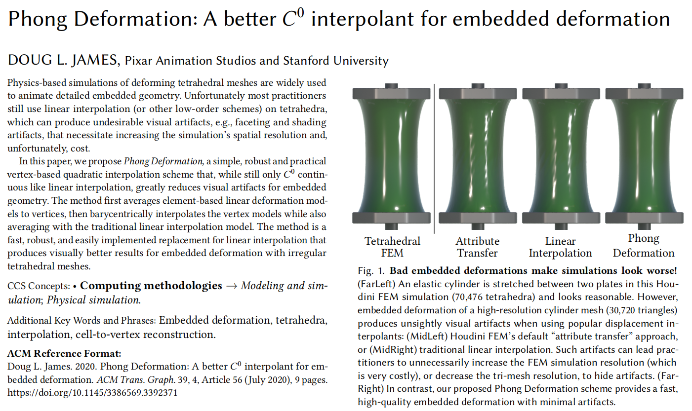  

- [Phong Deformation A better C0 interpolant for embedded deformation 笔记](#phong-deformation-a-better-c0-interpolant-for-embedded-deformation-笔记)
  - [总览](#总览)
  - [变形插值](#变形插值)
  - [顶点梯度估计](#顶点梯度估计)
  - [Phong变形](#phong变形)
  - [误差分析](#误差分析)
  - [结果与总结](#结果与总结)
  - [相关工作](#相关工作)

## 总览

在计算机图形学中我们时常要对一些复杂的表面进行变形操作, 最常见的就是在物理模拟或计算机动画中对一些很复杂的动画变形. 如果我们直接对复杂的网格曲面全局运用变形算法(例如之前提到的拉普拉斯变形)或者对每个顶点进行物理模拟, 由于需要计算的点特别多所以变形可能会非常耗时. 为了解决这种问题, 我们可以对模型生成一个比较简单的外框来进行相应的变形计算, 然后模型真实顶点通过插值的方式进行变形. 这种变形方法称为基于嵌入空间的变形, 可以大大减少变形时的性能代价.

但是这个插值的方法选择会对变形得到的表面产生很大的影响. 传统上我们使用普通的线性插值算法来对复杂顶点进行变形, 但是这会导致表面产生网格状的"不连续"现象, 这个现象在有光照处理的情况下更为突出. 有一些人对这个问题进行过处理但是如论文的题图效果并不好. 因此这篇文章的贡献就是找到了一种在性能消耗相对不会那么大的情况下有效改进插值效果的算法, 称为Phong变形.

Phong变形之所以能得到比以往更好的插值效果是因为尽管各种插值算法都是符合嵌入空间变形的C^0 连续算法, 但是它们在拟合上都只能达到二阶(O(h2 ))的准确度, 而Phong变形能在大多数情况下达到O(h3 )的准确度, 因此效果更好.

## 变形插值

Phong变形的思路来自于光照计算中的Phong光照着色和三角剖分问题中的Phong细分算法. Phong着色通过在粗糙网格上计算光照时对顶点的法线进行重心插值从而模拟出了平滑的光照. Phong细分则在细分网格时不但利用了重心插值的思想, 还额外带入了另一种插值, 然后将两种插值的结果混合在一起得到了更平滑的插值. 

因此Phong变形综合了这两种思想使用了两种变形时的插值算法然后将它们混合在一起得到更好的插值结果. 这个变形在二维上我们可以看作由下图左边的普通线性插值变形和右边的顶点混合插值变形融合为中间的Phong变形.

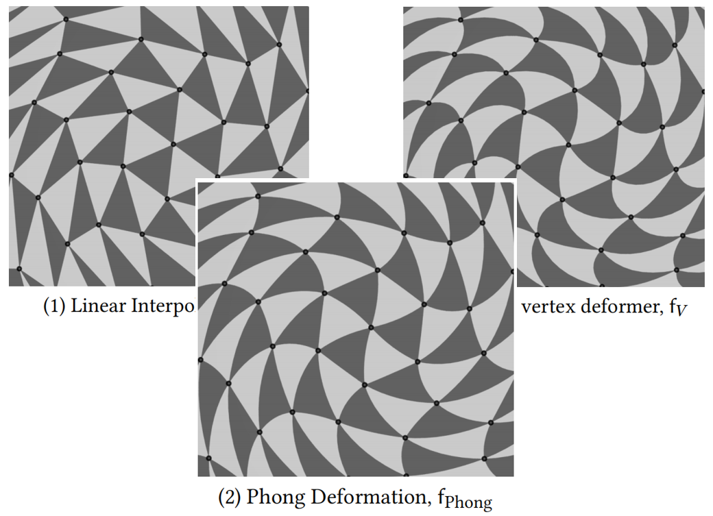  

为了更好地解释顶点变形问题, 我们需要介绍一下拉格朗日描述下的网格变形. 拉格朗日描述是力学里的一个概念, 关注对质点状态的描述因此正好适合网格图形中对顶点的描述. 在这种描述中顶点的变换可以用一个映射f来表示. 当我们要描述一种网格变形就是要找到如下图的一个合适的函数f来表示顶点的变换.

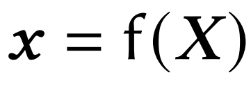  

直接求解这个f并不容易, 但是这个f又可以改写为下图这样的一个函数, 这个函数里的F称为形变梯度. 形变梯度描述了模型在点X_delta附近的形变程度, 因为是描述了形变的梯度而不是简单的位移梯度, 所以是和周围其他点的变形有关系的. 求解出这个形变梯度就能较好地表示顶点的变形.

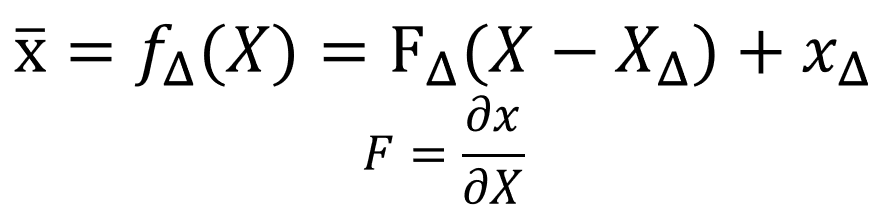  

了解这些之后就需要介绍两种用到的插值方法: 单元线性插值和顶点梯度插值. 对于单元线性插值来说, 由于我们现在有直接变形后的嵌入空间顶点, 我们可以使用下面的式子来得到四面体的单元线性插值. 首先大X是还没有变形前的四面体四个顶点坐标, 组成矩阵大V, 然后小x是经过变形后的顶点坐标, 组成矩阵小v. 对于这样的顶点显然我们可以通过差分近似的思想按照上面的公式得到一个变形梯度Fc, 这个梯度就是单元线性插值的形变梯度.

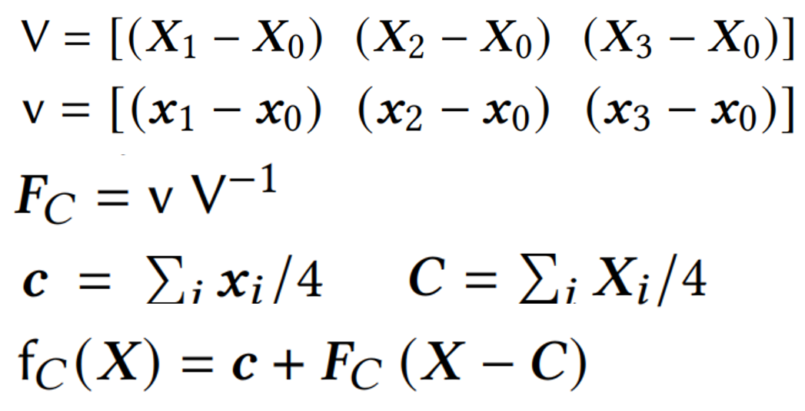  

之所以将其称为单元线性插值, 是因为这样得到的梯度实际上是四面体中心位置的梯度, 但是插值算法fc通过普通的线性插值方式, 按照四面体中心坐标变形前后的差距, 将这个梯度应用到了整个四面体单元中. 这种方法也就是最常见的嵌入变形所使用的方法, 下面的梯度图让我们能清楚看出按照这种方法渲染出来的结果有方块感的原因.

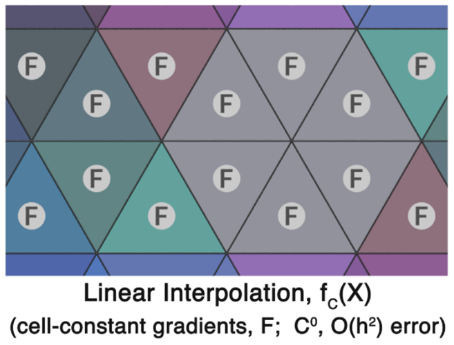  

为了解决梯度在单元中单一的问题, 文章加入了另一种常用但原理不同的插值方法: 顶点插值. 这种插值实际上就是Phong着色中的重心插值. 首先我们需要得到四面体上各个顶点的梯度, 然后一样利用线性插值的思路我们可以得到以四个顶点为中心的四个线性插值变形fi, 再利用重心坐标系将这个变形fi插值到整个四面体上. 这个步骤由下面的式子展示出来, 重心坐标系插值就是fV中的β部分.

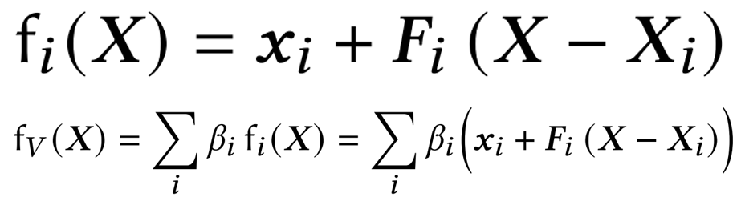  

所谓重心坐标插值, 核心就是用一组代表比例的坐标来表示区域内的一个点, 有点类似设置一个基于四面体自身的局部坐标系, 四面体的边就是坐标系的基. 我们将每个四面体内部的位置表示为三个不相关的边的线性组合, 用代表边向量长度比例的坐标β来控制位置. 更详细的介绍我在[图形学2.7]中有记录, 下面是求解任意点对应一个四面体计算重心坐标的公式流程. 重心插值的好处就是即便我们改变了这个三角形的形状其中的点的相对位置依然可以保证, 这很适合表面变形问题因此在图形学中广为应用.

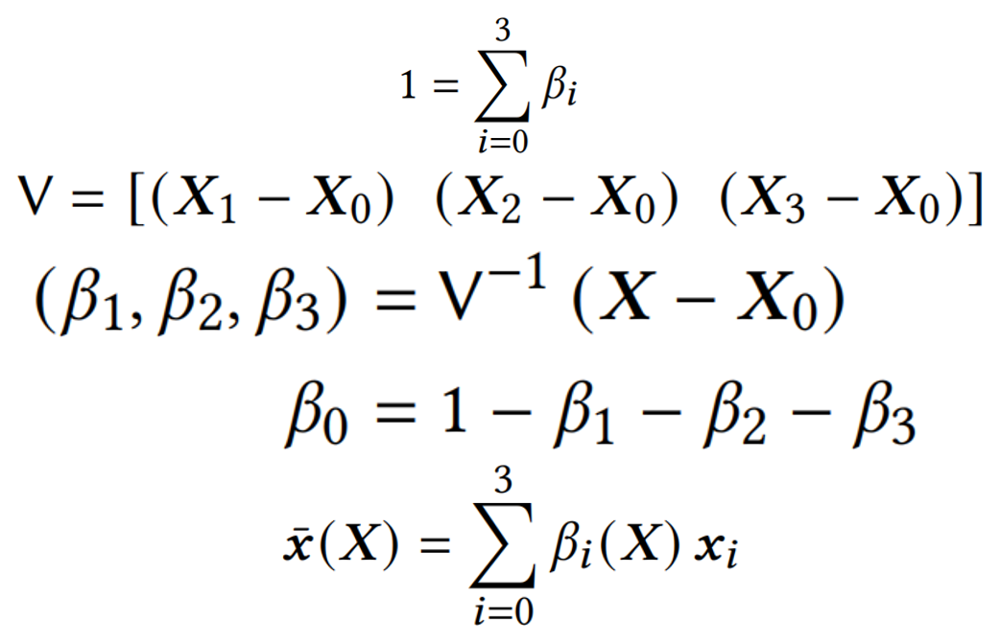  

在经过这样的插值后, 我们可以理解为此时四面体内部的梯度已经是不均匀的状态了, 将其可视化出来就是下面的样子. 但是这里我们遇到两个问题, 一个是下面的图片中可以看到梯度颜色似乎不够均匀, 整体的变化比较强烈, 此时我们拿这个梯度来变形会发现出现了变形过度的问题. 另一个问题是我们要如何得到各个顶点上的梯度F呢.

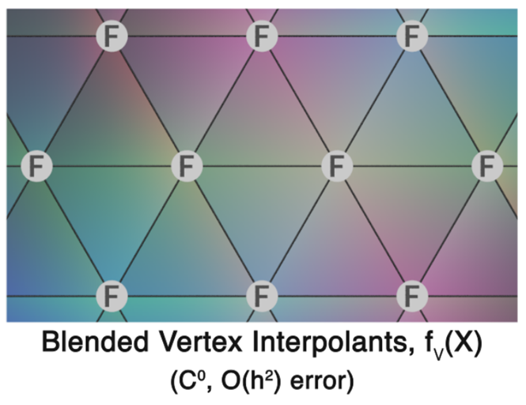  

## 顶点梯度估计

首先是第二个问题, 如何得到顶点梯度F. 梯度F的估计需要用到另一篇文章里的方法(标记在结尾相关工作部分), 这篇文章的算法可以保证对梯度的估计尽量稳定且尽管精度实际上是O(h^2 )的逼近准确度, 在这种估计算法下可以在大多数时候达到O(h^3 )的逼近准确度

对于这种估计方法, 首先我们需要找到物质空间中与当前顶点连接的其它四面体k, 计算顶点到这些四面体中心的向量rk, 然后组成下面的式子. 这个式子实际上就是利用其它三角形重心的梯度Fc来按照距离对当前顶点进行加权平均. 那么现在的问题就转化为如何找到合适的权值wk.

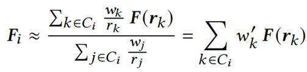  

求解wk在公式中需要满足下面加权向量和为0和权重尽量接近1这两个限制, 这两个约束显然一个是为了保证中心插值的尽量准确, 另一个是为了保证权值尽量归一化. 通过最小化这个权值和接近1这个约束可以求解wk.

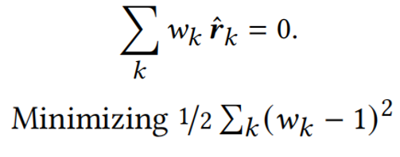  

这样一个最小化多项式的问题可以用拉格朗日乘子法来求解, 如下式组合式子然后偏导为0即可. 其中拉格朗日乘子λ通过将wk代回一开始求和为0的约束中可以解出来. 解出合适的权值后将这个权值待会一开始的加权平均中就可以得到各个顶点的估计形变梯度Fi.

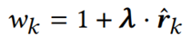  

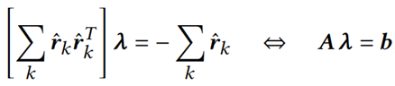  

由于权值的求解需要求解一个线性方程组, 所以显然当顶点邻接的四面体太少时精度会下降以至于出现秩亏. 对于这个问题文中又使用了Tikhonov正则化来优化上面的方程组的求解, 在这种做法下顶点的梯度估计能在大多数情况下达到三次方精度, 仅在少数时候精度降低到二次方且即便降低仍然能如下图有较好的变形结果.

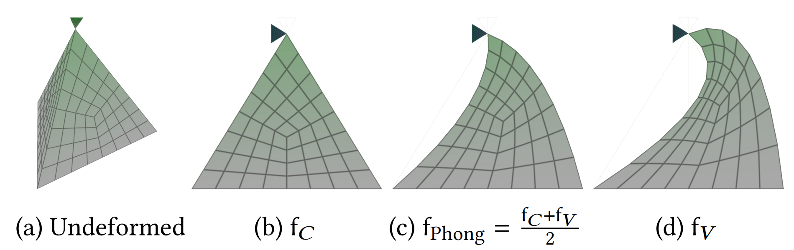  

## Phong变形

在最开始我们说到Phong变形的特点就是组合了两种不同的插值方式, 前面已经展现了两种不同的插值, 其中单元中心的插值法变形不足而顶点插值变形过度, 那么Phong变形就显而易见了, 对这两个变形加权平均来得到结果. 对于这个加权, Phong变形采用了最简单的α=1/2的权值, 尽管这个权值的选择看似随便, 在文章中的下一节却有详细的证明.

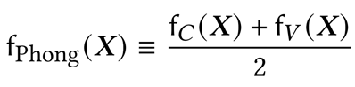  

至此回顾下整个框架, 其实就是找到基于单元中心的传统插值变形, 然后将这个变形另外插值到顶点上再应用到整个四面体, 将这两个插值加权下来. 从梯度的角度来看得到的效果如下图, 整个区域中的梯度有了更加自然合理的分布, 核心是因为梯度分布到了更多的区域.

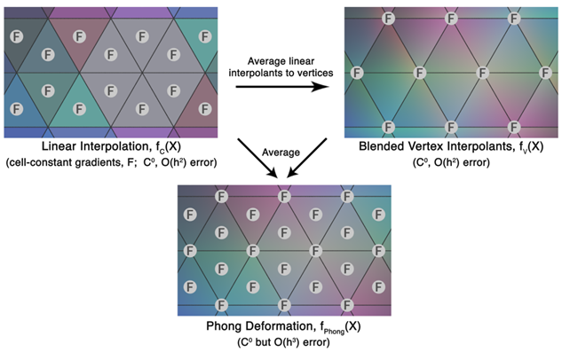  

## 误差分析

对于Phong变形, 作者在文中给出了详细的实验证明和理论证明, 其关键是证明Phong变形能够达到对真实变形O(h^3 )的拟合准确度. 我们知道插值问题实际上是一个拟合问题, 而估计一个拟合算法的误差最常用的方法是用泰勒级数计算截断误差. 这里作者以一维插值为例, 我们同样可以写出单元线性插值的表达式f(X)≈(1−β) f_0+βf_1, 此处的β是一维上的坐标用于代替重心坐标系, 值为β=X/h, h是需要插值的单元大小, f0和f1可以用差分近似来估计.

对于这样的线性插值表达式, 我们计算对应的泰勒级数可以得到下面的截断误差, 可以看到这里存在着二次方项的h, 代表这里的精度只能达到O(h^2 )

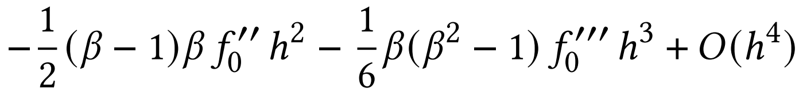  

类似的, 可以写出顶点梯度插值的公式如下, 式子整体和线性插值差不多.

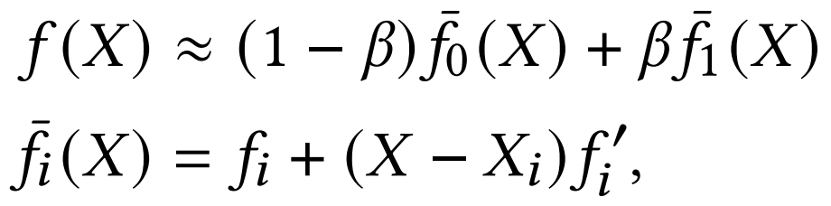  

对于顶点梯度插值, 同样进行泰勒展开求其截断误差. 在这里我们会注意到这个截断误差同样导致精度只能达到O(h^2 ), 但是其二阶项的值和线性插值的二阶项的值刚好是相反数关系, 我们很自然想到了通过一个1/2的加权可以消除掉这个二阶项, 这就是前面α=1/2的由来.

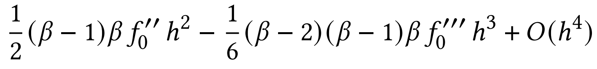  

加权约简后得到的误差就是Phong变形在一维上的误差, 很显然它已经达到了O(h^2 )的精度, 而且其三阶系数项还要比加权平均前的插值都要小很多(显然这里的β都是小于1的).

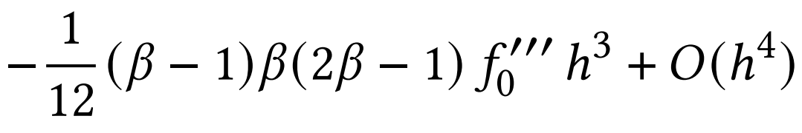  

一维上的插值有能达到O(h^4 )精度的算法所以Phong变形意义不大, 但是在三维上就不是这样了. 经过类似的推导可以证明Phong在三维上同样能够达到三次方精度如下. 配合在大多数情况下也是三次方精度的Fi估计算法, 整个Phong变形都能在大多数时候达到很好的结果.

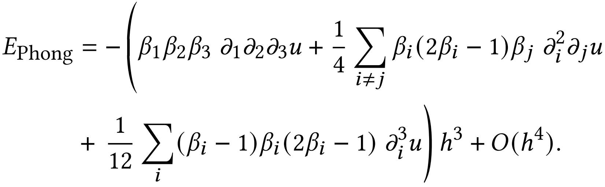  

对于这段误差分析, 作者进行了实验并画出了图像来证明.

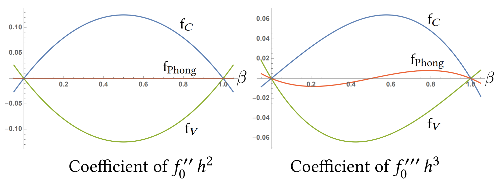  

## 结果与总结

文章的变形结果表现为下面的几张图, 可以看到在误差控制上Phong变形得到了误差更小的插值效果.

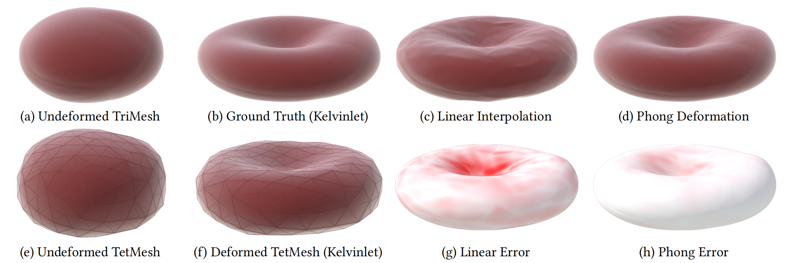  

Phong变形大大减少了块状插值的效果, 下图(b)是另一种对这个问题的优化插值算法, 效果也不佳.

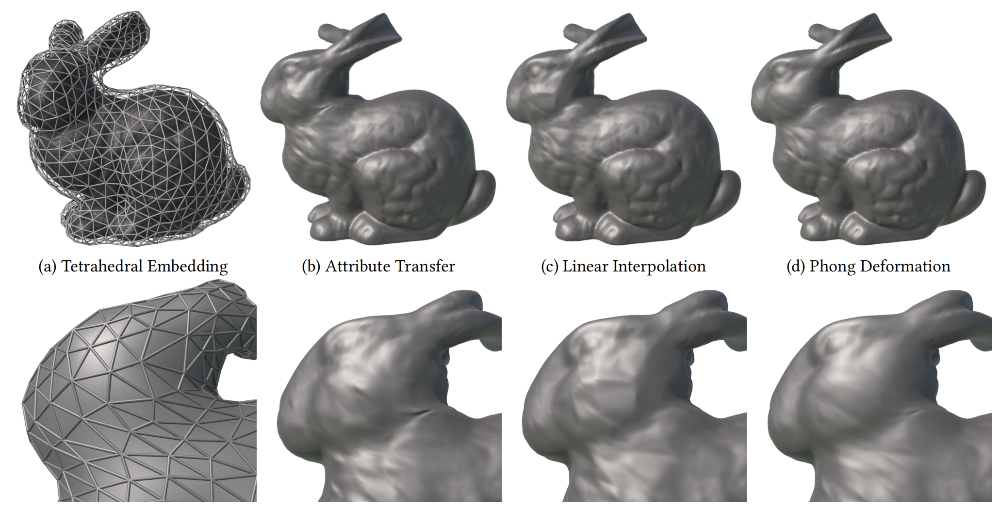  

而从效率方面来看, Phong插值自然是需要付出比线性插值更大的性能代价的, 但是这个代价远远小于去提高嵌入空间的精细度所带来的代价大, 文中提到只需要付出10X的性能代价, 就可以得到2.9X的误差降低, 性价比是很高的.

## 相关工作

尽管这是一篇很新的文章, 但是也许是问题本身比较传统的缘故, 文章所引用的文献大多上了年头, 不过这些文献还是很多值得一看.

1. 文中用到的嵌入空间变形和一些物理效果的模拟器 SideFX. 2020. Houdini Engine. http://www.sidefx.com.
2. 运用了置换映射来消除嵌入变形中的一些瑕疵 Doug L James and Dinesh K Pai. 2003. Multiresolution Green's function methods for interactive simulation of large-scale elastostatic objects. ACM Transactions on Graphics (TOG) 22, 1 (2003), 47–82.
3. 应用在三维空间中的广义重心坐标系, 用来得到更好的参数化或者变形插值结果, 均值坐标系  Michael S Floater. 2003. Mean value coordinates. Computer Aided Geometric Design 20, 1 (2003), 19–27.
4. 同3, 谐波坐标系 Pushkar Joshi, Mark Meyer, Tony DeRose, Brian Green, and Tom Sanocki. 2007. Harmonic coordinates for character articulation. ACM Transactions on Graphics (TOG) 26, 3 (2007), 71.
5. 文章的灵感来源, 著名的Phong着色 Bui Tuong Phong. 1975. Illumination for computer generated pictures. Commun. ACM 18, 6 (1975), 311–317.
6. 同5, Phong细分, 通过借助顶点法线来优化三角剖分减少Phong着色时产生的不连续光照效果 Tamy Boubekeur and Marc Alexa. 2008. Phong Tessellation. In ACM Transactions on Graphics (TOG), Vol. 27. ACM, 141.
7. 四面体上的插值算法中, 低阶的插值算法很早就有人做过, 而高阶的插值算法都会带来巨大的计算代价且需要更多的信息输入, 这篇是古老的1阶连续插值 Peter Alfeld. 1984. A Discrete C1 Interpolant for Tetrahedral Data. The Rocky Mountain journal of mathematics (1984), 5–16.
8. 另一种针对四面体变形的拟合算法有效减少了误差, 但是需要更大的性能代价 Adam W. Bargteil and Elaine Cohen. 2014. Animation of Deformable Bodies with Quadratic Bézier Finite Elements. ACM Trans. Graph. 33, 3, Article 27 (June 2014).
9. 文中的顶点梯度插值来源 Praveen Chandrashekar and Ashish Garg. 2013. Vertex-centroid finite volume scheme on tetrahedral grids for conservation laws. Computers & Mathematics with Applications 65, 1 (2013), 58 – 74. Ricardo Costa, Stéphane Clain
