# Surface-from-Gradients An Approach Based on Discrete Geometry Processing

- [Surface-from-Gradients An Approach Based on Discrete Geometry Processing](#surface-from-gradients-an-approach-based-on-discrete-geometry-processing)
  - [总览](#总览)
  - [离散几何处理SfG问题](#离散几何处理sfg问题)
  - [局部变形](#局部变形)
  - [全局混合](#全局混合)
  - [数学求解和边界](#数学求解和边界)
  - [结果与总结](#结果与总结)
  - [相关工作](#相关工作)

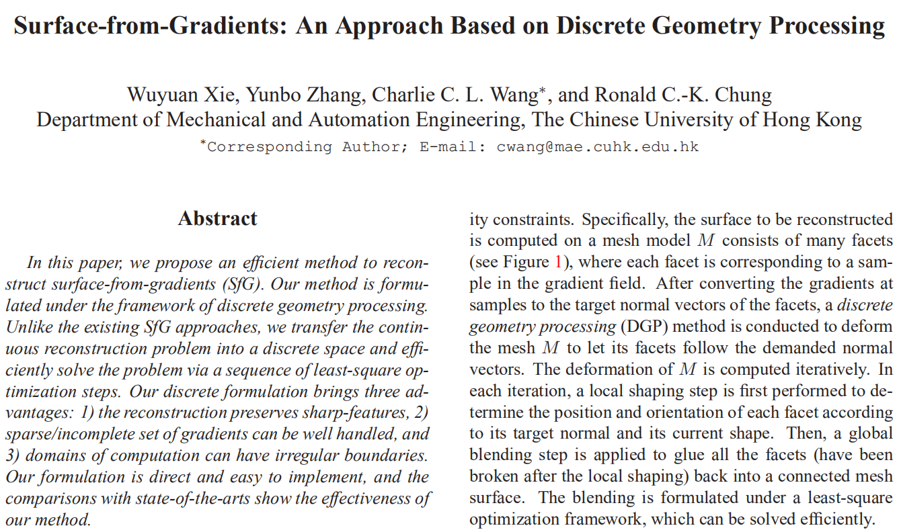  

## 总览

传统上从法线图或梯度图进行从梯度的表面重建(Surface-from-Gradients: SfG)有很多不方面的地方, 例如难以恢复表面锐利的物体, 容易受到噪声干扰, 对不规则的感兴趣区域(ROI)的重建不理想. 为了做到对噪声复杂的图形也能正常进行重建并尽量得到好的效果, 这篇文章用一种新的方法通过对表面进行离散化处理来进行重建.

思路:

1. 将法线图转换为像素级别的小块
2. 通过"局部变形"操作来对当前小块进行旋转和基础定位
3. 通过"全局混合"操作来将小块合并为一个大表面, 将分离开来的顶点重新组合
4. 重复迭代上面两个步骤数次只到小块的组合无法继续优化

下图就是实际上的迭代流程的表现

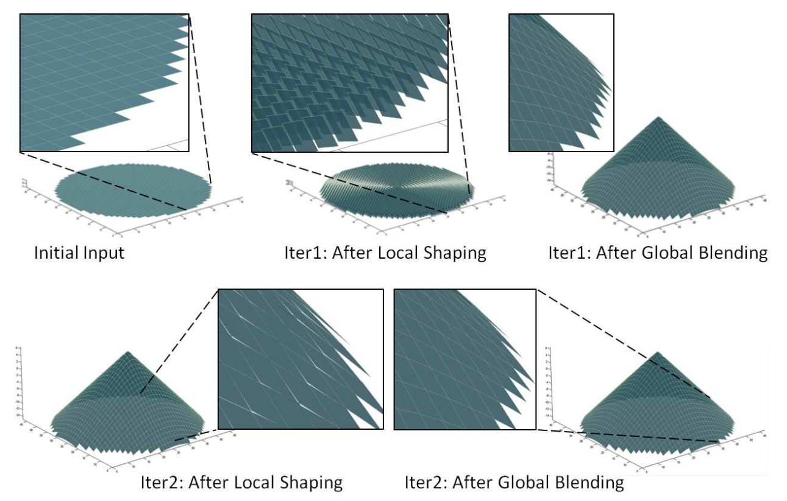  

## 离散几何处理SfG问题

文章的核心思路就是将传统的SfG问题离散化处理, 而为了进行这样的处理, 首先需要按照以下的方法构建出整体的数据结构, 这里输入的梯度场都通过n=(-p,-q,1)/sqrt(p^2+q^2+1)转换为了单位长度的法线图

1. 对于法线图中的每个像素, 像素中心都代表了一个输入梯度(p,q), 分别是法线的x分量和y分量
2. 对于每一个像素(i,j), 都以像素中心为中心建立起一个四边形小面片, 这个面片以四个顶点v为边界
3. 每一个顶点vij是初始化在法线图xoy坐标系中的((i-1/2)h,(j-1/2)h,0)中, 此处的h是输入像素的宽, 这里可以发现这个计算其实就是像素坐标系的像素边界
4. 因此被重建起来的表面M就是由这些小面片组成的, 而小面片的具体位置和朝向则是由其本身的四个顶点v决定的

有了数据结构后, 文章的目的就是前面说的, 将这些小面片旋转,移动到恰当的位置从而构造出一个比较不失真的重建表面. 首先这里的面片移动, 又一个关键的地方在于由于重建表面与法线图应该是一一对应关系, 因此面片的移动只发生在Z轴上, 不会改变面片的xy坐标. 知道这些信息后, 我们知道这个重建过程本质上是对面片群的顶点优化问题.

从抽象的方向来理解这个顶点优化问题, 如下图. 对于一个顶点v, 其最终位置是由与其连接的四个小面片决定的. 首先四个小面片都会进行旋转, 然后旋转后面片对应这个连接顶点的顶点自然就会分离, 这使得一个顶点变为了4个可能的顶点, 这四个顶点在一定范围内都能成立, 称为可行域, 就是下面的四个着色区域. 对于算法中的"局部变形"操作实际上就是将当前的顶点映射到四个最近的可行域上. 接着算法的"全局混合"步骤使得这四个映射后的顶点全局考虑被合理地重新融合为1个点, 决定了顶点v的新的坐标. 对于这个过程, 将得到的新的顶点位置重新进行这一段处理, 迭代数次后每个顶点都会达到一个合理的位置, 也就是收敛到一个稳定的表面, 这样重建就完成了.

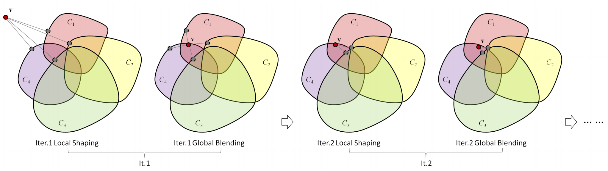  

这样的迭代步骤的好处就是可以通过这个局部/全局迭代, 使得算法没有传统上一些优化算法受到初始化状态过大影响的缺点, 保证了算法能比较快地收敛到稳定状态, 解决了这个凸优化问题.

## 局部变形

首先对于每个小面片, 其都拥有自己的面片中心, 记为cij, 这个cij的坐标是像素坐标和其像素边界的四个顶点坐标在z轴上的平均

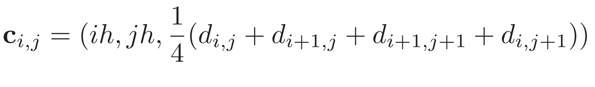  

然后此时如下图定义一个平面, 这个平面无限延展, 其中心是cij, 平面的朝向是法线图所指示的像素法线朝向, 由于这里我们只改变顶点的z, 因此我们可以用下面的公式将当前的顶点投影到其对应的中心cij所生成的这个平面上, 得到投影点pij

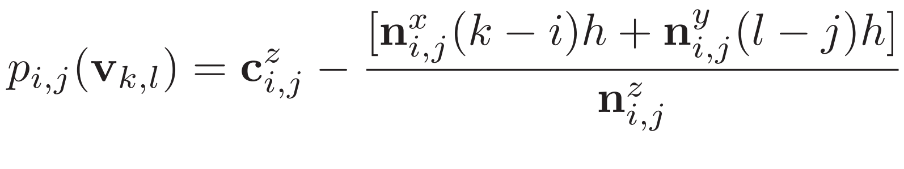  

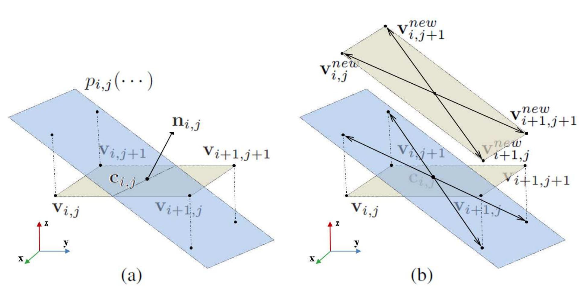  

在进行了这个投影后, 模型中的每个顶点都获得了4个对应的投影顶点(因为这是环绕于顶点的四个面片旋转后的效果). 为了处理顶点数量不匹配的问题, 简单地平均化顶点显然不是好方法, 这里引出了下面的全局混合步骤.

## 全局混合

首先对于每小面片fij, 其四个顶点的目标Z深度可以写为下面的向量形式z, 相应的它们的投影写成向量p:

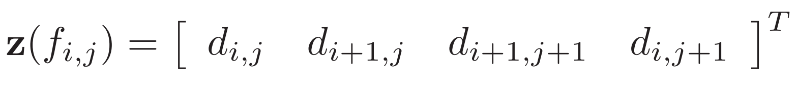  

对于目标重建表面, 我们希望的实现效果是每个小面片顶点的真实值和其投影点的值能尽量接近, 因为这代表了面片都旋转到了正确的方向上而且得以在新的位置保持稳定. 最简单的解决方法是直接在迭代中让其顶点与其投影点值相等, 但是这种方法有个问题, 就是会导致迭代速度变得很慢因为这个约束太强了.

为了优化迭代速度, 文章放松了这个约束, 转而要求变形后的顶点与其自身的中心点形成的向量需要与投影点和投影点中心形成的向量相同(平行). 这个也就是上面示意图中(b)的效果, 这个小小的改进形成了巨大的效率优化.

为了计算这些向量, 我们可以写出下面的矩阵N, 这个矩阵是应用在前面的z向量和p向量上的, 拆开来尝试一下就知道这实际上完成了求顶点中心和做差得到向量的过程

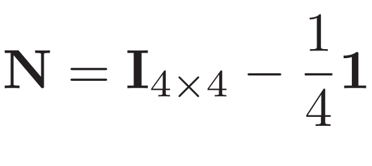  

有了这个矩阵后, 对于这个约束我们可以写出下面这个代价函数, 这个求和计算了所有小面片在重建过程中面片角度产生的误差, 下面使用最小二乘法在全局上对这个代价函数进行优化可以求解出需要的Z深度

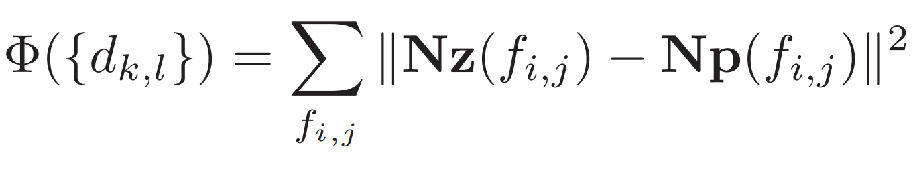  

## 数学求解和边界

最小二乘法很适合求解这样的优化问题, 通过将所有的顶点用下面的式子联系起来, 这里的A是一个 4*面数 X 点数 的矩阵, 从Nz中构造出来, b是 4*面数 X 1 的向量, 从Np中构造出来. 

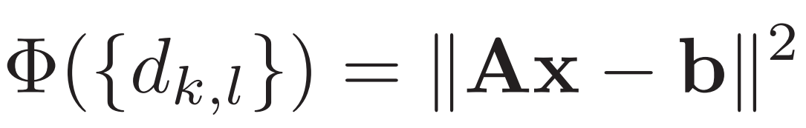  

写成Ax=b后, 对于这样的一个大型方程组, 我们通过下面的式子可以求解出x的取值, 从矩阵的尺寸中我们可以很明显的明白x是 点数 X 1 的向量, 储存了求解后这次迭代的顶点深度值z.

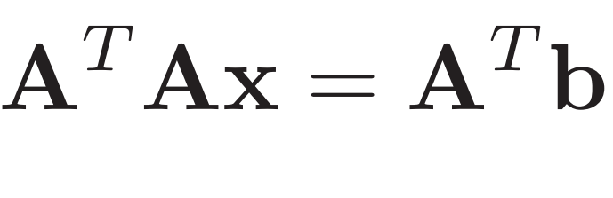  

而对于上面的式子, 我们可以进一步优化这个求解过程. 在求解中我们可以注意到这里的A代表的是面片与顶点的连接关系, 实际上在运行中并不会发生改变, 推动x改变的实际上是变化的b, 因此如果我们在一开始构造方程组的时候就将A^TA提前计算好并且作为一个现有值来重复利用, 就可以大大加速运行的过程.

算法还有需要解决的问题就是不规则边界, 破洞, 高频噪声问题. 对于不规则边界, 这个算法离散处理的好处就是不用在意这个问题, 在边界不规则的情况下仍然可以正常运行. 对于破洞问题, 此算法的对抗能力也比传统算法强很多, 对于那些没有被给出法线的区域, 文中直接使用当前处理遇到的法线来作代替使用, 然后就正常运行. 尽管这会带来一些错误但是由于最小二乘解的稳定性最后重建结果还是比较正常的. 对于高频噪声的方法, 文中的处理方法是提前查找出那些过于突出的法线, 也就是那些于z轴角度差距过大的法线, 将其定为异常值然后用和破洞处理一样的方法, 将其作为空法线来对待

## 结果与总结

最主要的结果就是这篇文章的方法得到了误差更小的复杂物体重建效果

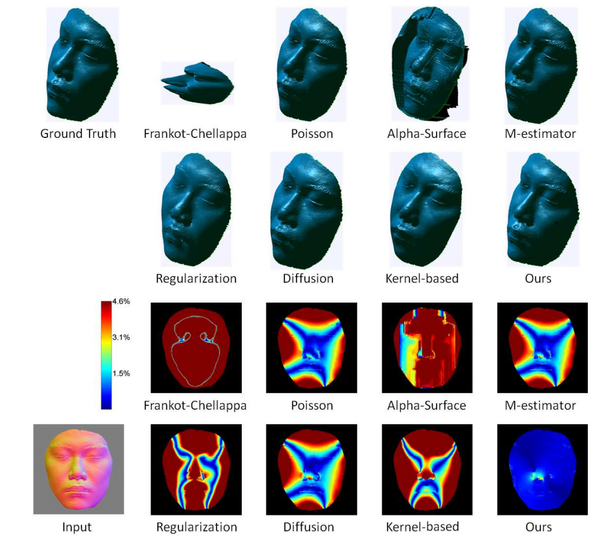  

对尖锐物体也有了效果很好的重建

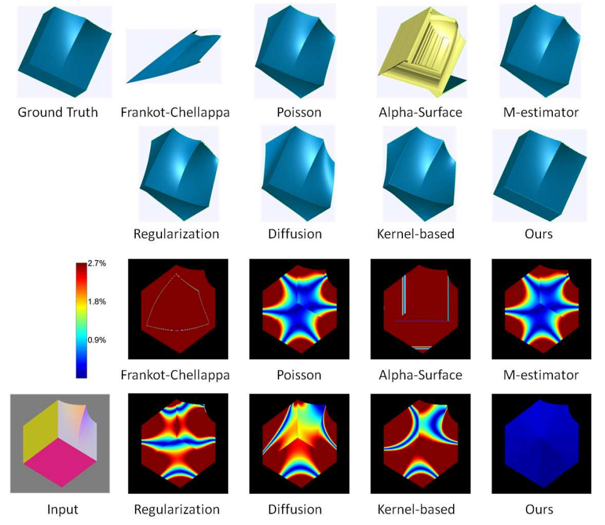  

面对噪声时也能得到较好较稳定的重建效果, (b)是不处理噪声的重建, (c)是有处理噪声的重建

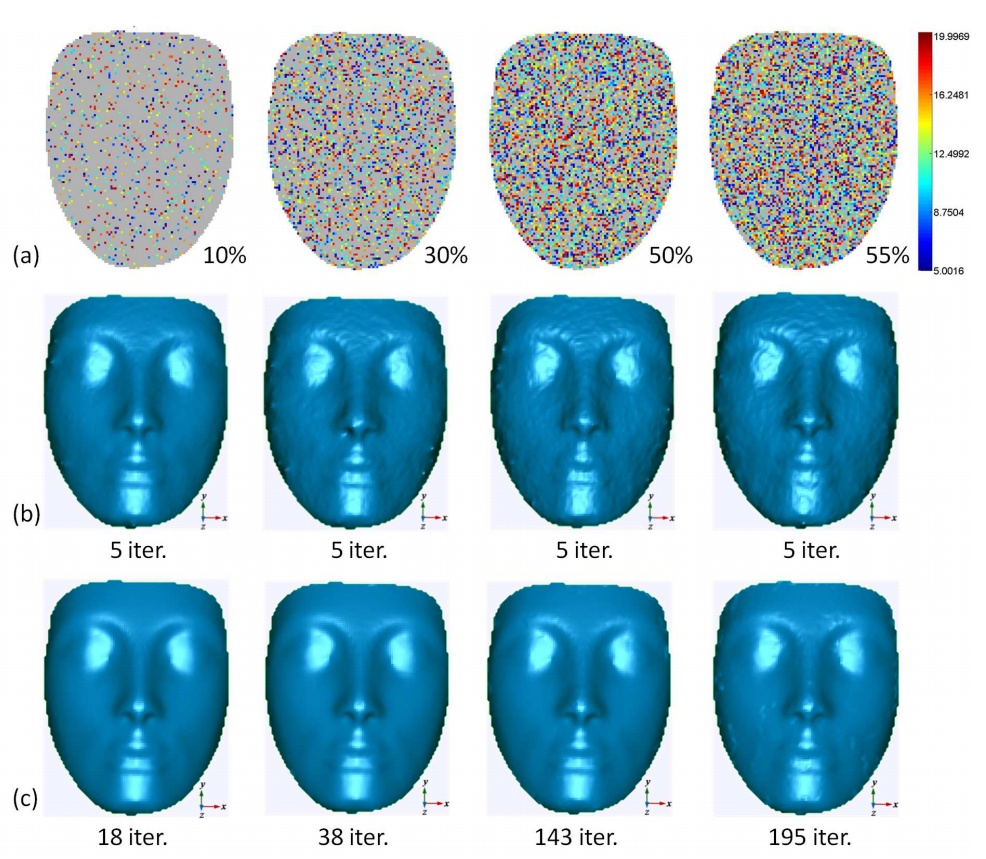  

## 相关工作

这篇文章是2014年CVPR的, 也不能算是新文章了, 里面很多引用的文献都已经过时, 但大概总结了相关的工作如下, 还是可以用来了解领域扩展视野的:

1. 提出一个优化重建可积性的通用框架, 包含了很多不同的方法 A. Agrawal, R. Raskar, and R. Chellappa. What is the range of surface reconstructions from a gradient field? In European Conference Computer Vision (ECCV), 2006, pages 578–591. Springer, 2006.
2. 局部/全局处理的思路来源 R.W. Sumner and J. Popovic. Deformation transfer for triangle meshes. ACM Transactions on Graphics, 23(3):399–405, 2004.